# iwiki-mcp — Architecture

A structural map of the iwiki-mcp server: layers, module dependencies, the on-disk
model, the tool surface, and the core pipelines (write, retrieval, indexing, git
sync, OKF frontmatter). Diagrams are Mermaid, tuned for a dark Obsidian theme.

> Companion to the user-facing `README.md` (install / registration / env reference).
> This document is developer-facing: it explains *how* the pieces fit, not *how to
> set them up*.

## What it is

`iwiki-mcp` is a **stdio MCP server** — not a daemon. The MCP client (Claude Code,
Codex) spawns one process per session and talks to it over stdin/stdout. The server
fronts a shared, git-synced wiki **base** split into **domains**. Coding agents author
Markdown pages; the server validates structure, persists to disk, embeds and indexes
the content, and answers hybrid (vector + lexical + link-graph) search across the
domains a project is bound to.

Three nouns anchor everything:

- **Base** — a directory (intended to be a git repo) pointed at by `IWIKI_BASE_DIR`.
- **Domain** — an immediate subdirectory of the base; holds `*.md` pages plus a
  per-domain `index.jsonl` (vector store) and `log.jsonl` (ingest log).
- **Binding** — a project's `.iwiki.toml` declaring which domains it may `read`
  from and the single domain it may `write` to.

## Layered architecture

Two layers live under `src/iwiki_mcp/`. The **top layer** is MCP-aware and reaches
side effects (filesystem, git, HTTP embeddings). The **`engine/` core** is
framework-free and unit-testable without the MCP runtime — several of its modules
(`validate`, `lint`, `links`, `frontmatter`, `okf_artifacts`) are deliberately
kept `httpx`-free and stdlib-only so they import in any project.

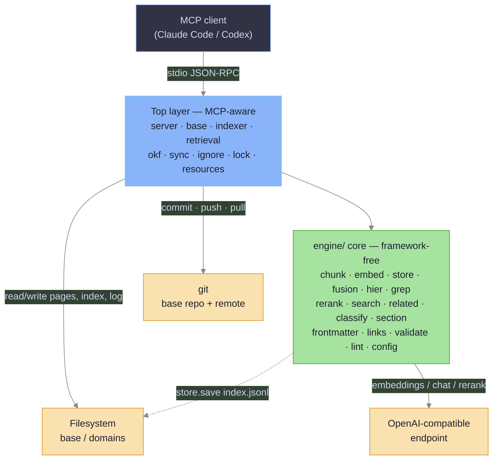

**Top-layer modules:** `server` (tool surface + guards), `base` (binding + path
resolve), `indexer` (ingest + index), `retrieval` (multi-signal query), `okf`
(frontmatter assembly), `sync` (git ops), `ignore` (`.iwikiignore` gate), `lock`
(cross-process lock), `resources` (authoring rules).

**Engine modules:** `chunk`, `embed`, `store`, `fusion`, `hier`, `grep`, `rerank`,
`search`, `related`, `classify`, `section`, `frontmatter`, `links`, `validate`,
`lint`, `config`.

### Layer contract

| Concern | Top layer | Engine core |
| --- | --- | --- |
| Knows about MCP / `FastMCP` | yes (`server.py`) | no |
| Reaches git | `sync.py` (write mutations) + `okf.py` (`git log` for timestamps) | no |
| Reaches the network | `okf.py`→`classify`, indexer/retrieval→`embed`, `server`→`rerank` | only `embed`/`classify`/`rerank` |
| Path-traversal guards | `server._validate_domain` / `_slug_parts` / `_page_path` / `_contains`, `okf._is_safe_type_segment`, `retrieval._domain_file_parts` (all top-layer) | — |
| Config-free / stdlib-only | — | `validate`, `lint`, `links`, `frontmatter`, `okf_artifacts`, `section`, `grep` |

## Module dependencies

Import direction is top → engine; the engine never imports the top layer. (A
`from .base import ...` inside `okf`/`indexer`/`retrieval` is not an exception —
those three are top-layer modules, not `engine/`.) The graph is split into three
views. Note the deliberate constant duplication: `OVERVIEW_HEADING`, `LEAD_MAX`,
and the `_H2` regex are copied across `chunk.py`, `validate.py`, `lint.py`,
`section.py`, and `okf.py` so the config-free modules never import `chunk`/`embed`
(keeping `httpx`, pulled in via `embed`, out of them).

### Top-layer composition

`server` drives the orchestration modules; `indexer`, `retrieval`, and `okf` share
`base` for path/binding resolution.

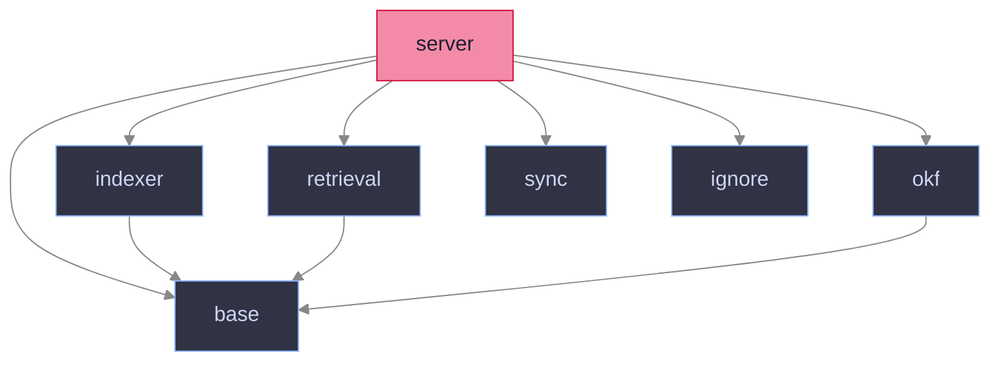

### Ingest & query → engine primitives

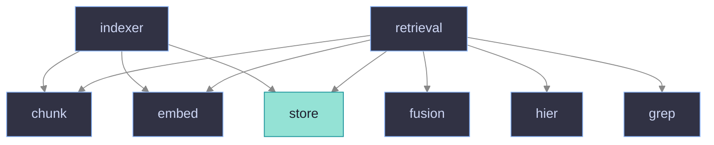

### Engine-internal core

The config-free cluster: `lint`/`validate` fold in `frontmatter`, `links`, and
`okf_artifacts`; `hier`/`related` build on `store` + `links`.

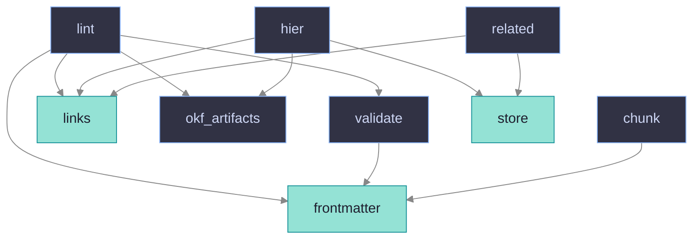

`frontmatter`, `store`, and `links` (highlighted) are the most-depended-on engine
primitives; `store.VectorStore` is the deliberate seam for a future
SQLite/sqlite-vec swap (callers depend only on `load`/`save`/`query`).

## On-disk model

The base is a git repo. Each non-`.`-prefixed subdirectory is a domain. Pages live
at `<type>/<slug>.md` (the frontmatter `type` doubles as the directory). Per-domain
`index.jsonl` and `log.jsonl` sit at the domain root; a legacy `.iwiki/` subdir is
migrated to the root on first touch (`base.migrate_store_location`). The base keeps
a single `.iwiki/lock` at its own root for the cross-process git lock — it is never
a domain.

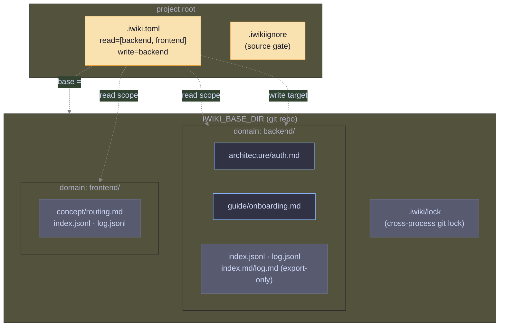

**Binding resolution** (`base.resolve_binding`): `base` comes from `.iwiki.toml`
`base` or `IWIKI_BASE_DIR`; `read`/`write` from `.iwiki.toml`. An empty/absent `read`
defaults the search scope to *all* domains. `write` must equal the current project
domain (the project directory's basename). `wiki_bind` protects an existing non-empty
`read` — it may only *append* the current project domain, never swap the scope.

## MCP tool surface

Every `wiki_*` handler is defined as a plain function, then registered separately
(`mcp.tool()(wiki_*)` at the bottom of `server.py`) so tests call the
implementations directly. Each is wrapped by `@_safe`: it **never raises** —
exceptions become `{"error", "hint"}` dicts.

```mermaid
%%{init: {'theme': 'base', 'themeVariables': {'background': '#1e1e2e', 'primaryColor': '#313244', 'primaryTextColor': '#cdd6f4', 'primaryBorderColor': '#89b4fa', 'lineColor': '#888888'}}}%%
mindmap
  root((wiki_* tools))
    Read:::read
      wiki_search
      wiki_read_page
      wiki_list_pages
      wiki_list_domains
      wiki_related
      wiki_status
    Write:::write
      wiki_write_page
      wiki_update_page
      wiki_delete_page
      wiki_index
      wiki_create_domain
    OKF:::okf
      wiki_migrate_okf
      wiki_apply_okf
      wiki_export_okf
    Health:::health
      wiki_lint
      wiki_remediation_plan
    Config:::cfg
      wiki_bind
      wiki_sync

  classDef read   fill:#89b4fa,color:#1e1e2e,stroke:#74c7ec
  classDef write  fill:#f38ba8,color:#1e1e2e,stroke:#d20f39
  classDef okf    fill:#a6e3a1,color:#1e1e2e,stroke:#40a02b
  classDef health fill:#f9e2af,color:#1e1e2e,stroke:#df8e1d
  classDef cfg    fill:#94e2d5,color:#1e1e2e,stroke:#179299
```

### Cross-cutting error model

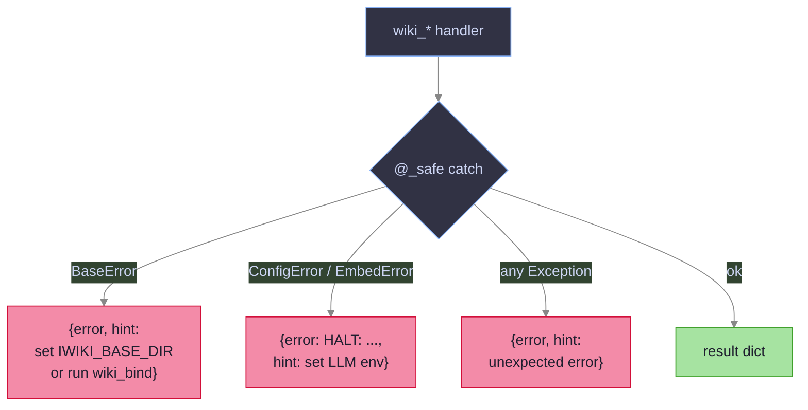

`Config.load()` raises `ConfigError` when `IWIKI_LLM_BASE_URL`/`IWIKI_LLM_KEY` are
unset — surfaced as a `HALT:` error (the stop rule). Missing base/binding raises
`base.BaseError`.

## Startup / process lifecycle

`main()` runs *before* opening MCP stdio: it loads config and sends one probe
request to the embeddings endpoint (`probe_embedding_endpoint`, 10 s timeout, no
retries). A failure prints a redacted diagnostic to stderr and exits `1`.
`iwiki-mcp --help` stays offline (no probe).

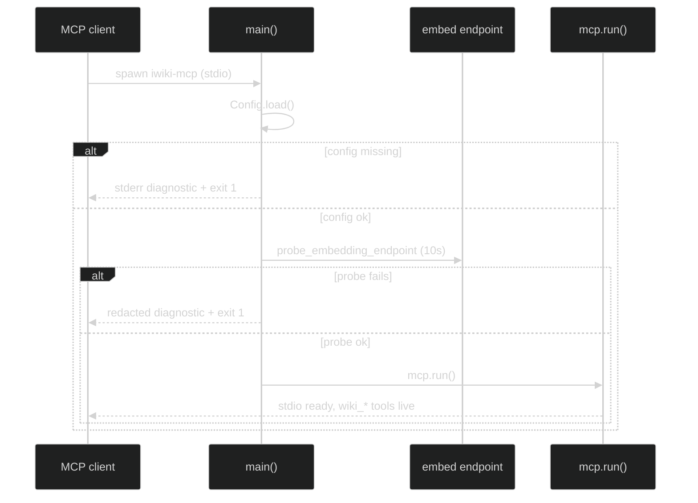

## Write pipeline

`wiki_write_page` is transactional: validate → write file → append ingest log →
re-index, with rollback (delete file, drop the last log line) if any later step
fails. Writes **refuse to overwrite** an existing page (a guarded op). Every mutating
handler first runs `sync.ensure_fresh(base)` — a `diverged` base makes it return
`base diverged from remote` with **zero** side effects. The flow splits into a
guard phase and a transaction phase; both funnel failures into one `@_safe` error
dict.

### Guard phase

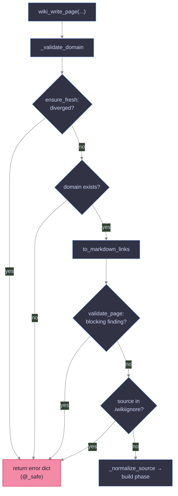

### Transaction phase

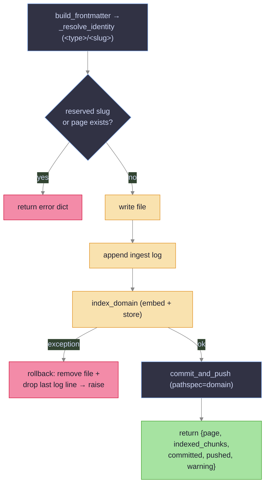

`wiki_update_page` follows the same skeleton but edits **one** `##` section
in-place (`section.replace_section`, which rejects an ambiguous/missing heading),
does a whole-file ingest-log upsert (`upsert_ingest_log` keeps one record per page),
and rolls back by restoring the original bytes. `wiki_delete_page` removes the file,
appends a `delete` log op, reindexes, and rolls back by rewriting the file.

## Indexing pipeline

`indexer.index_domain` re-chunks every page, then **reuses** existing vectors whose
`(hash, dim, schema-version)` still match — only changed/new chunks are embedded. New
vectors are int8-quantized before landing in `index.jsonl`.

### index_domain flow

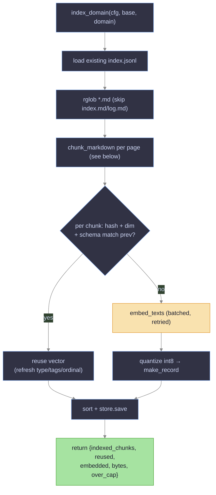

### chunk_markdown

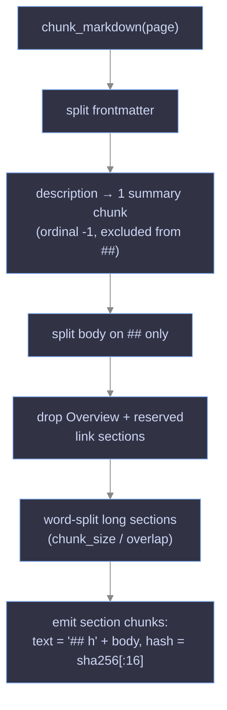

**Chunking model** (`chunk.py`): the frontmatter `description` becomes a single
`kind="summary"` vector (the article seed); every other `##` section becomes one or
more `kind="section"` vectors carrying only that section's own text. `## Overview`
and the reserved link sections (`## Outgoing links` / `## External links`) are never
indexed. Records are int8-quantized (`store.quantize`, per-vector scale) so
`index.jsonl` stays compact; `CAP_BYTES = 8 MiB` flags an `over_cap` domain.

## Retrieval pipeline

`wiki_search` (read intent) runs a **broad multi-signal gather** per domain, fuses
the ranked signals with deterministic Reciprocal Rank Fusion (RRF), then optionally
reranks the hydrated pool through a LiteLLM endpoint. Five independent signals feed
the fusion; each is a ranked list, and RRF rewards a candidate that surfaces in more
than one. The flow is decomposed into four views below.

### Query routing

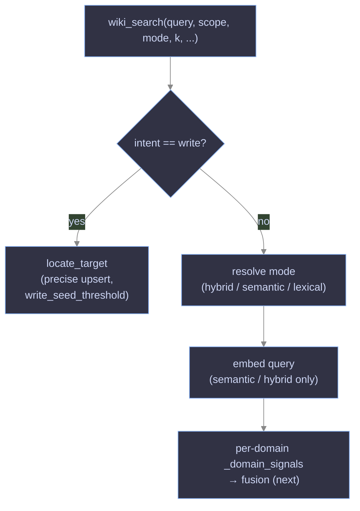

### Signals & fusion

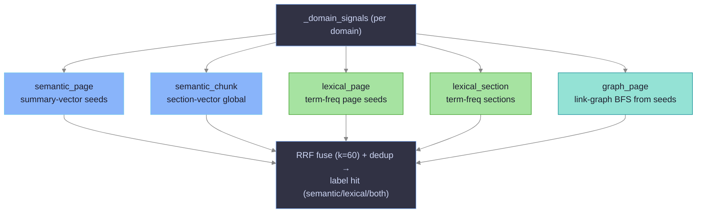

### Rerank & top-k

The fused pool holds up to `max(top_k, 32)` candidates; rerank scores the **full**
pool, then the result is sliced to `top_k`.

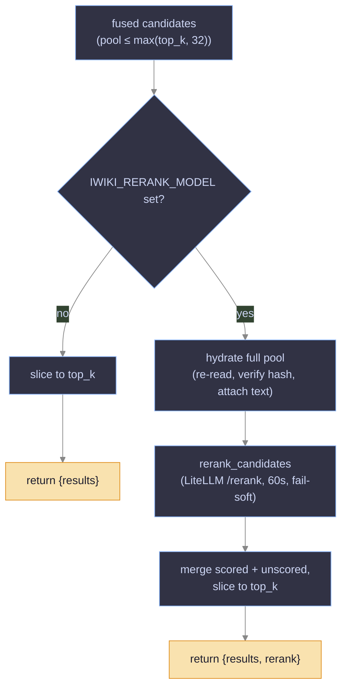

### Two-level semantic retrieval

The semantic side is hierarchical (`hier.py`), ported from obsidian-ai-wiki for
parity: summary vectors **seed** articles above `seed_threshold`, an undirected wiki
link-graph BFS (`graph_depth`, `bfs_top_k`) **expands** those seeds into a candidate
pool, and section vectors are ranked *inside* that pool. This lets a broad query
match a page by its whole-article summary even when no single section vector scores
well. The read path (`_domain_signals`) scores summaries/sections inline and expands
the graph with `hier.rank_graph_pages`; the write-target locate (`intent="write"`,
`retrieval.locate_target`) calls the `hier.py` helpers directly —
`seed_articles` → `expand_graph` → `rank_sections`.

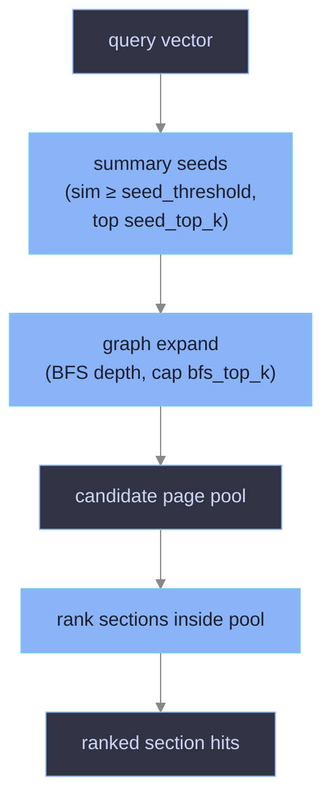

Data-integrity guards in the read path are load-bearing: `retrieval` re-opens each
page under `O_NOFOLLOW`, stamps it (`st_dev`, `st_ino`, `st_size`, `st_mtime_ns`),
and only trusts a lexical/hydrated hit when the live chunk hash still matches the
indexed record — a stale index never leaks wrong text into results. A shared
`page_cache` avoids re-reading a page across signals within one query.

## Git sync & freshness

`sync.py` is best-effort: a non-repo, missing remote, or rebase conflict degrades to
a `warning`/`error` dict, never an exception. Two entry points matter:
`ensure_fresh` (pre-write freshness) and `sync` / `commit_and_push` (publish). All
git mutations serialize through a cross-process `FileLock` at `base/.iwiki/lock`
(`lock.py`) so many client sessions can share one base. Remote URLs and SSH targets
are scrubbed from any surfaced git output (`_sanitize_git_output`).

### `ensure_fresh` state machine

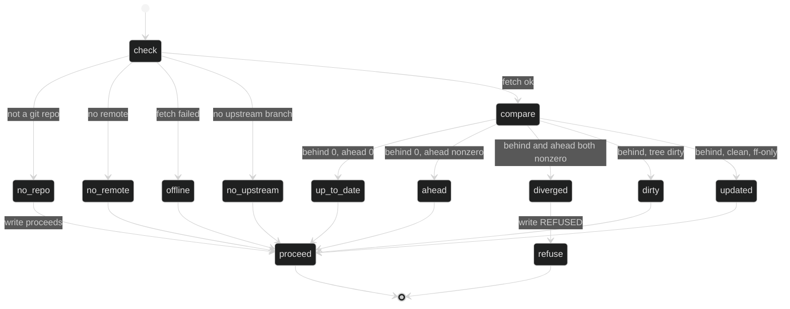

Only `diverged` (local unpushed commits **and** remote moved ahead) blocks the
write; every other state proceeds, threading any `warning` onto the result.

### Publish path (`commit_and_push` → `sync`)

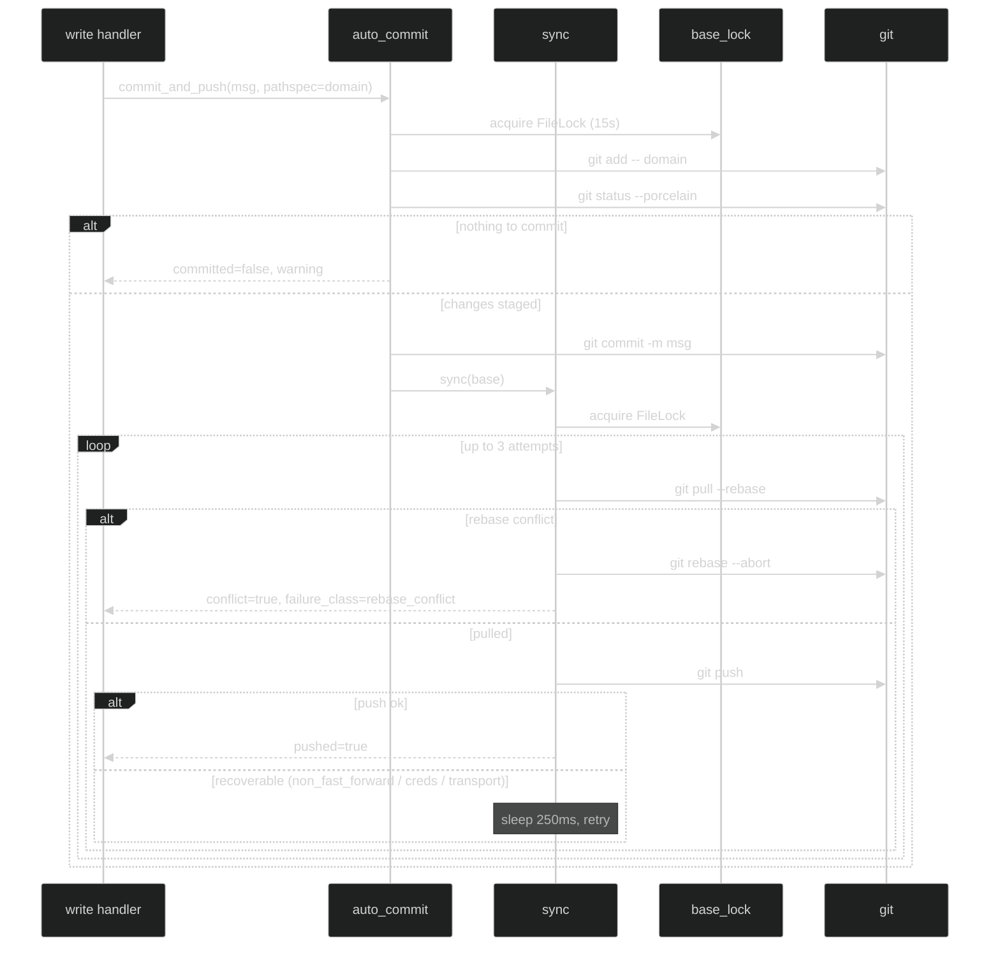

## OKF frontmatter pipeline

Every page carries a YAML frontmatter block above the `# Title` H1
(`frontmatter.py`, a stdlib-only YAML subset — no pyyaml). The write tools fill it.
`type`/`tags` follow a strict precedence, and `type` doubles as the page's directory
segment.

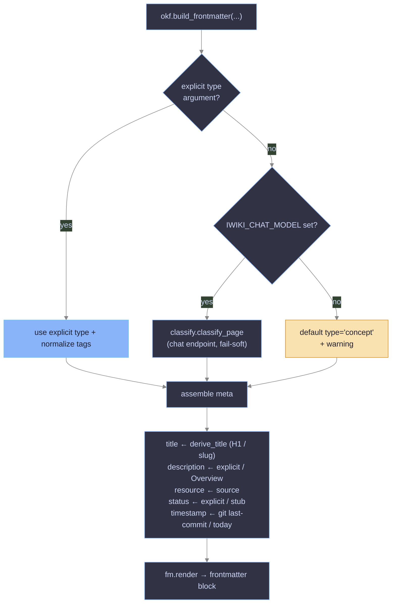

### OKF adoption & layout tools

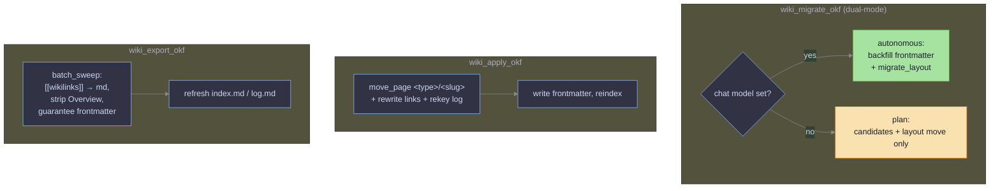

`migrate_layout` moves each flat `<slug>.md` that carries a frontmatter `type` under
`<type>/<slug>.md`, rewriting intra-domain links (`move_page` →
`links.rewrite_link_targets`) and re-keying the ingest log. A target collision is
**skipped and reported**, never clobbered; an unsafe `type` (containing `/`, `..`,
leading `.`) is left in place under `layout_skipped_unsafe`.

## Health checks (`lint`)

`lint.py` is config-free and never embeds — a pure deterministic report used by
`wiki_lint` and `wiki_remediation_plan`. An absent/empty domain is a clean
`{"wiki_present": false}` no-op.

```mermaid
%%{init: {'theme': 'base', 'themeVariables': {'background': '#1e1e2e', 'primaryColor': '#313244', 'primaryTextColor': '#cdd6f4', 'primaryBorderColor': '#89b4fa', 'lineColor': '#888888'}}}%%
flowchart LR
    L["lint(wiki_dir)"] --> B["broken links<br/>(parse_links vs files/anchors)"]
    L --> O["orphans<br/>(unreferenced pages)"]
    L --> S["stale<br/>(src_hash / mtime vs log)"]
    L --> MS["missing_source<br/>(ingest source gone)"]
    L --> LW["legacy_wikilink"]
    L --> SEC["sections<br/>(validate_page findings)"]
    L --> MF["missing_frontmatter"]
    L --> TD["tag_drift<br/>(near-duplicate tags)"]

    classDef actionable fill:#f38ba8,color:#1e1e2e,stroke:#d20f39
    classDef other fill:#f9e2af,color:#1e1e2e,stroke:#df8e1d
    class B,MS actionable
    class O,S,LW,SEC,MF,TD other
```

Every `lint` finding is report-only — none blocks a write (that is `validate_page`'s
job); broken links and `missing_source` are highlighted only as the primary
repair/delete candidates. `wiki_remediation_plan` groups `stale` findings into
`update_candidates` (source
changed, page still valid) and `missing_source` into `delete_candidates`, guarding
each source against `.iwikiignore` and path-escape before reading it.

## Structure validation

`validate_page` enforces the section-formation rules. The **blocking** subset
(`deep_heading`, `pre_h2_text`) is rejected on write; the rest are advisory
(report-only, surfaced by lint).

| Finding | Severity | Rule |
| --- | --- | --- |
| `deep_heading` | block | no `###`+ headings — flatten to `##` |
| `pre_h2_text` | block | no indexable text before the first `##` (only a single `# H1`) |
| `missing_lead` / `long_lead` | advisory | each `##` leads with a ≤250-char paragraph |
| `missing_type` / `unknown_type` | advisory | frontmatter `type` present and in the OKF vocab |
| `missing_description` | advisory | frontmatter has a `description` |
| `unknown_status` | advisory | `status` in `{stub, developing, stable, deprecated}` |

## Configuration & dependencies

Runtime config is entirely env-driven (`engine/config.py`, `Config.load()`); see the
`README.md` **Env reference** for the full table. Key knobs: embeddings
(`IWIKI_EMBED_MODEL`, `IWIKI_EMBED_DIMENSIONS`), search tuning (`IWIKI_TOP_K`,
`IWIKI_SCORE_THRESHOLD`, `IWIKI_SEARCH_MODE`, `IWIKI_SEED_*`, `IWIKI_GRAPH_DEPTH`),
indexing (`IWIKI_CHUNK_SIZE`, `IWIKI_CHUNK_OVERLAP`), and optional
`IWIKI_CHAT_MODEL` / `IWIKI_RERANK_MODEL`.

**External dependencies** (`pyproject.toml`):

| Package | Role |
| --- | --- |
| `mcp` | FastMCP stdio server + tool registration |
| `httpx` | embeddings / chat / rerank HTTP client |
| `numpy` | query-embedding array (float32 cast); cosine itself is pure-Python in `store.py` |
| `pathspec` | gitignore-style `.iwikiignore` matching |
| `filelock` | cross-process git lock on the base |
| `tomli` | `.iwiki.toml` parsing on Python 3.10 (`tomllib` on ≥3.11) |

Dev extra: `pytest`, `pytest-asyncio`, `flake8` (max-line-length 100). Tests never
hit the network — they monkeypatch `indexer.embed_texts` and set dummy `IWIKI_*`
env vars.

## Design invariants (quick reference)

- **Fail-soft handlers.** `@_safe` guarantees a JSON-serializable dict; git and
  embedding failures degrade, never crash.
- **Path-traversal guards run before any filesystem join** — `_validate_domain`,
  `_slug_parts`, `_page_path`, `_contains`, `okf._is_safe_type_segment`,
  `retrieval._domain_file_parts`.
- **Transactional writes** roll back file + log + index on any step failure; writes
  refuse to overwrite.
- **Pre-write freshness** fast-forwards a cleanly-behind base and refuses a
  `diverged` one with zero side effects.
- **Constant duplication is intentional** — `OVERVIEW_HEADING`, `LEAD_MAX`, the
  `_H2` regex, and `RESERVED_*` are copied so config-free modules avoid importing
  `chunk`/`embed`. Change one, change all (the "keep in sync" comments mark them).
- **`VectorStore` is the storage seam** — a future SQLite/sqlite-vec backend only
  needs `load`/`save`/`query`.
- **Domain-relative `file` paths** in the index keep the store machine-portable
  across a shared git base.
