# iwiki-mcp — Architecture

A structural map of the iwiki-mcp server: layers, module dependencies, the on-disk
model, the tool surface, and the core pipelines (write, retrieval, indexing, git
sync, OKF frontmatter). Diagrams are Mermaid, tuned for a dark Obsidian theme.

> Companion to the user-facing `README.md` (install / registration / env reference).
> This document is developer-facing: it explains *how* the pieces fit, not *how to
> set them up*.

## What it is

`iwiki-mcp` has two runtimes: a client-spawned **stdio MCP server** and a hosted
**Streamable HTTP** server bound to loopback behind a TLS reverse proxy. Stdio supports
the original Git base or one locally configured PostgreSQL wiki; hosted HTTP requires
PostgreSQL and selects an isolated wiki from each bearer token. Coding agents author
Markdown pages; the server validates structure, persists and indexes content, and
answers hybrid (vector + lexical + link-graph) search inside the effective domain scope.

The optional `iwiki_mcp.telegram_bot` package is a third, independently deployed
client process, not an MCP server runtime. `TelegramTransport` owns long polling;
`AccessPolicy` denies unknown Telegram IDs before outbound work; `RemoteIwikiClient`
uses one scoped hosted-MCP token; `InferenceClient` calls OpenAI-compatible chat and
audio endpoints; and `ConversationService` keeps only in-memory domain selection and
expiring write previews. It sends inference only content retrieved from the selected
domain. Create and section-update mutations require explicit confirmation, while
updates use a fresh remote revision and section hash without conflict retry. See the
[operator guide](telegram-bot.md).

Three nouns anchor everything:

- **Base** — a Git directory pointed at by `IWIKI_BASE_DIR`, or a PostgreSQL tenant
  selected by local `storage.iwiki_id` or hosted authentication.
- **Domain** — a named wiki partition inside one tenant. Git represents it as an
  immediate base subdirectory with `*.md`, `index.jsonl`, and `log.jsonl`; PostgreSQL
  represents it as tenant-scoped relational rows.
- **Binding** — a project's `.iwiki.toml` declaring which domains it may `read`
  from and the single domain it may `write` to.

## PostgreSQL storage and hosted HTTP

PostgreSQL uses one database-wide `iwiki` schema and separates wikis with `iwiki_id`
on every tenant-owned row and composite constraint. `postgres.migrations` applies
forward-only migrations in one transaction under a database advisory lock before the
runtime starts. It creates only the `iwiki` schema, expects the operator-installed
`vector` extension, and records the embedding model and vector dimension as immutable
storage metadata. A metadata mismatch refuses startup rather than silently mixing
vectors or re-embedding data.

`postgres.store.PostgresStore` owns tenant-scoped page, chunk, link, search, lint, and
optimistic-revision operations. `postgres.auth.AuthStore` stores digested bearer tokens
and separate content/management domain grants. Schema v4 adds default-deny
`tokens.can_create_domain`, `token_domain_management_grants`, and domain-leading indexes
on both grant tables. It is forward-only: there is no down migration, and rollback to an
older binary requires a pre-v4 database restore or compatibility release. `admin`
creates/disables wikis, creates domains, creates/lists/revokes tokens, exposes
`managed_domains`, and provides `token set-create-domain` plus
`token set-domain-management` recovery. No command physically deletes a wiki.

Local PostgreSQL stdio resolves an immutable maximum scope from `.iwiki.toml`, including
`storage.iwiki_id`. Hosted config forbids `iwiki_id`: `http.HostedRuntime` authenticates
the request, derives the tenant and grants, and creates session-owned binding state.
Persistent explicit `selected` scope is separate from request `effective` scope
intersected with fresh grants. A session lock bridges FastMCP dispatch, makes revocation
immediate without persisting transient removal, and prevents newly granted target access
from automatic expansion. `wiki_bind` can only persist narrowing. Project initialization
owns local `.iwiki.toml` and `.iwikiignore`; hosted provisioning never writes them.
Session identifiers used under a different token are indistinguishable from unknown
sessions and expire after bounded inactivity.

Hosted `wiki_create_domain` uses the real request AuthContext and an `AuthStore`
transaction to recheck `can_create_domain`, create the domain, and insert creator
read/write plus `can_manage_grants` authority atomically. It expands only the creator's
selected/effective state after commit or exact idempotent retry. The domain manager tools
`wiki_list_domain_grants`, `wiki_set_domain_grant`, and `wiki_revoke_domain_grant`
pre-authorize current `managed_domains` and recheck authority in SQL. They never mutate
management rows, self-target is denied, and management authority cannot be delegated
through MCP schemas. Operator token revocation retains the token audit row but deletes
its content and management grants in the same transaction.

Authentication retains three statements: token/capability lookup, one domain-rooted
combined query with left joins to content and management grants, and throttled
`last_used_at` update. `eval/auth_grant_latency.py` compares three rounds of 500 complete
legacy/current authentication SQL paths on a fixed 8-content/2-overlapping-management
fixture and fails when median p95 ratio exceeds 1.25. It prints fixture counts and
latency only, never the DSN.

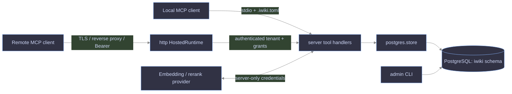
```mermaid
%%{init: {'theme': 'base', 'themeVariables': {'background': '#1e1e2e', 'primaryColor': '#313244', 'primaryTextColor': '#cdd6f4', 'primaryBorderColor': '#89b4fa', 'lineColor': '#888888'}}}%%
flowchart LR
    Local["Local MCP client"] -->|"stdio + .iwiki.toml"| Server["server tool handlers"]
    Remote["Remote MCP client"] -->|"TLS / reverse proxy / Bearer"| HTTP["http HostedRuntime"]
    HTTP -->|"authenticated tenant + grants"| Server
    Server --> Store["postgres.store"]
    Store --> DB[("PostgreSQL: iwiki schema")]
    Admin["admin CLI"] --> DB
    Models["Embedding / rerank provider"] <-->|"server-only credentials"| Server
```

Hosted startup order is strict: parse secret-safe TOML and environment, probe the model
endpoint, open a bounded psycopg pool, run migrations, then let uvicorn accept `/mcp`.
The listener accepts loopback hosts only. Browser `Origin` must exactly match the
normalized allowlist; non-browser clients may omit it, but bearer authentication remains
mandatory. Database, authentication, and authorization failures cross the HTTP boundary
only as sanitized 503, 401, or 403 responses; invalid or mismatched sessions use 404.
Because hosted mode has no server-initiated notifications, authenticated `GET /mcp`
stops at the outer middleware with 405 and `Allow: POST, DELETE`; it never acquires the
per-session request lock or enters FastMCP. Stateful POST dispatch and DELETE termination
continue through the session manager.

Git-only tools fail early with stable `unsupported_storage` data when PostgreSQL is
active. PostgreSQL update/delete require `expected_revision`; a lost optimistic-lock
race returns `conflict` and the current revision. See `README.md` for the complete tool
matrix and operator commands.

## Optional Python code graph

The code graph is an independent local SQLite cache for Python, TypeScript/TSX, and/or
JavaScript source in the bound project. It is not part of the wiki Markdown/vector
index and does not participate in `wiki_search`. `CodeGraphLocationResolver` derives
its database, WAL, SHM, lock, and metadata paths beneath `<base>/.iwiki/` from the
primary domain. The cache is rebuildable and never starts a build during server
startup.

`codegraph.config` loads the `[code_graph]` table from `.iwiki.toml`: `enabled`,
`languages`, `auto_rebuild`, rebuild/file limits, `include_tests`, and safe relative
`exclude` paths. `languages` accepts `python`, `typescript`, and/or `javascript`.
`wiki_code_index` requests a full build for the configured languages; when
`auto_rebuild="bounded"`, a read request may use only its bounded rebuild budget.
Schema-v1 stores are incompatible and replaced by a deterministic full rebuild.
Missing, stale, busy, failed, or incompatible states remain fail-soft and cannot
prevent wiki tools from serving Markdown/vector data.

The MCP boundary contains exactly `wiki_code_status`, `wiki_code_index`,
`wiki_code_search`, and `wiki_code_context`. Search returns typed file/module/symbol
entities. Context accepts exact typed entity-ID seeds (`py:`, `ts:`, or `js:`) and
applies bounded direction, depth, relation, node, file, and source-byte limits;
`include_source` defaults to `false`. Source discovery and source reads enforce
project-root safety.

On PostgreSQL storage the snapshot header — not `[code_graph].languages` — is the
authority for the read path's language filter. `postgres.codegraph`'s reader resolves
the active snapshot first, then `snapshot_language_scope` intersects the header's
declared `languages` with the binary's `KNOWN_LANGUAGES`; `server.wiki_code_search`
passes a request builder that only validates the caller's filter once that scope is
known. This keeps write and read paths on one contract: a hosted server holds no
checkout and its project directory (for HTTP, wherever `server.toml` lives) says
nothing about what was published. A filter outside the snapshot's scope is
`unsupported_language`, distinct from the `invalid_config` a language unknown to the
binary returns; header languages the binary cannot query are dropped and reported in
`warnings`. The local SQLite path is unchanged and still validates against the
project's configured languages.

### Publication application and operator boundary

`codegraph.application` is the shared application service for MCP indexing and the
`iwiki-mcp code publish --project <checkout> [--json]` CLI. It separates local source
context (the checkout rooted at `<project>`) from target binding (the primary domain
selected by `.iwiki.toml`). The source cache for PostgreSQL publishing is local at
`<project>/.iwiki/code-<domain>.sqlite3` and is excluded through `.git/info/exclude`;
the SQLite target/cache has the same project-local location. `publish_mode` selects
exactly one `sqlite`, direct `postgres`, or `mcp` target. PostgreSQL uses the publisher
abstraction rather than raw SQL. MCP publication can address local stdio or remote HTTP;
those targets are equivalent, and no adapter fallback is allowed.

The mode-specific environment boundary admits `IWIKI_DB_PASSWORD` for `postgres` and
`IWIKI_CODE_GRAPH_MCP_URL` plus `IWIKI_CODE_GRAPH_MCP_TOKEN` for `mcp`. Configuration
and invocation enforce checkout-root safety; diagnostics redact password, token, URL,
DSN, and paths in text stderr and compact `--json`. Publication activates a complete
snapshot atomically, so reads see either old or new graph, never staging rows. CLI exits
`0` for ready, `1` for runtime/publication failure, and `2` for usage/configuration
failure.

Operators run or schedule the CLI only on a machine holding checkout. Before
`wiki_code_search` or `wiki_code_context`, they verify `wiki_code_status` reports
`fresh == true`; Markdown-only semantics continue to use separate `wiki_search`. Unified
wiki/code search is future capability, not an implemented interface.

### Shared ECMAScript core

`codegraph/languages/_ecmascript.py` is the framework shared by the TypeScript and
JavaScript adapters: the Tree-sitter walker, the heritage (`extends`/`implements`)
resolver, the ESM `import` extractor, and symbol dedup all live there once. Each
adapter drives that shared walker through a `LanguageProfile` — a frozen dataclass
carrying `language`, `prefix`, `kind_by_node` (extra Tree-sitter node types to
declaration kinds), and three switches: `handles_interface`, `handles_namespace`, and
`object_literal_scope`, plus an optional tuple of `declaration_hooks` the walker calls
for constructs a profile alone can't express. `typescript.py` is now a thin adapter
over this core: it supplies only what is TypeScript-specific — the `typescript`/`tsx`
grammar choice, its `LanguageProfile` (`handles_interface`/`handles_namespace` true,
`enum`/`type_alias` kinds), and the opt-in `tsc` type-boost subprocess. Two committed
pre-refactor baselines (a golden TypeScript adapter snapshot and a Python/TypeScript
run-level row count) guard that the extraction left TypeScript's output byte-identical.

`javascript.py` reuses the same walker with `object_literal_scope=True` and two
`declaration_hooks` — one claims `key: function`/`key: arrow` object-literal methods,
the other claims ES5 `C.prototype.m = ...` assignments, but only when `C` is already a
symbol declared in the same file. It parses with the `tsx` grammar too (a syntactic
superset of JavaScript, so no new dependency), and unlike TypeScript, every JavaScript
file is unconditionally module-backed: there is no top-level import/export probe,
because a CommonJS file that only assigns `module.exports` must still be a resolvable
import target for other files that `require` it. A relative specifier (`./util.js`)
resolves to a project module with its extension stripped, with a `<dir>.index`
fallback for directory imports; this is the mechanism that lets a JavaScript file's
`import`/`require` resolve to a TypeScript module.

`codegraph/resolver.py`'s `LANGUAGE_FAMILIES` scopes reference resolution by language
family: `python` resolves only against `python` declarations; `typescript` and
`javascript` resolve against each other's declarations as well as their own. This
prevents a same-named Python symbol from ever satisfying a JavaScript or TypeScript
reference (and vice versa) purely because the two languages happen to share an
identifier — a collision the pre-family-scoping resolver could not have avoided.

The offline benchmark command is:

```bash
uv run python -m eval.code_graph --fixture-root tests/fixtures/codegraph --output /tmp/iwiki-code-graph-evidence
```

It blocks release when any search warm maximum is not below `<500 ms`. The stricter
`<150 ms` search comparison is reported as non-blocking post-v1 evidence.

Incremental indexing is not part of the Python MVP; it requires a separate
specification and delivery. TypeScript support is Tree-sitter-only static extraction
(declarations, imports, class/interface heritage), not interface members, and does not
yet wire real type information into resolution. JavaScript support is the same
Tree-sitter-only extraction over the shared ECMAScript core described above (see
"Shared ECMAScript core"), across `.js`, `.jsx`, `.mjs`, and `.cjs`.

## Layered architecture

Two layers live under `src/iwiki_mcp/`. The **top layer** is MCP-aware and reaches
side effects (filesystem, git, PostgreSQL, hosted HTTP, model HTTP). The **`engine/` core** is
framework-free and unit-testable without the MCP runtime — several of its modules
(`validate`, `lint`, `links`, `frontmatter`, `okf_artifacts`) are deliberately
kept `httpx`-free and stdlib-only so they import in any project.

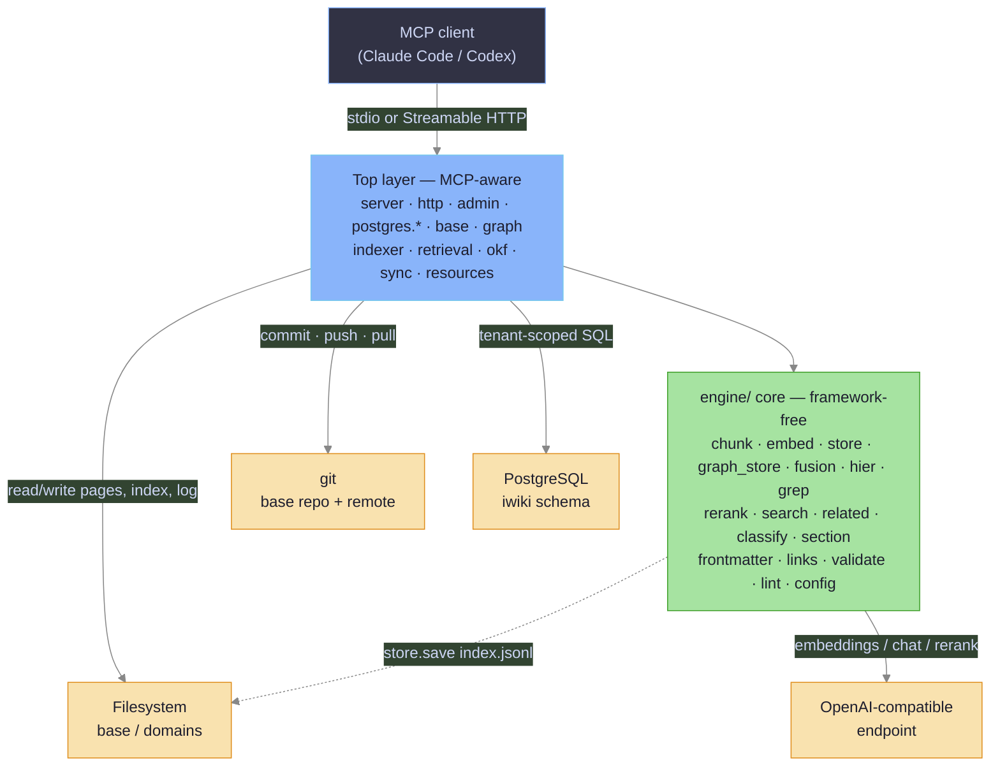
```mermaid
%%{init: {'theme': 'base', 'themeVariables': {'background': '#1e1e2e', 'primaryColor': '#313244', 'primaryTextColor': '#cdd6f4', 'primaryBorderColor': '#89b4fa', 'lineColor': '#888888'}}}%%
flowchart TB
    Client["MCP client<br/>(Claude Code / Codex)"]
    Client -->|"stdio or Streamable HTTP"| Top

    Top["Top layer — MCP-aware<br/>server · http · admin · postgres.* · base · graph<br/>indexer · retrieval · okf · sync · resources"]
    Engine["engine/ core — framework-free<br/>chunk · embed · store · graph_store · fusion · hier · grep<br/>rerank · search · related · classify · section<br/>frontmatter · links · validate · lint · config"]

    Top --> Engine
    Top -->|"read/write pages, index, log"| fs["Filesystem<br/>base / domains"]
    Top -->|"commit · push · pull"| git["git<br/>base repo + remote"]
    Top -->|"tenant-scoped SQL"| pg["PostgreSQL<br/>iwiki schema"]
    Engine -.->|"store.save index.jsonl"| fs
    Engine -->|"embeddings / chat / rerank"| llm["OpenAI-compatible<br/>endpoint"]

    classDef topcls fill:#89b4fa,color:#1e1e2e,stroke:#74c7ec,stroke-width:1px
    classDef engcls fill:#a6e3a1,color:#1e1e2e,stroke:#40a02b
    classDef extcls fill:#f9e2af,color:#1e1e2e,stroke:#df8e1d
    class Top topcls
    class Engine engcls
    class fs,git,pg,llm extcls
```

**Top-layer modules:** `server` (tool surface + storage dispatch), `http` (hosted
authentication, sessions, pool, and uvicorn lifecycle), `admin` (PostgreSQL operator
CLI), `postgres.*` (configuration, migration, authorization, and tenant store), `base` (binding + path
resolve), `graph` (freshness, rebuild, and scoped graph provider), `indexer`
(ingest + index), `retrieval` (multi-signal query), `okf`
(frontmatter assembly), `sync` (git ops), `ignore` (`.iwikiignore` gate), `lock`
(cross-process lock), `resources` (authoring rules).

**Engine modules:** `chunk`, `embed`, `store`, `graph_store`, `fusion`, `hier`, `grep`, `rerank`,
`search`, `related`, `classify`, `section`, `frontmatter`, `links`, `validate`,
`lint`, `config`.

### Layer contract

| Concern | Top layer | Engine core |
| --- | --- | --- |
| Knows about MCP / `FastMCP` | yes (`server.py`, `http.py`) | no |
| Reaches git | `sync.py`, `graph.py` (freshness), and `okf.py` (`git log` for timestamps) | `graph_store.py` delegates only local-cache exclusion to `base.ensure_graph_store_excluded` |
| Reaches the network | `http.py`→PostgreSQL/uvicorn, `postgres.*`→PostgreSQL, `okf.py`→`classify`, indexer/retrieval→`embed`, `server`→`rerank` | only `embed`/`classify`/`rerank` |
| Path-traversal guards | `server._validate_domain` / `_slug_parts` / `_page_path` / `_contains`, `okf._is_safe_type_segment`, `retrieval._domain_file_parts` (all top-layer) | — |
| Config-free / stdlib-only | — | `validate`, `lint`, `links`, `frontmatter`, `okf_artifacts`, `section`, `grep` |

## Module dependencies

Import direction is top → engine except for one narrow cache-bootstrap edge.
`server` dispatches Git bindings to the filesystem modules and PostgreSQL bindings to
`postgres.store`; `http` composes `server`, `postgres.auth`, migrations, the psycopg
pool, and uvicorn without moving transport state into the engine.

`engine.graph_store` calls `base.ensure_graph_store_excluded` before opening the
derived database. It does not import MCP, retrieval, indexing, or sync behaviour.
(`okf`/`indexer`/`retrieval` importing `base` remains top-layer composition.) The
graph is split into three views. Note the deliberate constant duplication:
`OVERVIEW_HEADING`, `LEAD_MAX`,
and the `_H2` regex are copied across `chunk.py`, `validate.py`, `lint.py`,
`section.py`, and `okf.py` so the config-free modules never import `chunk`/`embed`
(keeping `httpx`, pulled in via `embed`, out of them).

### Top-layer composition

`server` drives the orchestration modules; `graph`, `indexer`, `retrieval`, and
`okf` share `base` for path/binding resolution.

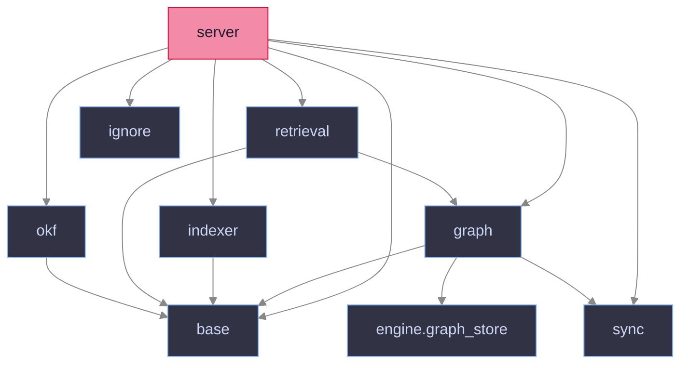
```mermaid
%%{init: {'theme': 'base', 'themeVariables': {'background': '#1e1e2e', 'primaryColor': '#313244', 'primaryTextColor': '#cdd6f4', 'primaryBorderColor': '#89b4fa', 'lineColor': '#888888'}}}%%
flowchart TB
    server["server"] --> base["base"] & graph_mod["graph"] & indexer["indexer"] & retrieval["retrieval"] & okf["okf"] & sync["sync"] & ignore["ignore"]
    graph_mod --> base & sync & graph_store["engine.graph_store"]
    indexer --> base
    retrieval --> base & graph_mod
    okf --> base

    classDef hot fill:#f38ba8,color:#1e1e2e,stroke:#d20f39
    class server hot
```

### Ingest & query → engine primitives

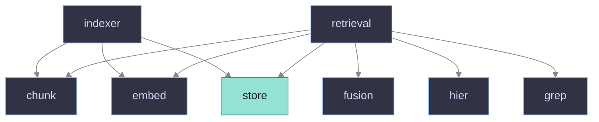
```mermaid
%%{init: {'theme': 'base', 'themeVariables': {'background': '#1e1e2e', 'primaryColor': '#313244', 'primaryTextColor': '#cdd6f4', 'primaryBorderColor': '#89b4fa', 'lineColor': '#888888'}}}%%
flowchart TB
    indexer["indexer"] --> chunk["chunk"] & embed["embed"] & store["store"]
    retrieval["retrieval"] --> fusion["fusion"] & hier["hier"] & grep["grep"]
    retrieval --> chunk & embed & store

    classDef core fill:#94e2d5,color:#1e1e2e,stroke:#179299
    class store core
```

### Engine-internal core

The config-free cluster: `lint`/`validate` fold in `frontmatter`, `links`, and
`okf_artifacts`; `hier`/`related` build on `store` + `links`.

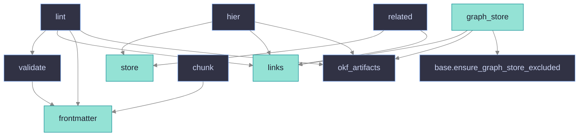
```mermaid
%%{init: {'theme': 'base', 'themeVariables': {'background': '#1e1e2e', 'primaryColor': '#313244', 'primaryTextColor': '#cdd6f4', 'primaryBorderColor': '#89b4fa', 'lineColor': '#888888'}}}%%
flowchart TB
    lint["lint"] --> validate["validate"] & links["links"] & fm["frontmatter"] & okf_art["okf_artifacts"]
    validate --> fm
    chunk["chunk"] --> fm
    hier["hier"] --> store["store"] & links & okf_art
    related["related"] --> store & links
    graph_store["graph_store"] --> links & okf_art & base_exclude["base.ensure_graph_store_excluded"]

    classDef core fill:#94e2d5,color:#1e1e2e,stroke:#179299
    class fm,store,links,graph_store core
```

`frontmatter`, `store`, and `links` (highlighted) are the most-depended-on engine
primitives; `store.VectorStore` is the deliberate seam for a future
SQLite/sqlite-vec swap (callers depend only on `load`/`save`/`query`).

## Storage models

The following on-disk model is authoritative only for Git storage. PostgreSQL stores
the same authored Markdown and derived retrieval records in tenant-scoped relational
tables under `iwiki`; it has no base directory, local graph cache, or automatic Git
commit/sync path. Git import and export are explicit admin operations.

The base is a git repo. Each non-`.`-prefixed subdirectory is a domain. Pages live
at `<type>/<slug>.md` (the frontmatter `type` doubles as the directory). Per-domain
`index.jsonl` and `log.jsonl` sit at the domain root and remain the portable vector
and provenance interchange; a legacy `.iwiki/` subdir is migrated to the root on
first touch (`base.migrate_store_location`). The base-local `.iwiki/graph.sqlite3`
is a Git-excluded, rebuildable SQLite cache for Markdown page links and anchors;
its WAL/SHM files are local too. The base keeps `.iwiki/lock` for the cross-process
Git lock — none of these files is a domain.

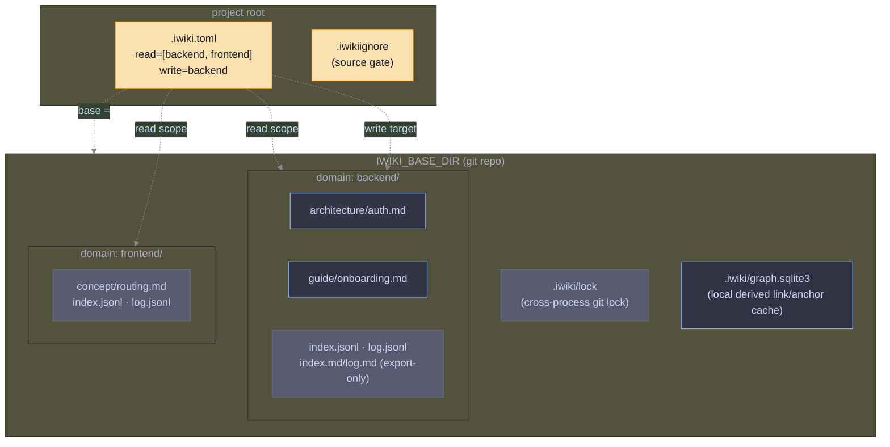
```mermaid
%%{init: {'theme': 'base', 'themeVariables': {'background': '#1e1e2e', 'primaryColor': '#313244', 'primaryTextColor': '#cdd6f4', 'primaryBorderColor': '#89b4fa', 'lineColor': '#888888'}}}%%
flowchart TB
    subgraph baserepo["IWIKI_BASE_DIR (git repo)"]
        meta[".iwiki/lock<br/>(cross-process git lock)"]
        graphdb[".iwiki/graph.sqlite3<br/>(local derived link/anchor cache)"]
        subgraph d1["domain: backend/"]
            b_arch["architecture/auth.md"]
            b_guide["guide/onboarding.md"]
            b_gen["index.jsonl · log.jsonl<br/>index.md/log.md (export-only)"]
        end
        subgraph d2["domain: frontend/"]
            f_all["concept/routing.md<br/>index.jsonl · log.jsonl"]
        end
    end

    subgraph proj["project root"]
        toml[".iwiki.toml<br/>read=[backend, frontend]<br/>write=backend"]
        iwignore[".iwikiignore<br/>(source gate)"]
    end

    toml -.->|"base ="| baserepo
    toml -.->|"read scope"| d1
    toml -.->|"read scope"| d2
    toml -.->|"write target"| d1

    classDef dom fill:#89b4fa,color:#1e1e2e,stroke:#74c7ec
    classDef gen fill:#585b70,color:#cdd6f4,stroke:#6c7086
    classDef cfg fill:#f9e2af,color:#1e1e2e,stroke:#df8e1d
    class b_gen,f_all,meta gen
    class toml,iwignore cfg
```

**Binding resolution** (`base.resolve_binding`): `base` comes from `.iwiki.toml`
`base` or `IWIKI_BASE_DIR`; `read`/`write`/`primary` from `.iwiki.toml`.
An empty/absent `read` defaults the search scope to *all* domains. `write` must equal
the current project domain (the project directory's basename). `primary` must belong
to `write`, and every write domain must stay inside `read`. `wiki_bind` protects an existing non-empty
`read` — it may only *append* the current project domain, never swap the scope.

## MCP tool surface

Every `wiki_*` handler is defined as a plain function, then registered separately
(`mcp.tool()(wiki_*)` at the bottom of `server.py`) so tests call the
implementations directly. Each is wrapped by `@_safe`: it **never raises** —
exceptions become `{"error", "hint"}` dicts.

```mermaid
%%{init: {'theme': 'base', 'themeVariables': {'background': '#1e1e2e', 'primaryColor': '#313244', 'primaryTextColor': '#cdd6f4', 'primaryBorderColor': '#89b4fa', 'lineColor': '#888888'}}}%%
mindmap
  root((wiki_* tools))
    Read:::read
      wiki_search
      wiki_read_page
      wiki_list_pages
      wiki_list_domains
      wiki_related
      wiki_status
    Write:::write
      wiki_write_page
      wiki_update_page
      wiki_insert_section
      wiki_delete_section
      wiki_move_section
      wiki_delete_page
      wiki_index
      wiki_create_domain
    OKF:::okf
      wiki_migrate_okf
      wiki_apply_okf
      wiki_export_okf
    Health:::health
      wiki_lint
      wiki_remediation_plan
    Config:::cfg
      wiki_bind
      wiki_sync

  classDef read   fill:#89b4fa,color:#1e1e2e,stroke:#74c7ec
  classDef write  fill:#f38ba8,color:#1e1e2e,stroke:#d20f39
  classDef okf    fill:#a6e3a1,color:#1e1e2e,stroke:#40a02b
  classDef health fill:#f9e2af,color:#1e1e2e,stroke:#df8e1d
  classDef cfg    fill:#94e2d5,color:#1e1e2e,stroke:#179299
```

### Cross-cutting error model

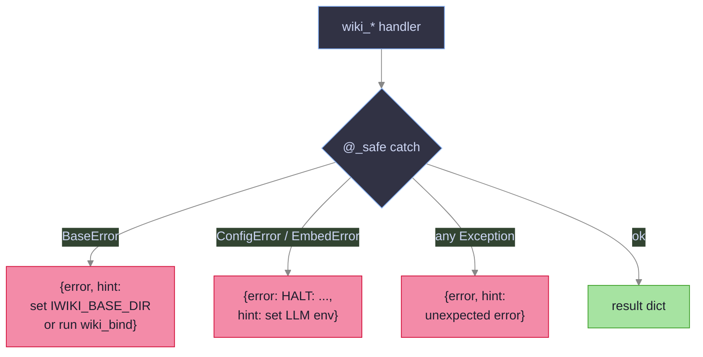
```mermaid
%%{init: {'theme': 'base', 'themeVariables': {'background': '#1e1e2e', 'primaryColor': '#313244', 'primaryTextColor': '#cdd6f4', 'primaryBorderColor': '#89b4fa', 'lineColor': '#888888'}}}%%
flowchart TD
    call["wiki_* handler"] --> safe{"@_safe catch"}
    safe -- "BaseError" --> e1["{error, hint:<br/>set IWIKI_BASE_DIR<br/>or run wiki_bind}"]
    safe -- "ConfigError / EmbedError" --> e2["{error: HALT: ...,<br/>hint: set LLM env}"]
    safe -- "any Exception" --> e3["{error, hint:<br/>unexpected error}"]
    safe -- "ok" --> ok["result dict"]

    classDef halt fill:#f38ba8,color:#1e1e2e,stroke:#d20f39
    classDef good fill:#a6e3a1,color:#1e1e2e,stroke:#40a02b
    class e1,e2,e3 halt
    class ok good
```

`Config.load()` raises `ConfigError` when `IWIKI_LLM_BASE_URL`/`IWIKI_LLM_KEY` are
unset — surfaced as a `HALT:` error (the stop rule). Missing base/binding raises
`base.BaseError`.

PostgreSQL driver errors are caught separately and become a stable
`PostgreSQL operation failed` tool result without connection text or SQL. Git-only
tools under PostgreSQL return `unsupported_storage` before touching local paths. Domain
grant tools outside hosted PostgreSQL return `unsupported_transport` with actual storage
and transport. Missing capabilities or malformed protected envelopes fail before dispatch
in `http._authorize_tool`: for one `tools/call` the refusal is sent by
`_send_tool_access_denied` as a JSON-RPC `-32001 access_denied` error over HTTP 200,
carrying the request's own id; a batch (or any non-object payload) has no single id and
keeps the HTTP 403 `_send_error` path, as do authentication, origin, and session
failures. Transaction-time authority loss returns in-band `access_denied`.

## Startup / process lifecycle

Bare `main()` runs *before* opening MCP stdio: it loads config and sends one probe
request to the embeddings endpoint (`probe_embedding_endpoint`, 10 s timeout, no
retries). For local PostgreSQL it also validates storage config and runs migrations
before stdio starts. A failure prints a redacted diagnostic to stderr and exits `1`.
`iwiki-mcp --help` stays offline (no probe).

`iwiki-mcp serve` follows the stricter hosted startup described above and runs only
Streamable HTTP with PostgreSQL. Admin subcommands load the same server config and run
migrations before their operation, but never start a listener. `--config` overrides
`IWIKI_SERVER_CONFIG`; `--project` belongs only to the bare local stdio parser.

After startup, the stdio transport exits after 1,800 seconds without an incoming
MCP message. Set `IWIKI_IDLE_TIMEOUT_SECONDS=0` to retain the process without an
idle limit. The timeout resets for every incoming message and waits for an active
tool call to finish; a later tool call requires the client to reconnect or spawn
a fresh server process.

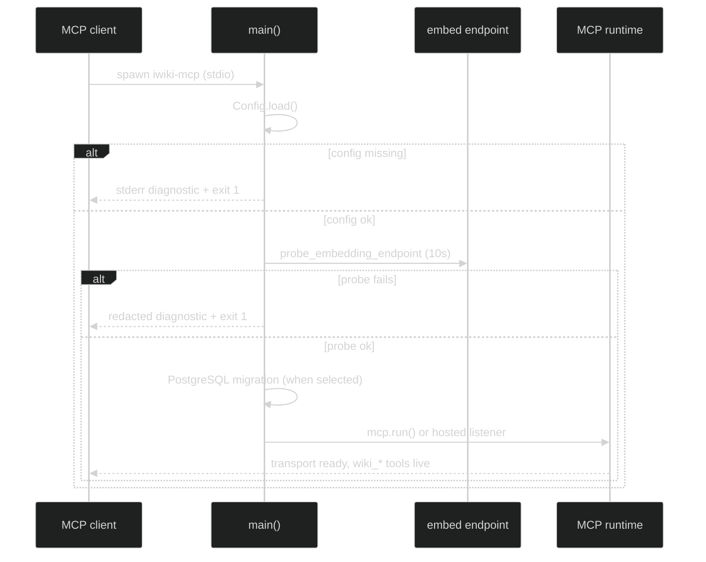
```mermaid
%%{init: {'theme': 'dark'}}%%
sequenceDiagram
    participant C as MCP client
    participant M as main()
    participant E as embed endpoint
    participant R as MCP runtime

    C->>M: spawn iwiki-mcp (stdio)
    M->>M: Config.load()
    alt config missing
        M-->>C: stderr diagnostic + exit 1
    else config ok
        M->>E: probe_embedding_endpoint (10s)
        alt probe fails
            M-->>C: redacted diagnostic + exit 1
        else probe ok
            M->>M: PostgreSQL migration (when selected)
            M->>R: mcp.run() or hosted listener
            R-->>C: transport ready, wiki_* tools live
        end
    end
```

## Write pipeline

`wiki_write_page` is transactional: validate → write file → append ingest log →
re-index, with rollback (delete file, drop the last log line) if any later step
fails. Writes **refuse to overwrite** an existing page (a guarded op). Every mutating
handler first runs `sync.ensure_fresh(base)` — a `diverged` base makes it return
`base diverged from remote` with **zero** side effects. The flow splits into a
guard phase and a transaction phase; both funnel failures into one `@_safe` error
dict.

### Guard phase

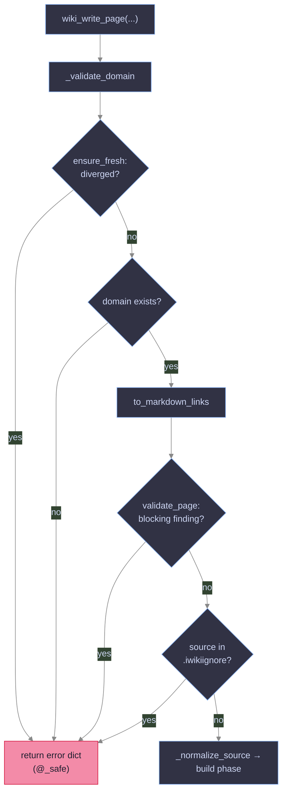
```mermaid
%%{init: {'theme': 'base', 'themeVariables': {'background': '#1e1e2e', 'primaryColor': '#313244', 'primaryTextColor': '#cdd6f4', 'primaryBorderColor': '#89b4fa', 'lineColor': '#888888'}}}%%
flowchart TD
    A["wiki_write_page(...)"] --> B["_validate_domain"]
    B --> C{"ensure_fresh:<br/>diverged?"}
    C -->|"yes"| ERR["return error dict<br/>(@_safe)"]
    C -->|"no"| D{"domain exists?"}
    D -->|"no"| ERR
    D -->|"yes"| E["to_markdown_links"]
    E --> F{"validate_page:<br/>blocking finding?"}
    F -->|"yes"| ERR
    F -->|"no"| G{"source in<br/>.iwikiignore?"}
    G -->|"yes"| ERR
    G -->|"no"| H["_normalize_source →<br/>build phase"]

    classDef stop fill:#f38ba8,color:#1e1e2e,stroke:#d20f39
    class ERR stop
```

### Transaction phase

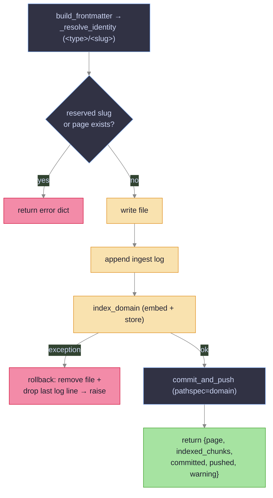
```mermaid
%%{init: {'theme': 'base', 'themeVariables': {'background': '#1e1e2e', 'primaryColor': '#313244', 'primaryTextColor': '#cdd6f4', 'primaryBorderColor': '#89b4fa', 'lineColor': '#888888'}}}%%
flowchart TD
    H["build_frontmatter →<br/>_resolve_identity (&lt;type&gt;/&lt;slug&gt;)"] --> K{"reserved slug<br/>or page exists?"}
    K -->|"yes"| ERR["return error dict"]
    K -->|"no"| T1["write file"]
    T1 --> T2["append ingest log"]
    T2 --> T3["index_domain (embed + store)"]
    T3 -->|"exception"| RB["rollback: remove file +<br/>drop last log line → raise"]
    T3 -->|"ok"| L["commit_and_push (pathspec=domain)"]
    L --> M["return {page, indexed_chunks,<br/>committed, pushed, warning}"]

    classDef stop fill:#f38ba8,color:#1e1e2e,stroke:#d20f39
    classDef good fill:#a6e3a1,color:#1e1e2e,stroke:#40a02b
    classDef tx fill:#f9e2af,color:#1e1e2e,stroke:#df8e1d
    class ERR,RB stop
    class M good
    class T1,T2,T3 tx
```

`wiki_update_page` follows the same skeleton but edits **one** `##` section
in-place (`section.replace_section`, which rejects an ambiguous/missing heading),
does a whole-file ingest-log upsert (`upsert_ingest_log` keeps one record per page),
and rolls back by restoring the original bytes. `wiki_delete_page` removes the file,
appends a `delete` log op, reindexes, and rolls back by rewriting the file.

`wiki_insert_section`, `wiki_delete_section`, and `wiki_move_section` extend this
family with section-granular structural edits — add, remove, or reorder a single `##`
section without touching the rest of the page — sharing `engine/section.py`'s
`list_sections` parser and the same fail-soft/transactional shape and PostgreSQL
`expected_revision` requirement as `wiki_update_page`. `wiki_read_page` accepts an
optional `heading` to return just that section (plus its `section_hash`) instead of
the whole page; `wiki_update_page`, `wiki_delete_section`, and `wiki_move_section`
accept a matching optional `expected_section_hash` as a pre-check layered in front of
`expected_revision`, rejecting a stale hash with `section_conflict`. Page reindexing
after any of these ops reuses unchanged sections' stored embeddings by chunk-hash diff
(`indexer.index_domain` for Git; `PostgresStore._vector_is_current` for PostgreSQL)
instead of re-embedding the whole page on every edit.

### Cross-domain rewrite coordinator

`server` builds immutable page-move or heading-rename edits; `cross_domain` owns
their shared execution. It discovers only the bound visible read set, resolved through
`base.resolve_scope` so an empty `read` means every current domain. Exact relative
links are candidates inside the target domain and exact `iwiki://` links are candidates
across visible domains. Before any file is changed, every candidate domain must belong
to `write`; a visible read-only candidate returns `write_scope_blocked`. Hidden
domains are neither inspected nor reported, so they are never rewritten.

The coordinator acquires `mutation_lock(base)` before recovery, exclusion setup, staged
path validation, snapshotting, Markdown/index/log edits, and the local commit. It stages
only explicit affected Markdown paths plus existing or tracked domain-root `index.jsonl`
and `log.jsonl`; never-created optional logs remain journaled as absent but are omitted
from Git pathspecs. It creates one commit with the `Iwiki-Transaction: <id>` trailer. Push occurs
after the lock and remains fail-soft. This separates canonical portable Markdown/JSONL
from the derived SQLite graph: batch graph refresh happens after the local commit; a
failure marks the affected graph state dirty, with fingerprint-checked Markdown fallback
instead of rolling back canonical files.

The fsynced journal at `.iwiki/transactions/<id>` records snapshots and advances
`prepared` → `applied` → `committed` → `finalized`. Pending journals are recovered under
the same lock before an overlapping mutation. A pre-commit journal restores its snapshots;
a committed journal completes graph-safe finalization. Missing/corrupt or conflicting
Git evidence is ambiguous and stops with `manual_recovery_required`, preserving the
journal for operator repair.

## Indexing pipeline

`indexer.index_domain` re-chunks every page, then **reuses** existing vectors whose
`(hash, dim, schema-version)` still match — only changed/new chunks are embedded. New
vectors are int8-quantized before landing in `index.jsonl`.

### index_domain flow

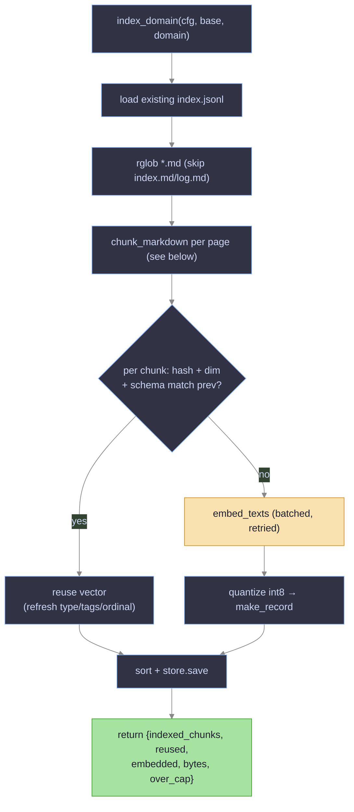
```mermaid
%%{init: {'theme': 'base', 'themeVariables': {'background': '#1e1e2e', 'primaryColor': '#313244', 'primaryTextColor': '#cdd6f4', 'primaryBorderColor': '#89b4fa', 'lineColor': '#888888'}}}%%
flowchart TD
    A["index_domain(cfg, base, domain)"] --> B["load existing index.jsonl"]
    B --> C["rglob *.md (skip index.md/log.md)"]
    C --> D["chunk_markdown per page (see below)"]
    D --> E{"per chunk: hash + dim<br/>+ schema match prev?"}
    E -->|"yes"| F["reuse vector<br/>(refresh type/tags/ordinal)"]
    E -->|"no"| G["embed_texts (batched, retried)"]
    G --> H["quantize int8 → make_record"]
    F --> I["sort + store.save"]
    H --> I
    I --> J["return {indexed_chunks, reused,<br/>embedded, bytes, over_cap}"]

    classDef net fill:#f9e2af,color:#1e1e2e,stroke:#df8e1d
    classDef good fill:#a6e3a1,color:#1e1e2e,stroke:#40a02b
    class G net
    class J good
```

### chunk_markdown

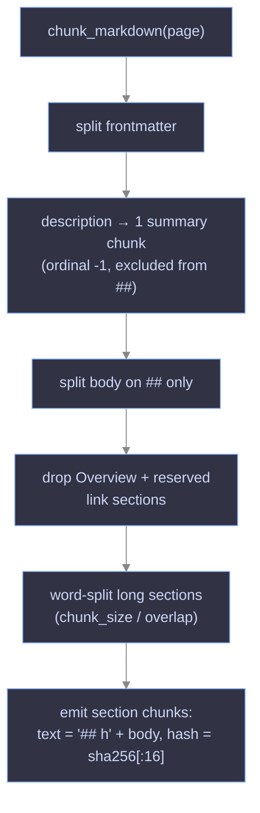
```mermaid
%%{init: {'theme': 'base', 'themeVariables': {'background': '#1e1e2e', 'primaryColor': '#313244', 'primaryTextColor': '#cdd6f4', 'primaryBorderColor': '#89b4fa', 'lineColor': '#888888'}}}%%
flowchart TD
    P["chunk_markdown(page)"] --> S1["split frontmatter"]
    S1 --> S2["description → 1 summary chunk<br/>(ordinal -1, excluded from ##)"]
    S2 --> S3["split body on ## only"]
    S3 --> S4["drop Overview + reserved<br/>link sections"]
    S4 --> S5["word-split long sections<br/>(chunk_size / overlap)"]
    S5 --> S6["emit section chunks:<br/>text = '## h' + body, hash = sha256[:16]"]
```

**Chunking model** (`chunk.py`): the frontmatter `description` becomes a single
`kind="summary"` vector (the article seed); every other `##` section becomes one or
more `kind="section"` vectors carrying only that section's own text. `## Overview`
and the reserved link sections (`## Outgoing links` / `## External links`) are never
indexed. Records are int8-quantized (`store.quantize`, per-vector scale) so
`index.jsonl` stays compact; `CAP_BYTES = 8 MiB` flags an `over_cap` domain.

## Retrieval pipeline

`wiki_search` (read intent) runs a **broad multi-signal gather** per domain, fuses
the ranked signals with deterministic Reciprocal Rank Fusion (RRF), then optionally
reranks the hydrated pool through a LiteLLM endpoint. Five independent signals feed
the fusion; each is a ranked list, and RRF rewards a candidate that surfaces in more
than one. The flow is decomposed into four views below.

### Query routing

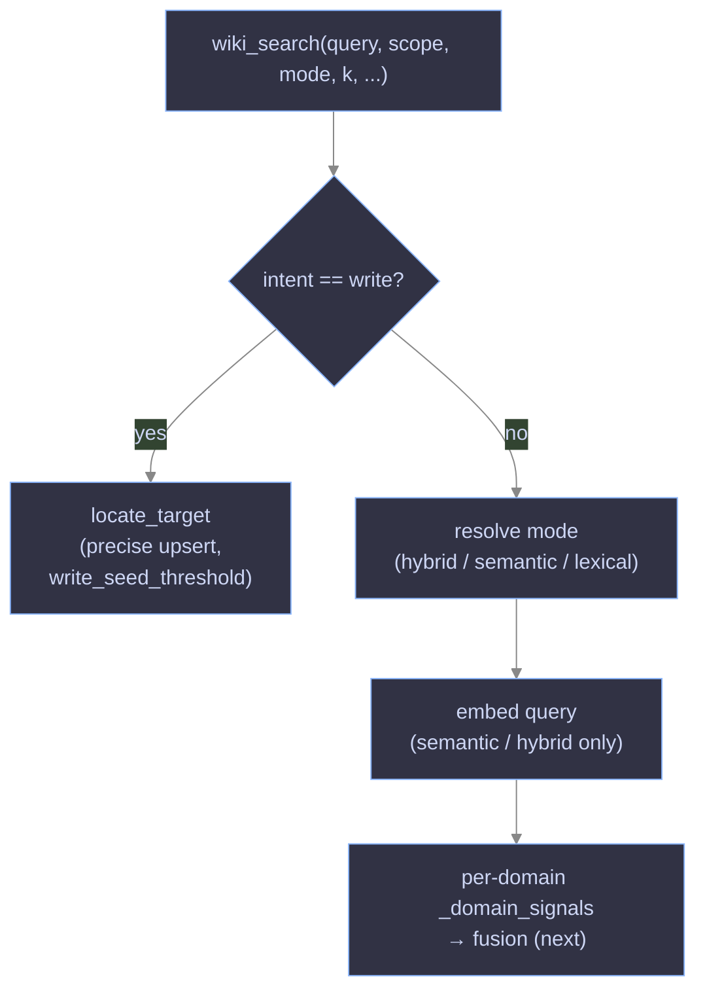
```mermaid
%%{init: {'theme': 'base', 'themeVariables': {'background': '#1e1e2e', 'primaryColor': '#313244', 'primaryTextColor': '#cdd6f4', 'primaryBorderColor': '#89b4fa', 'lineColor': '#888888'}}}%%
flowchart TD
    Q["wiki_search(query, scope, mode, k, ...)"] --> R{"intent == write?"}
    R -->|"yes"| W["locate_target<br/>(precise upsert,<br/>write_seed_threshold)"]
    R -->|"no"| MODE["resolve mode<br/>(hybrid / semantic / lexical)"]
    MODE --> EMB["embed query<br/>(semantic / hybrid only)"]
    EMB --> GATHER["per-domain _domain_signals<br/>→ fusion (next)"]
```

### Signals & fusion

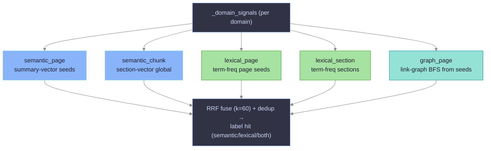
```mermaid
%%{init: {'theme': 'base', 'themeVariables': {'background': '#1e1e2e', 'primaryColor': '#313244', 'primaryTextColor': '#cdd6f4', 'primaryBorderColor': '#89b4fa', 'lineColor': '#888888'}}}%%
flowchart TD
    PER["_domain_signals (per domain)"] --> S1["semantic_page<br/>summary-vector seeds"]
    PER --> S2["semantic_chunk<br/>section-vector global"]
    PER --> S3["lexical_page<br/>term-freq page seeds"]
    PER --> S4["lexical_section<br/>term-freq sections"]
    PER --> S5["graph_page<br/>link-graph BFS from seeds"]
    S1 --> FUSE
    S2 --> FUSE
    S3 --> FUSE
    S4 --> FUSE
    S5 --> FUSE["RRF fuse (k=60) + dedup →<br/>label hit (semantic/lexical/both)"]

    classDef sem fill:#89b4fa,color:#1e1e2e,stroke:#74c7ec
    classDef lex fill:#a6e3a1,color:#1e1e2e,stroke:#40a02b
    classDef gph fill:#94e2d5,color:#1e1e2e,stroke:#179299
    class S1,S2 sem
    class S3,S4 lex
    class S5 gph
```

### Rerank & top-k

The fused pool holds up to `max(top_k, 32)` candidates; rerank scores the **full**
pool, then the result is sliced to `top_k`.

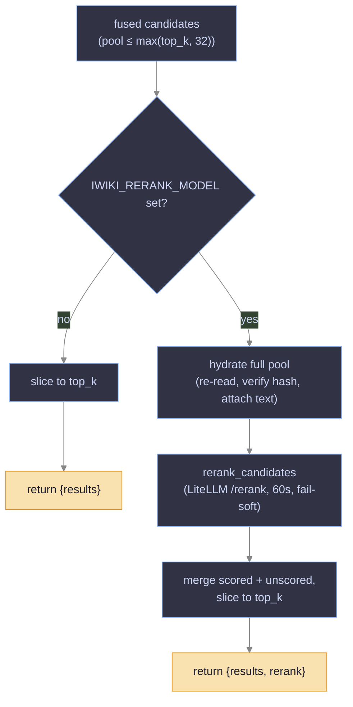
```mermaid
%%{init: {'theme': 'base', 'themeVariables': {'background': '#1e1e2e', 'primaryColor': '#313244', 'primaryTextColor': '#cdd6f4', 'primaryBorderColor': '#89b4fa', 'lineColor': '#888888'}}}%%
flowchart TD
    C["fused candidates<br/>(pool ≤ max(top_k, 32))"] --> RR{"IWIKI_RERANK_MODEL set?"}
    RR -->|"no"| K1["slice to top_k"]
    K1 --> O1["return {results}"]
    RR -->|"yes"| HY["hydrate full pool<br/>(re-read, verify hash, attach text)"]
    HY --> RK["rerank_candidates<br/>(LiteLLM /rerank, 60s, fail-soft)"]
    RK --> K2["merge scored + unscored,<br/>slice to top_k"]
    K2 --> O2["return {results, rerank}"]

    classDef good fill:#f9e2af,color:#1e1e2e,stroke:#df8e1d
    class O1,O2 good
```

### Two-level semantic retrieval

The semantic side is hierarchical (`hier.py`), ported from obsidian-ai-wiki for
parity: summary vectors **seed** articles above `seed_threshold`, an undirected wiki
link-graph BFS (`graph_depth`, `bfs_top_k`) **expands** those seeds into a candidate
pool, and section vectors are ranked *inside* that pool. This lets a broad query
match a page by its whole-article summary even when no single section vector scores
well. The read path (`_domain_signals`) scores summaries/sections inline and expands
the graph with `hier.rank_graph_pages`; the write-target locate (`intent="write"`,
`retrieval.locate_target`) calls the `hier.py` helpers directly —
`seed_articles` → `expand_graph` → `rank_sections`.

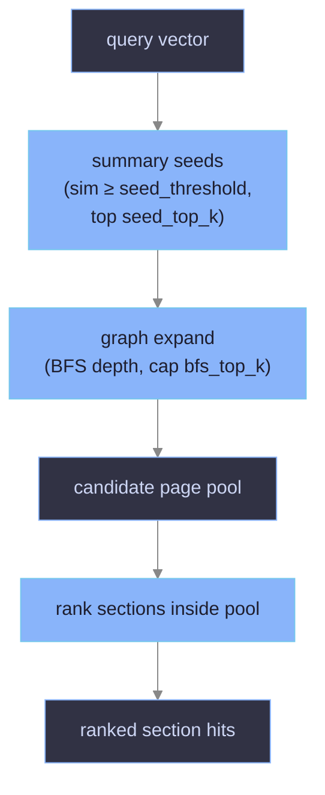
```mermaid
%%{init: {'theme': 'base', 'themeVariables': {'background': '#1e1e2e', 'primaryColor': '#313244', 'primaryTextColor': '#cdd6f4', 'primaryBorderColor': '#89b4fa', 'lineColor': '#888888'}}}%%
flowchart TB
    QV["query vector"] --> SEED["summary seeds<br/>(sim ≥ seed_threshold,<br/>top seed_top_k)"]
    SEED --> EXP["graph expand<br/>(BFS depth, cap bfs_top_k)"]
    EXP --> POOL["candidate page pool"]
    POOL --> RANK["rank sections inside pool"]
    RANK --> RES["ranked section hits"]

    classDef step fill:#89b4fa,color:#1e1e2e,stroke:#74c7ec
    class SEED,EXP,RANK step
```

Data-integrity guards in the read path are load-bearing: `retrieval` re-opens each
page under `O_NOFOLLOW`, stamps it (`st_dev`, `st_ino`, `st_size`, `st_mtime_ns`),
and only trusts a lexical/hydrated hit when the live chunk hash still matches the
indexed record — a stale index never leaks wrong text into results. A shared
`page_cache` avoids re-reading a page across signals within one query.

## Git sync & freshness

`sync.py` is best-effort: a non-repo, missing remote, or rebase conflict degrades to
a `warning`/`error` dict, never an exception. Two entry points matter:
`ensure_fresh` (pre-write freshness) and `sync` / `commit_and_push` (publish). All
git mutations serialize through a cross-process `FileLock` at `base/.iwiki/lock`
(`lock.py`) so many client sessions can share one base. Remote URLs and SSH targets
are scrubbed from any surfaced git output (`_sanitize_git_output`).

### `ensure_fresh` state machine

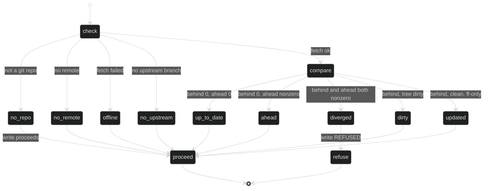
```mermaid
%%{init: {'theme': 'dark'}}%%
stateDiagram-v2
    [*] --> check
    check --> no_repo : not a git repo
    check --> no_remote : no remote
    check --> offline : fetch failed
    check --> no_upstream : no upstream branch
    check --> compare : fetch ok
    compare --> up_to_date : behind 0, ahead 0
    compare --> ahead : behind 0, ahead nonzero
    compare --> diverged : behind and ahead both nonzero
    compare --> dirty : behind, tree dirty
    compare --> updated : behind, clean, ff-only

    diverged --> refuse : write REFUSED
    no_repo --> proceed : write proceeds
    no_remote --> proceed
    offline --> proceed
    no_upstream --> proceed
    up_to_date --> proceed
    ahead --> proceed
    dirty --> proceed
    updated --> proceed
    refuse --> [*]
    proceed --> [*]
```

Only `diverged` (local unpushed commits **and** remote moved ahead) blocks the
write; every other state proceeds, threading any `warning` onto the result.

### Publish path (`commit_and_push` → `sync`)

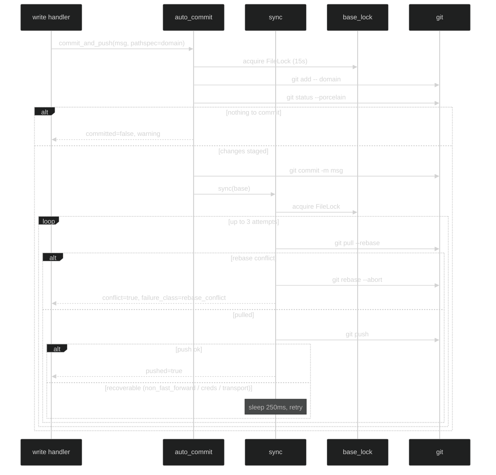
```mermaid
%%{init: {'theme': 'dark'}}%%
sequenceDiagram
    participant H as write handler
    participant AC as auto_commit
    participant SY as sync
    participant L as base_lock
    participant G as git

    H->>AC: commit_and_push(msg, pathspec=domain)
    AC->>L: acquire FileLock (15s)
    AC->>G: git add -- domain
    AC->>G: git status --porcelain
    alt nothing to commit
        AC-->>H: committed=false, warning
    else changes staged
        AC->>G: git commit -m msg
        AC->>SY: sync(base)
        SY->>L: acquire FileLock
        loop up to 3 attempts
            SY->>G: git pull --rebase
            alt rebase conflict
                SY->>G: git rebase --abort
                SY-->>H: conflict=true, failure_class=rebase_conflict
            else pulled
                SY->>G: git push
                alt push ok
                    SY-->>H: pushed=true
                else recoverable (non_fast_forward / creds / transport)
                    Note over SY: sleep 250ms, retry
                end
            end
        end
    end
```

## OKF frontmatter pipeline

Every page carries a YAML frontmatter block above the `# Title` H1
(`frontmatter.py`, a stdlib-only YAML subset — no pyyaml). The write tools fill it.
`type`/`tags` follow a strict precedence, and `type` doubles as the page's directory
segment.

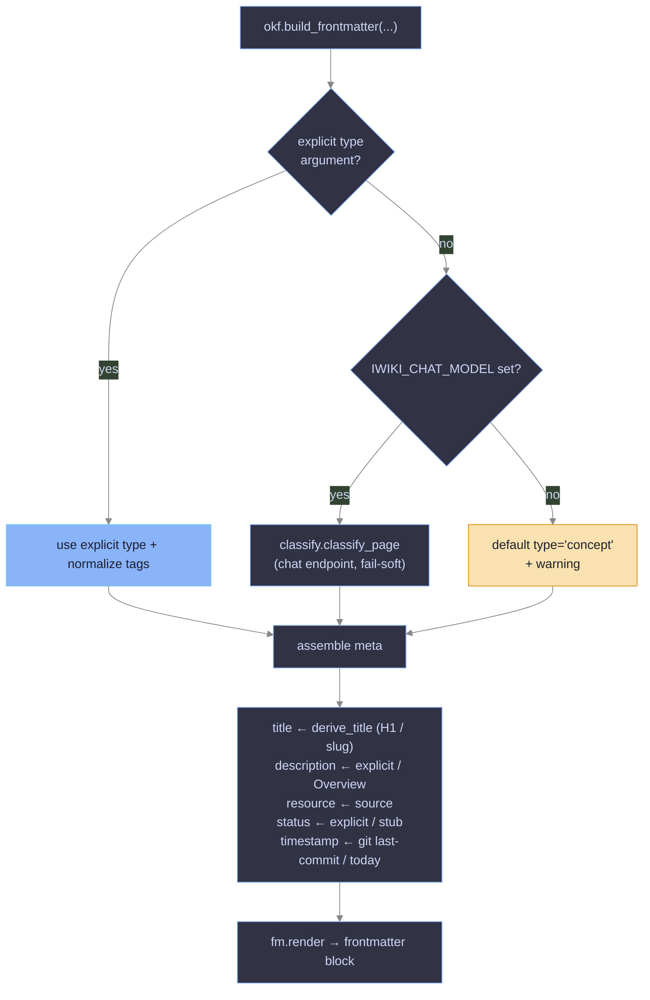
```mermaid
%%{init: {'theme': 'base', 'themeVariables': {'background': '#1e1e2e', 'primaryColor': '#313244', 'primaryTextColor': '#cdd6f4', 'primaryBorderColor': '#89b4fa', 'lineColor': '#888888'}}}%%
flowchart TD
    A["okf.build_frontmatter(...)"] --> B{"explicit type<br/>argument?"}
    B -->|"yes"| C["use explicit type + normalize tags"]
    B -->|"no"| D{"IWIKI_CHAT_MODEL set?"}
    D -->|"yes"| E["classify.classify_page<br/>(chat endpoint, fail-soft)"]
    D -->|"no"| F["default type='concept'<br/>+ warning"]
    C --> G["assemble meta"]
    E --> G
    F --> G
    G --> H["title ← derive_title (H1 / slug)<br/>description ← explicit / Overview<br/>resource ← source<br/>status ← explicit / stub<br/>timestamp ← git last-commit / today"]
    H --> I["fm.render → frontmatter block"]

    classDef pri fill:#89b4fa,color:#1e1e2e,stroke:#74c7ec
    classDef def fill:#f9e2af,color:#1e1e2e,stroke:#df8e1d
    class C pri
    class F def
```

### OKF adoption & layout tools

```mermaid
%%{init: {'theme': 'base', 'themeVariables': {'background': '#1e1e2e', 'primaryColor': '#313244', 'primaryTextColor': '#cdd6f4', 'primaryBorderColor': '#89b4fa', 'lineColor': '#888888'}}}%%
flowchart TB
    subgraph mig["wiki_migrate_okf (dual-mode)"]
        M1{"chat model set?"}
        M1 -->|"yes"| M2["autonomous:<br/>backfill frontmatter<br/>+ migrate_layout"]
        M1 -->|"no"| M3["plan:<br/>candidates + layout move only"]
    end
    subgraph app["wiki_apply_okf"]
        A1["move_page &lt;type&gt;/&lt;slug&gt;<br/>+ rewrite links + rekey log"]
        A1 --> A2["write frontmatter, reindex"]
    end
    subgraph exp["wiki_export_okf"]
        E1["batch_sweep:<br/>[[wikilinks]] → md,<br/>strip Overview,<br/>guarantee frontmatter"]
        E1 --> E2["refresh index.md / log.md"]
    end

    classDef auto fill:#a6e3a1,color:#1e1e2e,stroke:#40a02b
    classDef plan fill:#f9e2af,color:#1e1e2e,stroke:#df8e1d
    class M2 auto
    class M3 plan
```

`migrate_layout` moves each flat `<slug>.md` that carries a frontmatter `type` under
`<type>/<slug>.md`, rewriting intra-domain links (`move_page` →
`links.rewrite_link_targets`) and re-keying the ingest log. A target collision is
**skipped and reported**, never clobbered; an unsafe `type` (containing `/`, `..`,
leading `.`) is left in place under `layout_skipped_unsafe`.

## Health checks (`lint`)

`lint.py` is config-free and never embeds — a deterministic Markdown-authoritative
report used by `wiki_lint` and `wiki_remediation_plan`. It separately reads SQLite
parity without creating, repairing, or rebuilding the cache: a quiescent WAL cache
is inspected from an isolated temporary snapshot, while a changing snapshot reports
sanitized `busy`. An absent/empty legacy direct lint call is a clean
`{"wiki_present": false}` no-op; explicit server-domain lint still reports graph
parity so stale rows are visible.

```mermaid
%%{init: {'theme': 'base', 'themeVariables': {'background': '#1e1e2e', 'primaryColor': '#313244', 'primaryTextColor': '#cdd6f4', 'primaryBorderColor': '#89b4fa', 'lineColor': '#888888'}}}%%
flowchart LR
    L["lint(wiki_dir)"] --> B["broken links<br/>(structured links vs visible pages/anchors)"]
    L --> O["orphans<br/>(unreferenced pages)"]
    L --> S["stale<br/>(src_hash / mtime vs log)"]
    L --> MS["missing_source<br/>(ingest source gone)"]
    L --> LW["legacy_wikilink"]
    L --> SEC["sections<br/>(validate_page findings)"]
    L --> MF["missing_frontmatter"]
    L --> TD["tag_drift<br/>(near-duplicate tags)"]
    L --> RT["reserved_target / unavailable_domain"]
    L --> GP["read-only graph parity<br/>(state · fingerprint · pages · edges · anchors)"]

    classDef actionable fill:#f38ba8,color:#1e1e2e,stroke:#d20f39
    classDef other fill:#f9e2af,color:#1e1e2e,stroke:#df8e1d
    class B,MS actionable
    class O,S,LW,SEC,MF,TD,RT,GP other
```

Every `lint` finding is report-only — none blocks a write (that is `validate_page`'s
job); broken links and `missing_source` are highlighted only as the primary
repair/delete candidates. `wiki_remediation_plan` groups `stale` findings into
`update_candidates` (source
changed, page still valid) and `missing_source` into `delete_candidates`, guarding
each source against `.iwikiignore` and path-escape before reading it.

## Structure validation

`validate_page` enforces the section-formation rules. The **blocking** subset
(`deep_heading`, `pre_h2_text`) is rejected on write; the rest are advisory
(report-only, surfaced by lint).

| Finding | Severity | Rule |
| --- | --- | --- |
| `deep_heading` | block | no `###`+ headings — flatten to `##` |
| `pre_h2_text` | block | no indexable text before the first `##` (only a single `# H1`) |
| `missing_lead` / `long_lead` | advisory | each `##` leads with a ≤250-char paragraph |
| `missing_type` / `unknown_type` | advisory | frontmatter `type` present and in the OKF vocab |
| `missing_description` | advisory | frontmatter has a `description` |
| `unknown_status` | advisory | `status` in `{stub, developing, stable, deprecated}` |

## Configuration & dependencies

Model config and credentials are env-driven (`engine/config.py`, `Config.load()`),
while storage addresses and hosted limits are strict TOML (`postgres.config`); see the
`README.md` **Env reference** and deployment examples. Key knobs: embeddings
(`IWIKI_EMBED_MODEL`, `IWIKI_EMBED_DIMENSIONS`), search tuning (`IWIKI_TOP_K`,
`IWIKI_SCORE_THRESHOLD`, `IWIKI_SEARCH_MODE`, `IWIKI_SEED_*`, `IWIKI_GRAPH_DEPTH`),
indexing (`IWIKI_CHUNK_SIZE`, `IWIKI_CHUNK_OVERLAP`), and optional
`IWIKI_CHAT_MODEL` / `IWIKI_RERANK_MODEL`. `IWIKI_IDLE_TIMEOUT_SECONDS` controls
the stdio idle shutdown and defaults to 1,800 seconds; `0` disables it.

PostgreSQL TOML deliberately excludes passwords and model settings. Local stdio adds
`storage.iwiki_id`; hosted config forbids it and requires loopback host, normalized
`allowed_origins`, bounded pool sizes, and positive statement/lock timeouts. Runtime
secrets are `IWIKI_DB_PASSWORD`, `IWIKI_LLM_KEY`, and the model endpoint environment.

**External dependencies** (`pyproject.toml`):

| Package | Role |
| --- | --- |
| `mcp` | FastMCP stdio server + tool registration |
| `httpx` | embeddings / chat / rerank HTTP client |
| `numpy` | query-embedding array (float32 cast); cosine itself is pure-Python in `store.py` |
| `pathspec` | gitignore-style `.iwikiignore` matching |
| `filelock` | cross-process git lock on the base |
| `tomli` | `.iwiki.toml` parsing on Python 3.10 (`tomllib` on ≥3.11) |
| `psycopg` / `psycopg-pool` | PostgreSQL driver and bounded hosted connection pool |
| `pgvector` | PostgreSQL vector adaptation and similarity storage |
| `uvicorn` | loopback ASGI server for hosted Streamable HTTP |

Dev extra: `pytest`, `pytest-asyncio`, `flake8` (max-line-length 100). Tests never
hit the network — they monkeypatch `indexer.embed_texts` and set dummy `IWIKI_*`
env vars.

## Design invariants (quick reference)

- **Fail-soft handlers.** `@_safe` guarantees a JSON-serializable dict; git and
  embedding failures degrade, never crash.
- **Path-traversal guards run before any filesystem join** — `_validate_domain`,
  `_slug_parts`, `_page_path`, `_contains`, `okf._is_safe_type_segment`,
  `retrieval._domain_file_parts`.
- **Transactional writes** roll back file + log + index on any step failure; writes
  refuse to overwrite.
- **Tenant isolation is structural.** PostgreSQL rows and constraints carry `iwiki_id`;
  every store is created with immutable authenticated scope.
- **Optimistic PostgreSQL mutations.** Update/delete require a current revision and
  return stable conflicts instead of overwriting concurrent changes.
- **Hosted startup is fail-closed.** Config, model probe, pool, and migrations succeed
  before the listener accepts traffic; credentials never enter status or error payloads.
- **Pre-write freshness** fast-forwards a cleanly-behind base and refuses a
  `diverged` one with zero side effects.
- **Constant duplication is intentional** — `OVERVIEW_HEADING`, `LEAD_MAX`, the
  `_H2` regex, and `RESERVED_*` are copied so config-free modules avoid importing
  `chunk`/`embed`. Change one, change all (the "keep in sync" comments mark them).
- **`VectorStore` is the storage seam** — a future SQLite/sqlite-vec backend only
  needs `load`/`save`/`query`.
- **Domain-relative `file` paths** in the index keep the store machine-portable
  across a shared git base.
