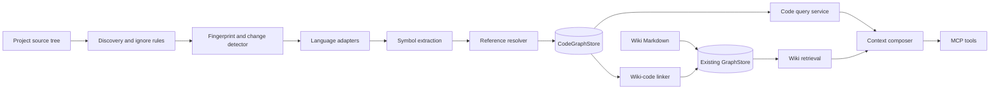

# Техническое задание: интеграция графа кода в `iwiki-mcp`

**Статус:** рабочая версия для обсуждения  
**Версия:** 1.0
**Репозиторий:** `ikeniborn/iwiki-mcp`  
**Назначение:** основа для архитектурной спецификации, плана реализации, оценки трудоёмкости и критериев приёмки.

---

## 1. Цель

Добавить в `iwiki-mcp` производный граф программного кода для точного получения агентами структурного контекста проекта:

- файлы, модули и символы;
- импорты и экспорты;
- объявления классов, функций и методов;
- вызовы;
- наследование и реализации;
- обратные зависимости;
- область влияния изменений;
- связь кода с Wiki-страницами;
- компактный bounded context для MCP-клиентов.

Граф кода дополняет существующую Wiki и граф Markdown-ссылок, но не заменяет их.

## 2. Исходное состояние

`iwiki-mcp` — Python MCP-сервер через `stdio`. Текущее решение:

- хранит Wiki в Git-синхронизируемом Markdown;
- делит Wiki на домены;
- хранит переносимый векторный индекс в `index.jsonl`;
- хранит ingest-журнал в `log.jsonl`;
- использует локальный SQLite-кэш `.iwiki/wiki-graph.sqlite3`;
- строит граф Wiki-страниц, заголовков и Markdown-ссылок;
- поддерживает lexical, semantic и hybrid retrieval;
- применяет bounded graph expansion;
- использует fingerprint и состояния `ready`, `dirty`, `rebuilding`;
- допускает fallback при недоступности графового кэша;
- реализует fail-soft MCP handlers.

Текущий Wiki-граф содержит `domains`, `pages`, `anchors`, `edges`. Он не предназначен для AST и code relations.

## 3. Базовые архитектурные решения

1. Создать отдельный `CodeGraphStore`.
2. Не расширять текущие `pages` и `edges` кодовыми узлами.
3. Считать исходный код источником истины, граф — rebuildable cache.
4. Не хранить полный AST/CST.
5. Хранить нормализованные символы, диапазоны, сигнатуры и отношения.
6. Не выполнять полную индексацию при старте MCP.
7. Не менять контракт `wiki_search` в MVP.
8. Не отправлять исходный код во внешние embeddings в MVP.
9. Ограничивать глубину, число узлов, файлов и объём source context.
10. Ошибка code graph не должна блокировать Wiki tools.
11. Для MVP использовать SQLite, не внешнюю graph DB.
12. Сохранять unresolved и ambiguous references, а не отбрасывать их.

## 4. Целевая архитектура



## 5. Предлагаемая структура модулей

```text
src/iwiki_mcp/
├── codegraph/
│   ├── __init__.py
│   ├── models.py
│   ├── schema.py
│   ├── store.py
│   ├── runtime.py
│   ├── fingerprint.py
│   ├── discovery.py
│   ├── indexer.py
│   ├── resolver.py
│   ├── query.py
│   ├── context.py
│   ├── linking.py
│   └── languages/
│       ├── base.py
│       ├── python.py
│       ├── typescript.py
│       └── javascript.py
├── engine/
├── server.py
└── ...
```

`server.py` остаётся композиционным корнем и местом регистрации MCP tools. SQL, парсинг и обход графа в него не помещать.

## 6. Хранилище

### 6.1. Wiki-граф

```text
IWIKI_BASE_DIR/.iwiki/wiki-graph.sqlite3
```

### 6.2. Граф кода

Для каждого проектного домена создаётся отдельная SQLite-БД непосредственно в `.iwiki`:

```text
IWIKI_BASE_DIR/.iwiki/code-<domain>.sqlite3
```

Служебные файлы:

```text
IWIKI_BASE_DIR/.iwiki/code-<domain>.sqlite3-wal
IWIKI_BASE_DIR/.iwiki/code-<domain>.sqlite3-shm
IWIKI_BASE_DIR/.iwiki/code-<domain>.lock
IWIKI_BASE_DIR/.iwiki/code-<domain>.metadata.json
```

Пример:

```text
IWIKI_BASE_DIR/
└── .iwiki/
    ├── wiki-graph.sqlite3
    ├── wiki-graph.sqlite3-wal
    ├── wiki-graph.sqlite3-shm
    ├── lock
    ├── code-backend.sqlite3
    ├── code-backend.sqlite3-wal
    ├── code-backend.sqlite3-shm
    ├── code-backend.lock
    ├── code-backend.metadata.json
    ├── code-frontend.sqlite3
    └── ...
```

Правила:

- `<domain>` берётся из существующего server binding;
- дополнительный `project-id` не вводится;
- вложенный каталог `code-graphs/<domain>/` не используется;
- Wiki-граф и графы кода хранятся вне Git;
- графы кода не размещаются внутри Wiki-доменов;
- один проектный домен соответствует одному активному рабочему контексту;
- `checkout-id` не используется;
- путь проекта, Git revision, worktree fingerprint, schema version и parser versions сохраняются в `code-<domain>.metadata.json`;
- физические пути вычисляет `CodeGraphLocationResolver`.

Требования SQLite:

- WAL mode;
- foreign keys;
- busy timeout;
- schema versioning;
- integrity check;
- atomic replace полной пересборки;
- один writer;
- запрет чтения частично построенной БД;
- отдельный `code-<domain>.lock`;
- восстановление через полную пересборку.

Git ignore:

```text
.iwiki/wiki-graph.sqlite3
.iwiki/wiki-graph.sqlite3-wal
.iwiki/wiki-graph.sqlite3-shm
.iwiki/code-*.sqlite3
.iwiki/code-*.sqlite3-wal
.iwiki/code-*.sqlite3-shm
.iwiki/code-*.lock
.iwiki/code-*.metadata.json
```

## 7. Модель данных

### 7.1. Репозитории

```sql
CREATE TABLE repositories (
    repository_id TEXT PRIMARY KEY,
    root_path TEXT NOT NULL,
    git_remote TEXT,
    git_commit TEXT,
    source_fingerprint TEXT NOT NULL,
    config_fingerprint TEXT NOT NULL,
    parser_fingerprint TEXT NOT NULL,
    state TEXT NOT NULL
        CHECK (state IN ('ready', 'dirty', 'rebuilding', 'failed')),
    indexed_at TEXT NOT NULL
);
```

### 7.2. Файлы

```sql
CREATE TABLE files (
    file_id TEXT PRIMARY KEY,
    repository_id TEXT NOT NULL,
    path TEXT NOT NULL,
    language TEXT NOT NULL,
    content_hash TEXT NOT NULL,
    parser_version TEXT NOT NULL,
    size_bytes INTEGER NOT NULL,
    UNIQUE(repository_id, path)
);
```

### 7.3. Символы

```sql
CREATE TABLE symbols (
    symbol_id TEXT PRIMARY KEY,
    file_id TEXT NOT NULL,
    kind TEXT NOT NULL,
    qualified_name TEXT NOT NULL,
    local_name TEXT NOT NULL,
    start_line INTEGER NOT NULL,
    end_line INTEGER NOT NULL,
    start_byte INTEGER,
    end_byte INTEGER,
    signature TEXT,
    visibility TEXT,
    content_hash TEXT NOT NULL,
    metadata_json TEXT NOT NULL DEFAULT '{}',
    UNIQUE(file_id, qualified_name, start_line)
);
```

### 7.4. Отношения

```sql
CREATE TABLE relations (
    relation_id TEXT PRIMARY KEY,
    source_symbol_id TEXT,
    source_file_id TEXT NOT NULL,
    target_symbol_id TEXT,
    target_reference TEXT,
    relation_type TEXT NOT NULL,
    source_line INTEGER,
    confidence REAL NOT NULL DEFAULT 1.0,
    resolution_state TEXT NOT NULL,
    metadata_json TEXT NOT NULL DEFAULT '{}'
);
```

`resolution_state`:

```text
resolved
partially_resolved
unresolved
ambiguous
```

### 7.5. Связи Wiki и кода

```sql
CREATE TABLE wiki_symbol_links (
    domain TEXT NOT NULL,
    page_id TEXT NOT NULL,
    symbol_id TEXT NOT NULL,
    relation_type TEXT NOT NULL,
    confidence REAL NOT NULL DEFAULT 1.0,
    source TEXT NOT NULL,
    PRIMARY KEY(domain, page_id, symbol_id, relation_type)
);
```

Обязательные индексы:

- `files(repository_id, path)`;
- `symbols(file_id)`;
- `symbols(qualified_name)`;
- `symbols(local_name)`;
- `symbols(kind)`;
- `relations(source_symbol_id, relation_type)`;
- `relations(target_symbol_id, relation_type)`;
- `relations(target_reference)`;
- `wiki_symbol_links(page_id)`;
- `wiki_symbol_links(symbol_id)`.

## 8. Узлы и отношения

Полный целевой набор узлов:

```text
repository
package
module
file
class
interface
protocol
function
method
constructor
field
constant
endpoint
handler
model
table
```

MVP:

```text
module
file
class
function
method
```

Целевые отношения:

```text
CONTAINS
DECLARES
IMPORTS
EXPORTS
CALLS
INHERITS
IMPLEMENTS
OVERRIDES
REFERENCES
READS
WRITES
RETURNS
ACCEPTS
EXPOSES
TESTS
DOCUMENTED_BY
```

MVP:

```text
DECLARES
IMPORTS
CALLS
INHERITS
DOCUMENTED_BY
```

## 9. Идентификаторы

Требования:

- стабильность между повторными индексированиями;
- независимость от абсолютного пути;
- учёт языка и репозитория;
- различение вложенных символов и overload;
- пригодность для Wiki frontmatter.

Предлагаемый canonical format:

```text
<language>:<repository-id>:<module-path>:<qualified-name>:<signature-hash>
```

Пример:

```text
python:iwiki-mcp:iwiki_mcp.engine.search:SearchEngine.search:91b7...
```


project UUID в .iwiki.toml
fallback: normalized Git remote
fallback: hash project-relative identity
```

## 10. Обнаружение файлов

Индексатор обязан:

- работать только внутри `project_dir`;
- запрещать path traversal;
- не следовать по небезопасным symlink;
- учитывать `.gitignore`;
- учитывать ignore rules `iwiki-mcp`;
- поддерживать дополнительные exclude patterns;
- ограничивать размер файла и число файлов;
- исключать dependencies, generated code и secrets.

Исключения по умолчанию:

```text
.git/
.iwiki/
.venv/
venv/
node_modules/
dist/
build/
coverage/
__pycache__/
vendor/
generated/
.env
.env.*
*.pem
*.key
id_rsa
id_ed25519
credentials*
secrets*
```

## 11. Парсинг и разрешение ссылок

Базовый синтаксический слой — Tree-sitter.

Tree-sitter используется для:

- объявлений;
- вложенности;
- imports/exports;
- синтаксических calls;
- inheritance clauses;
- диапазонов строк и байтов.

Tree-sitter не гарантирует точность для:

- dynamic dispatch;
- dependency injection;
- reflection;
- monkey patching;
- wildcard imports;
- generated symbols;
- compiler path aliases;
- overload resolution.

Поэтому pipeline:

```text
Tree-sitter extraction
→ unresolved symbolic references
→ language-specific resolver
→ resolved/partial/unresolved/ambiguous relations
```

Интерфейс адаптера:

```python
class LanguageAdapter(Protocol):
    language: str
    extensions: tuple[str, ...]

    def parse_file(...) -> ParsedFile:
        ...

    def resolve_references(...) -> ResolutionResult:
        ...
```

## 12. Языки

Первая версия должна включать:

1. мультиязычное ядро;
2. Python adapter;
3. TypeScript adapter.

JavaScript может обрабатываться TypeScript adapter, но отдельные критерии приёмки JavaScript не входят в первую версию без отдельного решения.

Java, Go и C# не входят в первую версию.

### Общие требования к adapters

Ядро не должно содержать Python- или TypeScript-специфичные правила.

```text
LanguageAdapter
├── PythonAdapter
└── TypeScriptAdapter
```

Adapter отвечает за:

- объявления;
- qualified names;
- сигнатуры;
- import/export;
- локальные ссылки;
- language-specific metadata;
- частичное разрешение ссылок.

### Python adapter

Минимально поддержать:

- modules;
- classes;
- functions;
- methods;
- imports;
- relative imports;
- aliases;
- inheritance;
- статически определимые calls.

### TypeScript adapter

Минимально поддержать:

- modules;
- classes;
- interfaces;
- functions;
- methods;
- constructors;
- imports и exports;
- named/default exports;
- aliases;
- `extends`;
- `implements`;
- статически определимые calls;
- относительные импорты;
- `tsconfig.json` path aliases.

Project references, monorepo workspaces и сложный module resolution уточняются в спецификации resolver.

## 13. Индексация

### 13.1. Полная пересборка

1. Разрешить `project_dir`.
2. Загрузить конфигурацию.
3. Проверить containment.
4. Обнаружить файлы.
5. Вычислить fingerprint.
6. Создать временную БД.
7. Распарсить файлы.
8. Записать файлы и символы.
9. Записать unresolved relations.
10. Выполнить cross-file resolution.
11. Проверить целостность.
12. Атомарно заменить рабочую БД.
13. Установить `ready`.
14. Вернуть статистику.

### 13.2. Инкрементальная индексация

Целевой алгоритм:

1. Сравнить file hashes.
2. Определить добавленные, изменённые и удалённые файлы.
3. Удалить устаревшие symbols/relations.
4. Перепарсить изменённые файлы.
5. Найти изменённые exported symbols.
6. Повторно разрешить importers.
7. Обновить reverse relations.
8. Обновить fingerprint.
9. Опубликовать новую ревизию.

MVP: полная пересборка плюс быстрый no-op при совпадении fingerprint. Incremental index — следующий этап.

## 14. Fingerprint

Fingerprint учитывает:

- отсортированные относительные пути;
- content hash файлов;
- Git commit;
- dirty worktree;
- конфигурацию индексатора;
- список языков;
- excludes;
- schema version;
- версии adapters;
- resolver version.

Не учитывает:

- абсолютный путь;
- время запуска;
- случайные значения.

## 15. Жизненный цикл

Состояния:

```text
missing
ready
dirty
rebuilding
failed
```

Startup:

- не строит граф;
- читает metadata;
- проверяет schema compatibility;
- выполняет только быстрые проверки.

Предварительная stale policy:

- если fingerprint совпадает — использовать граф;
- если граф отсутствует — lazy build;
- если stale и rebuild укладывается в лимит — bounded auto-rebuild;
- если лимит превышен — вернуть `stale=true` и рекомендацию вызвать `wiki_code_index`;
- stale snapshot не выдавать как актуальный без явного признака.

## 16. MCP tools

### `wiki_code_status`

Возвращает:

- state;
- revision;
- commit;
- fingerprints;
- schema/parser versions;
- counts;
- unresolved ratio;
- indexed_at;
- warnings.

### `wiki_code_index`

```python
wiki_code_index(
    force: bool = False,
    languages: list[str] | None = None,
    incremental: bool = True,
) -> dict
```

### `wiki_code_search`

```python
wiki_code_search(
    query: str,
    kinds: list[str] | None = None,
    path: str | None = None,
    languages: list[str] | None = None,
    limit: int = 20,
) -> dict
```

Поиск:

- exact qualified name;
- exact local name;
- prefix;
- tokenized lexical match;
- signature;
- path;
- aliases.

### `wiki_code_context`

```python
wiki_code_context(
    symbols: list[str],
    direction: Literal["in", "out", "both"] = "both",
    depth: int = 1,
    relations: list[str] | None = None,
    include_source: bool = True,
    include_wiki: bool = True,
    max_nodes: int = 50,
    max_files: int = 20,
    max_source_bytes: int = 200_000,
) -> dict
```

Обязательные поля результата:

```json
{
  "revision": "...",
  "fresh": true,
  "seeds": [],
  "nodes": [],
  "relations": [],
  "files": [],
  "wiki_pages": [],
  "limits": {},
  "truncated": false,
  "warnings": []
}
```

### `wiki_code_impact`

Не входит в MVP. Добавляется следующим этапом либо как режим `wiki_code_context`.

## 17. Связь Wiki и кода

### 17.1. Модель связи

Используется комбинированная трёхуровневая схема:

```text
WikiPage
├── symbol selector
├── file selector
└── source glob selector
```

### 17.2. Frontmatter

```yaml
code:
  symbols:
    - qualified_name: iwiki_mcp.engine.search.SearchEngine.search

  files:
    - src/iwiki_mcp/engine/search.py

  source_globs:
    - src/iwiki_mcp/engine/search/**
```

### 17.3. Symbol-level

Назначение:

- точный переход Wiki → symbol;
- точный code context;
- impact analysis;
- lint удалённых и переименованных symbols.

Selector:

```yaml
code:
  symbols:
    - qualified_name: package.module.Class.method
```

### 17.4. File-level

Назначение:

- связь Wiki-страницы с исходным файлом;
- fallback при невозможности точного symbol resolution;
- enrichment контекста на уровне файла.

Selector:

```yaml
code:
  files:
    - src/package/module.py
```

### 17.5. Scope-level

Назначение:

- связь архитектурной страницы с подсистемой;
- расширение `wiki_search`;
- получение набора code candidates.

Selector:

```yaml
code:
  source_globs:
    - src/package/subsystem/**
```

### 17.6. Разрешение и хранение

- Markdown хранит только selectors;
- canonical symbol IDs являются производными;
- canonical IDs сохраняются только в `CodeGraphStore`;
- разрешение выполняется при `wiki_code_index`;
- relation `DOCUMENTED_BY` создаётся для resolved targets;
- приоритет: `symbol > file > source_glob`;
- повторная индексация пересоздаёт производные связи.

### 17.7. Lint

`wiki_lint` должен выявлять:

- неизвестный qualified name;
- неоднозначный qualified name;
- отсутствующий file selector;
- source glob без совпадений;
- selector вне `project_dir`;
- selector, попадающий в secret-like exclusion;
- конфликт selectors;
- устаревшую code revision.

### 17.8. Suggested links

Автоматическое сопоставление допускается только как предложение:

```text
relation_type = SUGGESTED_DOCUMENTED_BY
source = suggested
confidence < 1.0
```

Suggested links:

- не изменяют Wiki frontmatter автоматически;
- не считаются authoritative;
- не используются как подтверждённое влияние;
- могут использоваться как диагностическая подсказка.

## 18. Интеграция с retrieval

MVP:

- `wiki_search` не меняется;
- code tools работают отдельно;
- `wiki_code_context` может добавлять связанные Wiki-страницы.

Следующий этап:

```text
scope = wiki
scope = code
scope = hybrid_code
```

Интеграция code candidates в существующий RRF разрешается только после:

- отдельного benchmark;
- score normalization;
- hard-negative evaluation;
- latency budget;
- reranker contract;
- проверки отсутствия регрессий Wiki retrieval.

## 19. Безопасность

Обязательные требования:

- containment внутри `project_dir`;
- защита от traversal и unsafe symlink;
- исключение secrets;
- отсутствие внешних embeddings исходного кода;
- source передаётся только в ответ на MCP-вызов;
- byte/file/node limits;
- санитизация ошибок;
- отсутствие абсолютных путей в portable IDs;
- запрет логирования source и credentials.


## 20. Производительность

Предварительные цели:

| Показатель | Цель |
|---|---:|
| Startup overhead без rebuild | `< 100 мс` |
| No-op freshness check | `< 200 мс` |
| Индексация 1 000 Python-файлов | `< 15 с` |
| Поиск по унифицированному графу, warm maximum для первой версии | `< 500 мс` |
| Обход depth=1, до 50 узлов | `< 300 мс` |
| Размер БД | `< 3 × source text` |
| Память для 10 000 файлов | `< 1 ГБ` |

Значения считаются целями до подтверждения benchmark. Предыдущее значение `< 150 мс`
остаётся неблокирующей целью оптимизации после первой версии, а не release gate.

## 21. Качество

Python MVP:

| Метрика | Цель |
|---|---:|
| Top-level declarations | `≥ 98%` |
| Methods | `≥ 98%` |
| Локальные imports | `≥ 95%` |
| Статически разрешимые calls | `≥ 75%` |
| False resolved calls | `< 5%` |
| Повторная сборка | `100% deterministic` |
| Регрессия Wiki search | `0` |

Полный runtime call graph для динамического Python не гарантируется.

## 22. Наблюдаемость

Статус и логи должны включать:

- revision и fingerprint;
- duration;
- counts по языкам, символам и relations;
- resolved/unresolved/ambiguous;
- исключённые и truncated files;
- parser errors;
- timing discovery/parsing/resolution/persistence.

Исходный код и API keys в логах запрещены.

## 23. Восстановление

При повреждении DB:

1. не менять Wiki;
2. изолировать повреждённый cache;
3. выполнить полную пересборку;
4. атомарно опубликовать DB;
5. вернуть warning.

При несовместимой schema:

- использовать явную migration;
- иначе пересобрать;
- не читать частично совместимую DB.

## 24. Конкурентность

Поддержать несколько stdio MCP-процессов одного проекта:

- один writer;
- несколько readers;
- bounded lock wait;
- atomic DB replace;
- состояние `rebuilding`;
- отсутствие чтения временной DB.

## 25. Конфигурация

Предлагаемый `.iwiki.toml`:

```toml
[code_graph]
enabled = true
languages = ["python"]
database = "code-<domain>.sqlite3"
incremental = false
auto_rebuild = "bounded"
max_rebuild_seconds = 10
max_file_bytes = 1000000
max_total_files = 20000
include_tests = true

exclude = [
  "node_modules/**",
  "dist/**",
  "build/**",
  "generated/**"
]
```

Операторские overrides:

```text
IWIKI_CODE_GRAPH_ENABLED
IWIKI_CODE_GRAPH_MAX_FILE_BYTES
IWIKI_CODE_GRAPH_MAX_FILES
IWIKI_CODE_GRAPH_AUTO_REBUILD
```

## 26. Зависимости


Предварительно:

```toml
[project.optional-dependencies]
codegraph = [
  "tree-sitter>=...",
  "tree-sitter-language-pack>=..."
]
```

Риск: пользователь установит `iwiki-mcp` без codegraph extra. Нужна понятная диагностика и документация установки.

## 27. Тестирование

Unit:

- stable IDs;
- adapters;
- declarations/imports/calls/inheritance;
- unresolved references;
- fingerprint;
- ignore rules;
- containment;
- SQL migrations;
- traversal;
- output budgets.

Integration:

- full build;
- no-op rebuild;
- changed/deleted file;
- branch switch;
- dirty worktree;
- corrupted DB;
- concurrent processes;
- Wiki-code links;
- fail-soft behavior.

Golden fixtures:

```text
tests/fixtures/codegraph/python_basic
tests/fixtures/codegraph/python_imports
tests/fixtures/codegraph/python_inheritance
tests/fixtures/codegraph/python_dynamic
tests/fixtures/codegraph/security_paths
```

Benchmark:

```text
eval/code_graph/
```

Benchmark не меняет production behavior.

## 28. Этапы реализации

| Этап | Результат | Оценка |
|---|---|---:|
| 0 | ADR, schema, IDs, MCP contracts, stale/security policy | 2–4 чел.-дня |
| 1 | Python parser, store, full rebuild, status/index/search | 6–10 |
| 2 | Calls, inheritance, traversal, context, freshness | 7–12 |
| 3 | Wiki links, frontmatter, lint, stale diagnostics | 5–9 |
| 4 | Incremental index, branch/worktree handling | 6–10 |
| 5 | TypeScript/JavaScript adapters | 8–14 |
| 6 | Impact analysis, hybrid retrieval, benchmark | 8–14 |

## 29. Критерии приёмки MVP

1. Code graph отключается конфигурацией.
2. Все прежние Wiki tests проходят.
4. Сборка детерминирована.
5. Поддержаны Python module/file/class/function/method.
6. Поддержаны `DECLARES`, `IMPORTS`, basic `CALLS`, `INHERITS`.
7. Unresolved references сохраняются.
8. Поиск работает по qualified/local name.
9. Context возвращает bounded subgraph.
10. Результаты содержат path и line ranges.
11. Нет чтения вне `project_dir`.
12. Source не отправляется в embeddings.
13. Cache восстанавливается пересборкой.
14. Startup не запускает full build.
15. Rebuild защищён lock.
16. Новые handlers fail-soft.
17. Есть unit/integration/security tests.
18. Создан benchmark baseline.
19. `wiki_search` не получил регрессий.
20. Ошибка code graph не блокирует Wiki tools.

## 30. Не входит в MVP

- runtime tracing;
- dynamic call graph;
- Neo4j;
- внешний graph server;
- UI;
- embeddings полного source;
- Wiki-страница для каждой функции;
- authoritative LLM linking;
- cross-repository graph;
- Java/Go/C#;
- обязательная интеграция в RRF;
- background daemon;
- historical source snapshots.

## 33. Артефакты следующей стадии: архитектурная спецификация и план реализации

Перечисленные материалы не являются незакрытыми требованиями ТЗ. Они разрабатываются после утверждения ТЗ как отдельный комплект архитектурных спецификаций и плана реализации.

На следующей стадии должны быть подготовлены:

1. ADR по разделению `GraphStore` и `CodeGraphStore`.
2. Финальная SQL schema v1.
3. Спецификация формата идентификаторов символов.
4. Полные JSON Schema и контракты MCP tools.
5. State machine индекса и сценарии восстановления.
6. Детальные алгоритмы Python и TypeScript resolver.
7. Финальная schema секции `[code_graph]` в `.iwiki.toml`.
8. Security threat model.
9. Benchmark dataset, методика и quality gates.
10. План реализации по задачам и pull request.
11. Матрица трассировки требований к тестам.
12. Уточнённая оценка трудоёмкости и последовательности поставки.
