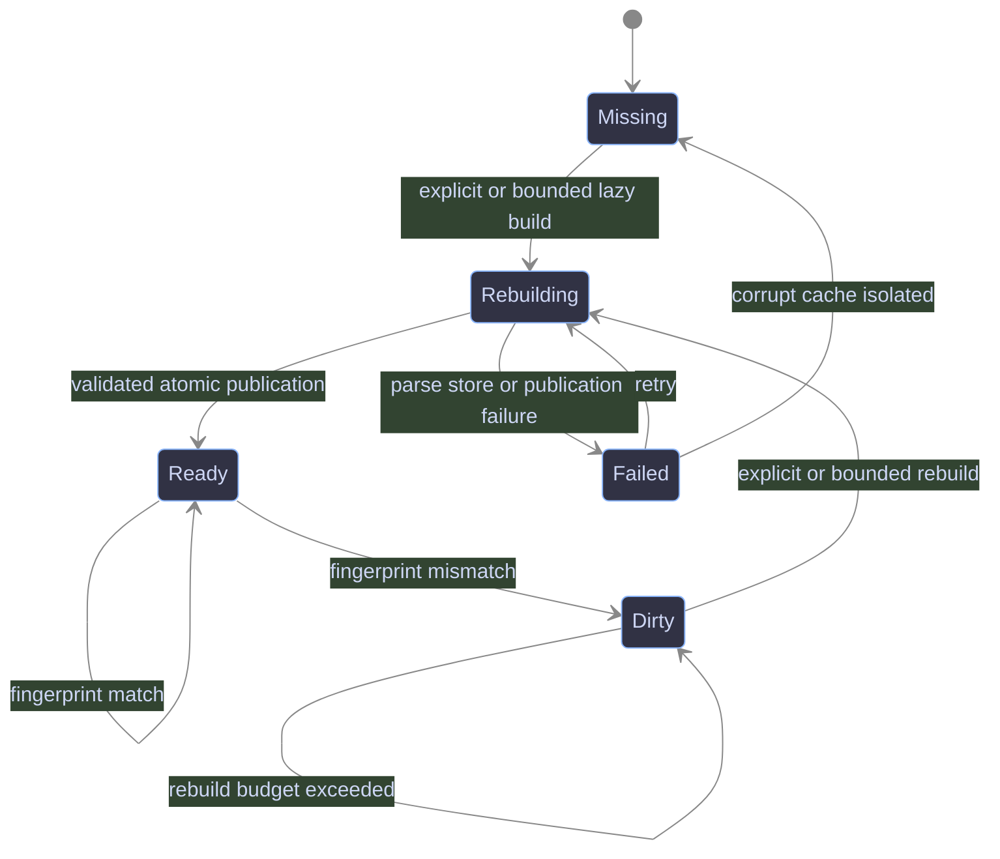
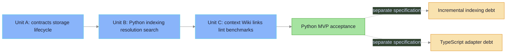

---
review:
  spec_hash: 5a597c9b75fad2d5
  last_run: 2026-08-10
  phases:
    structure: { status: passed }
    coverage: { status: passed }
    clarity: { status: passed }
    consistency: { status: passed }
  findings:
    - id: F-001
      phase: consistency
      severity: CRITICAL
      section: "17. Sequential delivery units"
      section_hash: 5444b4d65964ec36
      fragment: "It closes R-001 through R-012 except adapter behavior."
      text: >-
        The former Unit A requirement range contradicted Unit B's explicit
        discovery/fingerprinting/full-build outputs and made the approved
        sequential delivery boundary impossible to implement without drift.
      fix: >-
        Assign Unit A to R-001..R-009 primitives; assign discovery through
        search, build observability, and three R-016 tools to Unit B; let Unit C
        complete R-016 and own context/Wiki/evidence requirements.
      verdict: fixed
      verdict_at: 2026-08-09
chain:
  intent: docs/superpowers/intents/2026-08-09-iwiki-mcp-code-graph-intent.md
  spec: null
---

# iwiki-mcp Python Code Graph Design

**Date:** 2026-08-09
**Status:** approved
**Topic:** `iwiki-mcp-code-graph`
**Intent:** `docs/superpowers/intents/2026-08-09-iwiki-mcp-code-graph-intent.md`
**Requirements source:** `docs/superpowers/intents/iwiki-mcp-code-graph-technical-requirements-final.md`

## 1. Summary

This specification defines a Python-only code-graph MVP for `iwiki-mcp`. The graph is a per-primary-domain, rebuildable SQLite cache derived from the bound project's source tree. It exposes four fail-soft MCP tools for status, indexing, symbol search, and bounded context. It complements the existing Markdown Wiki and Wiki graph without changing the `wiki_search` contract or blocking Wiki tools when code-graph work fails.

The MVP uses mandatory Tree-sitter runtime dependencies, a language-neutral core, and a Python adapter. Incremental indexing and TypeScript are explicit technical debt that require separate specifications and deliveries.

## 2. Scope and source decisions

### 2.1 In scope

- Per-primary-domain code-graph location and lifecycle.
- SQLite schema v1 and stable domain-based identities.
- Safe project source discovery and deterministic fingerprinting.
- Python modules, files, classes, functions, async functions, and methods.
- `DECLARES`, `IMPORTS`, basic static `CALLS`, `INHERITS`, and confirmed `DOCUMENTED_BY` relations.
- Preserved resolved, partially resolved, ambiguous, and unresolved references.
- Full rebuild, fingerprint no-op, atomic publication, corruption recovery, and bounded writer locking.
- `wiki_code_status`, `wiki_code_index`, `wiki_code_search`, and `wiki_code_context`.
- Wiki symbol, file, and source-glob selectors with code-aware lint diagnostics.
- Unit, golden-fixture, integration, security, concurrency, and benchmark evidence.

### 2.2 Out of scope

- Incremental indexing or an `incremental` public parameter.
- TypeScript or JavaScript parsing and resolution.
- Impact analysis, hybrid code/Wiki RRF, source embeddings, runtime tracing, and dynamic call graphs.
- External graph databases, background daemons, cross-repository graphs, historical source snapshots, or a UI.
- Java, Go, C#, automatic authoritative Wiki linking, or one Wiki page per symbol.

### 2.3 Approved design decisions

- Python is the MVP. TypeScript is a later, separate specification and delivery.
- `tree-sitter` and `tree-sitter-language-pack` are mandatory runtime dependencies.
- `repository_id` is the bound `primary` domain. No project UUID or code-tool `domain` parameter is introduced.
- Every code tool targets `primary`; missing `primary` returns fail-soft diagnostics.
- One authoritative Python MVP specification owns three sequential delivery units.
- Incremental indexing and TypeScript remain recorded in the `iwiki-mcp` Wiki page `reference/code-graph-technical-debt`.

## 3. Acceptance from intent

The following outcomes and completion rule are copied verbatim from the approved intent.

### 3.1 Desired Outcomes

- An MCP client can locate Python modules, files, classes, functions, and methods by qualified or local name and receive project-relative paths and source ranges.
- An MCP client can request a bounded neighborhood containing declarations, imports, basic calls, inheritance, and resolved Wiki links, with explicit freshness, truncation, and unresolved-reference signals.
- Operators can inspect, build, disable, and recover the per-domain code graph without a full build during server startup.
- Wiki authors can declare symbol-, file-, and source-scope selectors, detect stale or unsafe selectors, and retain human control over suggested links.
- Existing Wiki tools and `wiki_search` retain their current contracts and remain usable when code-graph dependencies, parsing, storage, or rebuilding fail.
- The architecture can add TypeScript support after the Python MVP without moving language-specific rules into the core.

### 3.2 Done when

- Done when: the checked architecture specification traces every MVP outcome and hard constraint to explicit requirements and acceptance criteria, identifies all remaining human checkpoints, and decomposes implementation into reviewable sequential delivery units without gaps or out-of-scope extras.

## 4. Requirements

### 4.1 Binding, configuration, and packaging

- **R-001 — Primary domain:** Every code tool MUST use the resolved binding's `primary` as `repository_id` and storage identity. A missing primary MUST return a sanitized `{error, hint}` response. **Acceptance:** AC-01.
- **R-002 — Feature configuration:** `[code_graph].enabled` MUST disable code-graph reads and builds without changing Wiki behavior. Configuration MUST support `languages`, `auto_rebuild`, `max_rebuild_seconds`, `max_file_bytes`, `max_total_files`, `include_tests`, and `exclude`. **Acceptance:** AC-02.
- **R-003 — Mandatory parser dependencies:** `tree-sitter` and `tree-sitter-language-pack` MUST be normal project dependencies. Adapter initialization MUST be lazy so ordinary server startup does not parse grammars or source. **Acceptance:** AC-03.
- **R-004 — Derived locations:** Database, WAL, SHM, lock, and metadata paths MUST be derived from validated `base` and `primary`; operators MUST NOT configure a database path or project UUID. **Acceptance:** AC-04.

### 4.2 Storage and lifecycle

- **R-005 — Separate store:** Code data MUST use a separate `CodeGraphStore`; existing Wiki graph tables and contracts MUST remain unchanged. **Acceptance:** AC-05.
- **R-006 — SQLite integrity:** Schema v1 MUST enable foreign keys, WAL, busy timeout, schema validation, required indexes, `foreign_key_check`, and `integrity_check`. **Acceptance:** AC-06.
- **R-007 — Atomic publication:** A full build MUST write a unique staging database and publish it under the per-domain writer lock only after validation. Readers MUST never open staging or partially published data. **Acceptance:** AC-07.
- **R-008 — States and freshness:** Runtime state MUST distinguish `missing`, `ready`, `dirty`, `rebuilding`, and `failed`. Search/context MUST NOT present a non-ready snapshot as fresh. **Acceptance:** AC-08.
- **R-009 — Recovery:** Missing, corrupt, or incompatible caches MUST recover through a full rebuild without changing Wiki Markdown, vector indexes, or ingest logs. **Acceptance:** AC-09.
- **R-010 — Full-build MVP:** Indexing MUST perform either a deterministic full rebuild or a fingerprint no-op. Incremental invalidation and its API/config parameter are excluded. **Acceptance:** AC-10.

### 4.3 Discovery, extraction, and resolution

- **R-011 — Safe discovery:** Discovery MUST stay inside canonical `project_dir`, reject all symlink files/directories, apply Git/iwiki/config exclusions, exclude dependency/generated/secret-like paths, and enforce file-count and byte limits before parsing. **Acceptance:** AC-11.
- **R-012 — Deterministic identity:** File, symbol, relation, revision, and fingerprint identities MUST exclude absolute paths, timestamps, and randomness and MUST remain stable for identical inputs. **Acceptance:** AC-12.
- **R-013 — Python extraction:** The Python adapter MUST extract MVP nodes, ranges, normalized signatures, imports, inheritance clauses, and syntactic call references without importing or executing project code. **Acceptance:** AC-13.
- **R-014 — Conservative resolution:** Resolver output MUST distinguish resolved, partially resolved, ambiguous, and unresolved targets. It MUST NOT guess dynamic dispatch, reflection, DI, monkey patching, wildcard ambiguity, or missing external packages. **Acceptance:** AC-14.
- **R-015 — Language isolation:** Core models, storage, indexing, and query modules MUST contain no Python-specific parsing or resolution rules; those rules belong behind `LanguageAdapter`. **Acceptance:** AC-15.

### 4.4 MCP and context contracts

- **R-016 — Tool surface:** MVP MUST expose exactly `wiki_code_status`, `wiki_code_index`, `wiki_code_search`, and `wiki_code_context`; it MUST NOT change `wiki_search`. **Acceptance:** AC-16.
- **R-017 — Fail-soft isolation:** Binding, dependency, parse, storage, lock, rebuild, and query failures MUST return sanitized diagnostics and MUST NOT block existing Wiki tools. **Acceptance:** AC-17.
- **R-018 — Deterministic search:** Symbol search MUST rank exact qualified, exact local, prefix, tokenized lexical, and signature/path matches in that order with stable tie-breaking. **Acceptance:** AC-18.
- **R-019 — Bounded context:** Context traversal MUST enforce direction, depth, relation, node, file, and source-byte budgets and MUST report effective limits and truncation. **Acceptance:** AC-19.
- **R-020 — Safe source return:** Source MUST be returned only for an explicit `include_source=true` request after containment, content-hash, and byte-budget checks. Stale source MUST be omitted with `fresh=false` and a warning. **Acceptance:** AC-20.

### 4.5 Wiki links, diagnostics, and observability

- **R-021 — Selector model:** Wiki frontmatter MUST support symbol, file, and source-glob selectors. Derived links MUST preserve selector provenance and specificity `symbol > file > source_glob`. **Acceptance:** AC-21.
- **R-022 — Generic Wiki links:** Schema MUST store symbol targets and file targets; source globs MUST materialize file links rather than links to every symbol. **Acceptance:** AC-22.
- **R-023 — Code-aware lint:** `wiki_lint` MUST report unknown/ambiguous symbols, missing files, empty globs, unsafe/ignored/secret-like targets, conflicting selectors, stale revision, and unavailable code graph in a separate `code_graph` block. Ordinary Wiki lint MUST remain available. **Acceptance:** AC-23.
- **R-024 — Human authority:** MVP MUST NOT generate authoritative automatic links or mutate Wiki selectors automatically. **Acceptance:** AC-24.
- **R-025 — Observability:** Status/build results MUST report revision, fingerprints, duration, language/file/symbol/relation counts, resolution states, exclusions, truncation, parser errors, and phase timings without source or credentials. **Acceptance:** AC-25.

### 4.6 Quality and delivery

- **R-026 — Regression protection:** Existing Wiki tests and contracts MUST pass unchanged; code-graph failures MUST block zero Wiki calls. **Acceptance:** AC-26.
- **R-027 — Quality benchmark:** The benchmark MUST measure extraction/resolution quality and deterministic rebuild behavior against approved golden fixtures. **Acceptance:** AC-27.
- **R-028 — Performance benchmark:** The benchmark MUST record environment, corpus, command, startup/no-op/build/search/context latency, memory, and database size. **Acceptance:** AC-28.
- **R-029 — Sequential delivery:** Implementation planning MUST preserve the three ordered delivery units in Section 17 and prevent later units from being treated as prerequisites of earlier units. **Acceptance:** AC-29.
- **R-030 — Deferred debt:** Incremental indexing and TypeScript MUST remain excluded from Python MVP claims and linked to separate future specifications. **Acceptance:** AC-30.

## 5. Architecture

### 5.1 Component boundary

```mermaid
%%{init: {'theme': 'base', 'themeVariables': {'background': '#1e1e2e', 'primaryColor': '#313244', 'primaryTextColor': '#cdd6f4', 'primaryBorderColor': '#89b4fa', 'lineColor': '#888888', 'secondaryColor': '#181825', 'tertiaryColor': '#45475a'}}}%%
flowchart LR
    Client["MCP client"] --> Server["server.py composition root"]
    Server --> Binding["Binding with primary domain"]
    Binding --> Runtime["CodeGraphRuntime facade"]

    subgraph BuildPath["Build path"]
        Discovery["Safe source discovery"] --> Fingerprint["Deterministic fingerprint"]
        Fingerprint --> Adapter["Python adapter"]
        Adapter --> Resolver["Reference resolver"]
        Resolver --> Publisher["Atomic store publisher"]
    end

    subgraph ReadPath["Read path"]
        Search["Symbol search"]
        Context["Bounded context"]
        Status["Status and freshness"]
    end

    Runtime --> Discovery
    Publisher --> Store["Per-domain CodeGraphStore"]
    Runtime --> Search
    Runtime --> Context
    Runtime --> Status
    Store --> Search
    Store --> Context
    Store --> Status
    Wiki["Existing Wiki graph and Markdown"] --> Linker["Wiki-code linker"]
    Store --> Linker
    Linker --> Context

    classDef primary fill:#89b4fa,color:#1e1e2e,stroke:#74c7ec,stroke-width:2px
    classDef success fill:#a6e3a1,color:#1e1e2e,stroke:#40a02b
    classDef warning fill:#f9e2af,color:#1e1e2e,stroke:#df8e1d
    classDef neutral fill:#585b70,color:#cdd6f4,stroke:#6c7086
    class Server,Runtime primary
    class Store,Wiki success
    class Binding warning
    class Discovery,Fingerprint,Adapter,Resolver,Publisher,Search,Context,Status,Linker neutral
```



### 5.2 Package boundary

```text
src/iwiki_mcp/codegraph/
├── __init__.py
├── models.py
├── schema.py
├── store.py
├── location.py
├── runtime.py
├── fingerprint.py
├── discovery.py
├── indexer.py
├── resolver.py
├── query.py
├── context.py
├── linking.py
└── languages/
    ├── __init__.py
    ├── base.py
    └── python.py
```

`server.py` is the composition root and MCP registration surface. It MAY resolve binding and translate facade diagnostics, but MUST NOT contain SQL, parsing, reference resolution, discovery traversal, or graph traversal.

## 6. Binding, locations, and configuration

### 6.1 Binding rule

`CodeGraphRuntime` receives the request-scoped `Binding`. It requires `binding.primary`; read/write domain lists do not select or fan out code graphs. Because existing binding validation requires `primary` to belong to `write`, explicit indexing remains scoped to the project's writable primary domain.

### 6.2 Derived locations

For `primary = "iwiki-mcp"`:

```text
<base>/.iwiki/code-iwiki-mcp.sqlite3
<base>/.iwiki/code-iwiki-mcp.sqlite3-wal
<base>/.iwiki/code-iwiki-mcp.sqlite3-shm
<base>/.iwiki/code-iwiki-mcp.lock
<base>/.iwiki/code-iwiki-mcp.metadata.json
```

`CodeGraphLocationResolver` MUST reuse the existing domain safety rules before interpolation. The root `.iwiki/` cache directory MUST remain excluded from Git using the existing local exclusion mechanism.

### 6.3 Configuration contract

```toml
[code_graph]
enabled = true
languages = ["python"]
auto_rebuild = "bounded"
max_rebuild_seconds = 10
max_file_bytes = 1000000
max_total_files = 20000
include_tests = true

exclude = [
  "node_modules/**",
  "dist/**",
  "build/**",
  "generated/**",
]
```

The runtime reads this mapping from `load_project_config(binding.project_dir).get("code_graph", {})`; `Binding` is not expanded with raw configuration. `auto_rebuild` accepts exactly `"off"` or `"bounded"`. MVP accepts only `python` in `languages`. Unknown languages are configuration errors local to code tools. Operator overrides remain exactly `IWIKI_CODE_GRAPH_ENABLED`, `IWIKI_CODE_GRAPH_MAX_FILE_BYTES`, `IWIKI_CODE_GRAPH_MAX_FILES`, and `IWIKI_CODE_GRAPH_AUTO_REBUILD`; the last uses the same `off|bounded` values. There is no `database`, `project_id`, `project_uuid`, or `incremental` setting.

## 7. Data model

### 7.1 Repository and files

```sql
CREATE TABLE repositories (
    repository_id TEXT PRIMARY KEY,
    root_path TEXT NOT NULL,
    git_remote TEXT,
    git_commit TEXT,
    source_fingerprint TEXT NOT NULL,
    config_fingerprint TEXT NOT NULL,
    parser_fingerprint TEXT NOT NULL,
    revision TEXT NOT NULL,
    state TEXT NOT NULL
        CHECK (state IN ('ready', 'dirty', 'rebuilding', 'failed')),
    indexed_at TEXT NOT NULL
);

CREATE TABLE files (
    file_id TEXT PRIMARY KEY,
    repository_id TEXT NOT NULL
        REFERENCES repositories(repository_id) ON DELETE CASCADE,
    path TEXT NOT NULL,
    language TEXT NOT NULL,
    content_hash TEXT NOT NULL,
    parser_version TEXT NOT NULL,
    size_bytes INTEGER NOT NULL CHECK (size_bytes >= 0),
    UNIQUE(repository_id, path)
);
```

`root_path` is local diagnostic state and MUST NOT participate in portable IDs or MCP output. `missing` is represented by no usable database, not a repository row.

### 7.2 Symbols and relations

```sql
CREATE TABLE symbols (
    symbol_id TEXT PRIMARY KEY,
    file_id TEXT NOT NULL REFERENCES files(file_id) ON DELETE CASCADE,
    kind TEXT NOT NULL,
    qualified_name TEXT NOT NULL,
    local_name TEXT NOT NULL,
    start_line INTEGER NOT NULL CHECK (start_line >= 1),
    end_line INTEGER NOT NULL CHECK (end_line >= start_line),
    start_byte INTEGER,
    end_byte INTEGER,
    signature TEXT,
    visibility TEXT,
    content_hash TEXT NOT NULL,
    metadata_json TEXT NOT NULL DEFAULT '{}',
    UNIQUE(file_id, qualified_name, start_line)
);

CREATE TABLE relations (
    relation_id TEXT PRIMARY KEY,
    source_symbol_id TEXT REFERENCES symbols(symbol_id) ON DELETE CASCADE,
    source_file_id TEXT NOT NULL REFERENCES files(file_id) ON DELETE CASCADE,
    target_symbol_id TEXT REFERENCES symbols(symbol_id) ON DELETE CASCADE,
    target_reference TEXT,
    relation_type TEXT NOT NULL,
    source_line INTEGER,
    confidence REAL NOT NULL DEFAULT 1.0
        CHECK (confidence >= 0.0 AND confidence <= 1.0),
    resolution_state TEXT NOT NULL
        CHECK (resolution_state IN (
            'resolved', 'partially_resolved', 'unresolved', 'ambiguous'
        )),
    metadata_json TEXT NOT NULL DEFAULT '{}',
    CHECK (target_symbol_id IS NOT NULL OR target_reference IS NOT NULL)
);
```

`metadata_json` stores normalized language-specific metadata and MUST NOT contain source text.

### 7.3 Wiki-code links

```sql
CREATE TABLE wiki_code_links (
    link_id TEXT PRIMARY KEY,
    domain TEXT NOT NULL,
    page_id TEXT NOT NULL,
    symbol_id TEXT REFERENCES symbols(symbol_id) ON DELETE CASCADE,
    file_id TEXT REFERENCES files(file_id) ON DELETE CASCADE,
    selector_kind TEXT NOT NULL
        CHECK (selector_kind IN ('symbol', 'file', 'source_glob')),
    relation_type TEXT NOT NULL,
    confidence REAL NOT NULL DEFAULT 1.0
        CHECK (confidence >= 0.0 AND confidence <= 1.0),
    source TEXT NOT NULL,
    CHECK ((symbol_id IS NOT NULL) <> (file_id IS NOT NULL))
);
```

The generic target shape replaces the source draft's symbol-only link table because file and source-glob selectors require file-level targets.

### 7.4 Required indexes

```sql
CREATE INDEX idx_files_repository_path ON files(repository_id, path);
CREATE INDEX idx_files_content_hash ON files(content_hash);
CREATE INDEX idx_symbols_file ON symbols(file_id);
CREATE INDEX idx_symbols_qualified ON symbols(qualified_name);
CREATE INDEX idx_symbols_local ON symbols(local_name);
CREATE INDEX idx_symbols_kind ON symbols(kind);
CREATE INDEX idx_relations_source_type ON relations(source_symbol_id, relation_type);
CREATE INDEX idx_relations_target_type ON relations(target_symbol_id, relation_type);
CREATE INDEX idx_relations_reference ON relations(target_reference);
CREATE INDEX idx_wiki_links_page ON wiki_code_links(domain, page_id);
CREATE INDEX idx_wiki_links_symbol ON wiki_code_links(symbol_id);
CREATE INDEX idx_wiki_links_file ON wiki_code_links(file_id);
```

## 8. Stable identities

Canonical inputs are UTF-8 strings separated by NUL bytes before SHA-256 hashing.

```text
repository_id = primary domain

file_id =
  "py:file:" + sha256("file\0" + domain + "\0python\0" + relative_path)

symbol_identity =
  "python\0" + domain + "\0" + module_path + "\0" +
  qualified_name + "\0" + normalized_signature

symbol_id =
  "py:symbol:" + sha256("symbol\0" + symbol_identity)

relation_id =
  "py:relation:" + sha256(
    "relation\0" + source_identity + "\0" + relation_type + "\0" +
    source_location + "\0" + target_identity_or_reference
  )
```

The normalized signature includes symbol kind, async marker, parameter kinds/names, annotations, defaults, and return annotation while ignoring formatting. A body-only change preserves `symbol_id`; a rename or signature change creates a new identity. Nested qualified names distinguish nested symbols. Module paths derive only from project-relative paths.

## 9. Discovery and security boundary

### 9.1 Discovery order

1. Resolve and canonicalize `project_dir`.
2. Load `.gitignore`, `.iwikiignore`, built-in exclusions, and configured excludes.
3. Walk without following symlinks.
4. Reject every symlink file or directory.
5. Recheck containment for each candidate.
6. Apply path exclusions and `include_tests`.
7. Reject files beyond `max_file_bytes` and stop at `max_total_files` with explicit truncation.
8. Read bytes, compute content hashes, and pass supported files to adapters.

### 9.2 Built-in exclusions

```text
.git/
.iwiki/
.venv/
venv/
node_modules/
dist/
build/
coverage/
__pycache__/
vendor/
generated/
.env
.env.*
*.pem
*.key
id_rsa
id_ed25519
credentials*
secrets*
```

Path matching MUST use project-relative POSIX-style paths. A configured include MUST NOT override a secret-like built-in exclusion or containment rejection.

## 10. Python adapter and resolution

### 10.1 Adapter interface

```python
class LanguageAdapter(Protocol):
    language: str
    extensions: tuple[str, ...]

    def parse_file(self, source: bytes, path: str) -> ParsedFile:
        ...

    def resolve_references(
        self,
        parsed: ParsedFile,
        project_index: SymbolIndex,
    ) -> ResolutionResult:
        ...
```

Core code depends on this protocol and normalized models only.

### 10.2 Extraction

The Python adapter extracts modules, files, classes, functions, async functions, methods, imports, relative imports, aliases, inheritance clauses, and syntactic calls. It records line and byte ranges. It MUST NOT import modules, execute decorators/default expressions, inspect runtime objects, or invoke project code.

Tree-sitter parse errors become file warnings. The adapter MAY retain successfully parsed declarations only when their ranges are valid and outside error nodes; it MUST report partial parsing.

### 10.3 Resolution

- `IMPORTS` resolves project-local absolute modules, relative modules, aliases, and imported names.
- `INHERITS` resolves only uniquely identified project classes.
- `CALLS` resolves local bindings, imported functions/classes, and unambiguous `self` or class method references.
- A unique exact target is `resolved`.
- Multiple valid targets produce candidate relations marked `ambiguous`.
- A known module with an unknown member is `partially_resolved`.
- A missing or dynamic target remains `unresolved` with its normalized reference.

Dynamic dispatch, reflection, dependency injection, monkey patching, wildcard ambiguity, generated symbols, and external packages are never guessed.

## 11. Fingerprint and revision

Fingerprint input includes sorted relative paths and content hashes, Git commit, dirty-worktree marker, normalized code-graph configuration, language set, excludes, schema version, Tree-sitter grammar version, adapter version, and resolver version. It excludes absolute path, wall-clock time, process ID, and random values.

`revision` is the hash of the canonical persisted graph inputs and normalized output rows. Two builds from identical inputs MUST produce identical revision, IDs, row ordering at serialization boundaries, and query tie-breaking.

## 12. Build and publication lifecycle

### 12.1 Full build

1. Resolve binding, configuration, and locations.
2. Acquire the per-domain writer lock with bounded wait.
3. Discover candidates and compute fingerprint inputs.
4. Return no-op when the ready canonical database has the same fingerprint and compatible schema/parser versions.
5. Create a unique staging database beside the canonical database.
6. Parse files and persist files, symbols, and unresolved relations.
7. Run cross-file resolution and Wiki-selector resolution.
8. Store repository state and revision.
9. Run `foreign_key_check`, `integrity_check`, and schema parity checks.
10. Close staging connections and checkpoint staging WAL.
11. Wait for replace-compatible canonical handles within the same bounded lock deadline.
12. Atomically replace the canonical database and atomically publish metadata.
13. Open the canonical database, enable WAL, verify revision, and return statistics.

Any failure before publication leaves the prior canonical database unchanged. Failed staging artifacts are removed. A corrupt canonical database is moved to a diagnostic quarantine path before rebuilding.

### 12.2 Runtime state



Startup reads metadata and checks schema compatibility only. It never performs discovery or a full build. Search/context on `dirty`, `rebuilding`, or `failed` returns `fresh=false`, a sanitized warning, and remediation rather than presenting old graph data as current.

For `missing` or `dirty`, search/context MAY attempt one rebuild only when `auto_rebuild = "bounded"` and the remaining request budget is at least `max_rebuild_seconds`. If publication does not finish inside that limit, the call returns a non-ready diagnostic and a `wiki_code_index` hint; it does not return graph nodes from the old snapshot.

## 13. MCP contracts

### 13.1 Common response rules

Successful code responses include `domain`, `state`, `revision`, `fresh`, and `warnings`. Fail-soft responses use the current server convention `{error, hint}` and MAY include sanitized state. They MUST NOT contain absolute paths, source excerpts, environment values, credentials, raw SQL, or traceback text.

### 13.2 `wiki_code_status`

```python
wiki_code_status() -> dict
```

Returns enabled state, domain, lifecycle state, revision, commit, fingerprints, schema/parser/adapter/resolver versions, counts, resolution ratios, `indexed_at`, and warnings. It never triggers a build.

### 13.3 `wiki_code_index`

```python
wiki_code_index(
    force: bool = False,
    languages: list[str] | None = None,
) -> dict
```

Only `python` is accepted. `force=false` permits fingerprint no-op. `force=true` rebuilds the full Python snapshot. The result includes no-op/build status, revision, duration, counts, exclusions, parser warnings, resolution states, and phase timings.

### 13.4 `wiki_code_search`

```python
wiki_code_search(
    query: str,
    kinds: list[str] | None = None,
    path: str | None = None,
    languages: list[str] | None = None,
    limit: int = 20,
) -> dict
```

Ranking order is exact qualified name, exact local name, prefix, tokenized lexical match, then signature/path match. Stable ties use qualified name then symbol ID. Path filters are safe project-relative prefixes. Results contain IDs, kind, qualified/local names, normalized signature, project-relative path, and line/byte ranges.

### 13.5 `wiki_code_context`

```python
wiki_code_context(
    symbols: list[str],
    direction: Literal["in", "out", "both"] = "both",
    depth: int = 1,
    relations: list[str] | None = None,
    include_source: bool = True,
    include_wiki: bool = True,
    max_nodes: int = 50,
    max_files: int = 20,
    max_source_bytes: int = 200_000,
) -> dict
```

Required shape:

```json
{
  "domain": "iwiki-mcp",
  "state": "ready",
  "revision": "sha256:...",
  "fresh": true,
  "seeds": [],
  "nodes": [],
  "relations": [],
  "files": [],
  "wiki_pages": [],
  "limits": {
    "depth": 1,
    "max_nodes": 50,
    "max_files": 20,
    "max_source_bytes": 200000
  },
  "truncated": false,
  "warnings": []
}
```

Traversal is breadth-first with deterministic relation/source/target ordering. Budget exhaustion stops expansion, retains already accepted items, sets `truncated=true`, and reports the exhausted budget. Source reads recheck containment and current content hash; mismatches omit source and set `fresh=false`.

## 14. Wiki linking and lint

### 14.1 Frontmatter

```yaml
code:
  symbols:
    - qualified_name: iwiki_mcp.engine.search.SearchEngine.search
  files:
    - src/iwiki_mcp/engine/search.py
  source_globs:
    - src/iwiki_mcp/engine/**
```

Markdown stores selectors only. Canonical IDs and derived links remain in `CodeGraphStore`. Symbol selectors create symbol links; file selectors create file links; globs materialize matching file links. Duplicate targets retain the most specific selector provenance.

Confirmed links use `relation_type = 'DOCUMENTED_BY'` in `wiki_code_links`. They are not inserted into `relations`, whose source and target identities are code entities; `wiki_code_links` is the typed code-to-Wiki edge store for symbol and file targets.

### 14.2 Lint behavior

When code graph is ready, `wiki_lint` adds a `code_graph` report containing unknown or ambiguous qualified names, missing files, empty globs, unsafe containment, ignored/secret-like matches, conflicting selectors, and stale revisions. When code graph is disabled or unavailable, the block reports availability/remediation without preventing ordinary Markdown lint.

MVP does not generate suggested links. Any future suggestion MUST remain non-authoritative, MUST NOT mutate frontmatter automatically, and requires separate scope approval.

## 15. Error handling and observability

### 15.1 Failure classes

- `not_configured`: no primary or disabled feature.
- `invalid_config`: unsupported language, limit, or policy.
- `busy`: writer lock or replace-compatible handle deadline exceeded.
- `stale`: fingerprint mismatch without completed rebuild.
- `parse_failed`: no publishable graph from supported source.
- `store_failed`: schema, integrity, read, or write failure.
- `rebuild_failed`: build or publication failure.
- `unsafe_path`: containment, symlink, ignore, or secret boundary rejection.

Handlers map these classes to stable sanitized messages and hints. Unexpected exceptions are logged without source/credentials and returned through the same fail-soft boundary.

### 15.2 Metrics and logs

Status/build diagnostics include revision/fingerprint, duration, counts by language/node/relation/resolution state, excluded/truncated file counts, parser-error counts, and discovery/parsing/resolution/persistence timings. Source text and credentials are forbidden.

## 16. Testing and benchmark

### 16.1 Unit tests

- Stable file/symbol/relation IDs and normalized signatures.
- Schema creation, indexes, constraints, migration rejection, and integrity checks.
- Configuration parsing and environment overrides.
- Containment, symlink rejection, ignore precedence, secret exclusions, and budgets.
- Python declarations, imports, calls, inheritance, partial syntax, and unresolved references.
- Fingerprints, deterministic query ranking, traversal budgets, and source hash checks.

### 16.2 Golden fixtures

```text
tests/fixtures/codegraph/python_basic
tests/fixtures/codegraph/python_imports
tests/fixtures/codegraph/python_inheritance
tests/fixtures/codegraph/python_dynamic
tests/fixtures/codegraph/python_syntax_errors
tests/fixtures/codegraph/security_paths
```

### 16.3 Integration tests

- Full build and fingerprint no-op.
- Added/changed/deleted file and dirty worktree detection followed by full rebuild.
- Branch switch, corrupt database, incompatible schema, and metadata mismatch.
- Concurrent readers, competing writers, bounded `busy`, and atomic publication.
- Wiki symbol/file/glob links and code-aware lint.
- Disabled feature, missing primary, parser/store/build failure, and continuing Wiki calls.

### 16.4 Benchmark

`eval/code_graph/` owns a non-production benchmark runner and report. Every report records environment, corpus identity, command, versions, startup/no-op/build/search/context latency, peak memory, DB/source size, declaration/import/call quality, false resolutions, and deterministic rebuild comparison.

Initial targets remain those from the approved intent: startup `<100 ms`, no-op `<200 ms`, 1,000 Python files `<15 s`, search `<150 ms`, depth-1/50-node context `<300 ms`, DB `<3x` source text, 10,000-file memory `<1 GiB`, declarations/methods `>=98%`, local imports `>=95%`, statically resolvable calls `>=75%`, false resolved calls `<5%`, deterministic rebuild `100%`, and Wiki search regressions `0`.

## 17. Sequential delivery units



### 17.1 Unit A — contracts, storage, and lifecycle primitives

Expected outputs: package skeleton, models, schema v1, locations, configuration loading, mandatory dependencies, portable identity primitives, runtime-state storage primitives, atomic-publication primitives, and focused unit/security tests. It owns R-001 through R-009. It supplies identity primitives for R-012 but does not claim end-to-end determinism before source discovery, parsing, resolution, and rebuild are available.

### 17.2 Unit B — discovery, Python indexing, resolution, and search

Expected outputs: safe discovery, fingerprinting, Python adapter, resolver, full rebuild/no-op, `status`, `index`, `search`, golden fixtures, end-to-end determinism evidence, build observability, and fail-soft integration. It owns R-010 through R-015, R-017, R-018, and R-025, plus the `status`/`index`/`search` portion of R-016. This includes R-011/R-012 discovery and deterministic graph evidence. Unit B consumes Unit A storage/publication primitives; no Unit B output is a prerequisite of Unit A.

### 17.3 Unit C — context, Wiki links, lint, and benchmark

Expected outputs: bounded context/source reads, final four-tool registration, generic Wiki-code links, selector parsing, code-aware lint, recovery/concurrency integration tests, benchmark runner/report, Wiki documentation, and final regression evidence. It completes R-016 with `context` and owns R-019 through R-024 plus R-026 through R-030. Recovery/concurrency tests may reinforce earlier storage and fail-soft requirements without moving their ownership.

## 18. Acceptance criteria

- **AC-01:** With no primary, each code tool returns a sanitized error/hint and a Wiki read succeeds in the same process.
- **AC-02:** With `enabled=false`, no code database is created or read and existing Wiki tests pass.
- **AC-03:** Installed runtime imports both Tree-sitter dependencies; ordinary startup initializes no grammar/parser and satisfies the startup benchmark.
- **AC-04:** Location tests derive exactly the five per-primary paths and reject unsafe domain strings.
- **AC-05:** Schema inspection shows no code tables in the existing Wiki graph and no Wiki graph contract changes.
- **AC-06:** Schema/index parity, foreign-key enforcement, busy timeout, WAL, `foreign_key_check`, and `integrity_check` tests pass.
- **AC-07:** Fault injection before publication preserves the previous canonical revision; readers observe only complete old or complete new snapshots.
- **AC-08:** State tests cover all five states and prove non-ready search/context never claims `fresh=true`.
- **AC-09:** Corrupt/incompatible cache tests rebuild successfully while Wiki file/vector/log hashes remain unchanged.
- **AC-10:** Matching fingerprint produces a no-op; changed inputs trigger a full rebuild; no MVP contract exposes incremental behavior.
- **AC-11:** Traversal, symlink, secret, ignore, file-size, and file-count fixtures prove only allowed files are parsed.
- **AC-12:** Repeated builds and relocated clones with the same domain/input produce identical portable IDs and graph revision.
- **AC-13:** Golden fixtures prove required Python node/range/signature/import/call/inheritance extraction without executing project code.
- **AC-14:** Dynamic fixtures prove unresolved/ambiguous preservation and false-resolution rate below the approved gate.
- **AC-15:** Static dependency inspection shows core modules import only `LanguageAdapter` and normalized models, not Python grammar rules.
- **AC-16:** MCP registration exposes exactly the four code tools and leaves the `wiki_search` schema unchanged.
- **AC-17:** Injected binding/parser/store/lock/build/query failures return diagnostics and permit a succeeding Wiki tool call.
- **AC-18:** Search fixtures prove ranking tiers, filters, limits, relative paths, ranges, and stable tie ordering.
- **AC-19:** Context fixtures prove direction/depth/relation filters, all budgets, deterministic BFS, and truncation reporting.
- **AC-20:** Changed/outside/secret source is never returned; valid current source obeys the aggregate byte budget.
- **AC-21:** Selector fixtures prove provenance and specificity for symbol, file, and glob selectors.
- **AC-22:** SQL assertions prove symbol links target symbols, file/glob links target files, and cascade cleanup removes stale links.
- **AC-23:** Code-aware lint fixtures cover every required finding while ordinary Wiki lint remains usable without a ready code graph.
- **AC-24:** No MVP path mutates Wiki `code` selectors or produces authoritative automatic links.
- **AC-25:** Status/build results contain required metrics and sanitized logs contain no fixture source or credentials.
- **AC-26:** Full existing pytest suite passes and comparison confirms no `wiki_search` contract/result regression.
- **AC-27:** Benchmark report records all quality metrics and reaches the approved extraction/resolution gates.
- **AC-28:** Benchmark report records all environment/performance/resource fields and reaches the approved health targets.
- **AC-29:** Implementation plan maps every task to Unit A, B, or C in dependency order with a measurable output and verification command.
- **AC-30:** Product docs and Wiki identify incremental indexing and TypeScript as separate technical debt; Python MVP output makes no claim that either exists.

## 19. Risks and mitigations

- **Atomic replace with concurrent processes:** open database handles can delay replacement on some platforms. Mitigation: short-lived read-only connections, bounded writer deadline, explicit `busy`, staging isolation, and fault-injection tests.
- **Dynamic Python false certainty:** syntactic calls cannot model runtime dispatch. Mitigation: conservative resolver states, preserved references/candidates, and false-resolution quality gates.
- **Tree-sitter startup cost:** mandatory dependencies could affect ordinary Wiki startup. Mitigation: lazy grammar/parser initialization and measured startup gate.
- **Selector expansion cost:** broad globs can create excessive links. Mitigation: materialize file links only, reuse file limits, report truncation/conflicts, and avoid per-symbol expansion.
- **Metadata/DB crash skew:** separate files can publish at different moments. Mitigation: SQL revision is authoritative; metadata is atomically rewritten or reconstructed after mismatch.
- **Scope drift into deferred work:** language-neutral seams can invite premature incremental/TypeScript code. Mitigation: explicit R-030/AC-30, Wiki technical-debt page, and separate future specifications.

## 20. Human checkpoints

All original design forks raised during brainstorming are resolved for the Python MVP: language boundary, dependency packaging, repository identity, primary-domain routing, specification shape, generic Wiki-link schema, and technical-debt treatment. The corrected Unit A/Unit B allocation in Section 17 is a renewed human checkpoint because delivery slices are proposal-first; implementation MUST NOT begin until this amended specification is approved. After approval, implementation MUST stop and return to design review if it needs to weaken a hard constraint, add incremental/TypeScript scope, change the four MCP contracts, change `wiki_search`, replace the approved storage/identity/publication model, or move work across the approved unit boundaries.

## 21. Traceability summary

| Intent outcome | Requirements | Acceptance evidence |
|---|---|---|
| Locate Python symbols with paths/ranges | R-012–R-018 | AC-12–AC-18 |
| Request bounded structural and Wiki context | R-019–R-023 | AC-19–AC-23 |
| Inspect/build/disable/recover without startup build | R-001–R-010 | AC-01–AC-10 |
| Author and lint Wiki-code selectors with human authority | R-021–R-024 | AC-21–AC-24 |
| Preserve Wiki contracts and fail-soft availability | R-005, R-016–R-017, R-026 | AC-05, AC-16–AC-17, AC-26 |
| Preserve language-neutral path to later TypeScript | R-003, R-015, R-030 | AC-03, AC-15, AC-30 |
