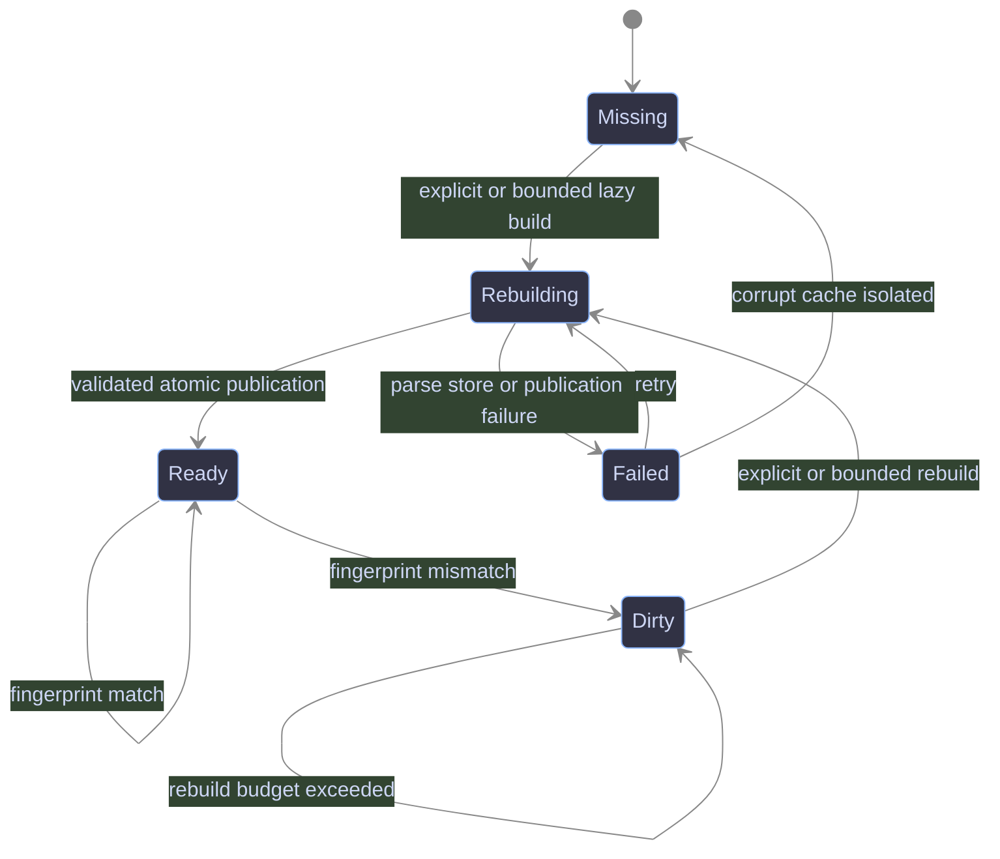
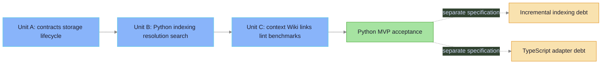

---
review:
  spec_hash: aa4913d5457d7806
  last_run: 2026-08-13
  phases:
    structure: { status: passed }
    coverage: { status: passed }
    clarity: { status: passed }
    consistency: { status: passed }
  findings:
    - id: F-001
      phase: consistency
      severity: CRITICAL
      section: "17. Sequential delivery units"
      section_hash: 9073cf7c2fbed6ac
      fragment: "The A/B/C boundaries and requirement ownership above are unchanged."
      text: >-
        The former Unit A requirement range contradicted Unit B discovery,
        fingerprinting, and full-build outputs.
      fix: >-
        Preserve R-001..R-009 in Unit A, keep discovery through search in Unit
        B, and gate all schema-v2 remediation before Unit C Task 8.
      verdict: fixed
      verdict_at: 2026-08-11
    - id: F-002
      phase: coverage
      severity: CRITICAL
      section: "7. Data model"
      section_hash: f50bb11e11f264b8
      fragment: "A module is an optional occurrence facet on a file row."
      text: >-
        The former symbol-only schema could not represent searchable files,
        declaration-free modules, alias provenance, or persisted Unicode
        normalization required by the intent and source requirements.
      fix: >-
        Define schema v2 with five authoritative tables, file-backed module
        facets, typed relations, compact normalization fields, and a non-
        persisted typed entity union.
      verdict: fixed
      verdict_at: 2026-08-11
    - id: F-003
      phase: clarity
      severity: WARNING
      section: "8. Stable identities"
      section_hash: 6bc4fd8d249f6e06
      fragment: "relation_identity = NUL_JOIN("
      text: >-
        The former relation-ID prose did not define byte-exact range and
        partially-resolved target serialization.
      fix: >-
        Specify ordered NUL fields, canonical decimal integers, and separate
        typed-target/reference fields for every resolution state.
      verdict: fixed
      verdict_at: 2026-08-11
    - id: F-004
      phase: consistency
      severity: CRITICAL
      section: "12. Build and publication lifecycle"
      section_hash: 2e04e1d2c58642ae
      fragment: "Enter the publication critical section and atomically replace"
      text: >-
        The former one-verification publication sequence contradicted the
        reviewed runtime lifecycle and its durable completion proof.
      fix: >-
        Specify database replacement, provisional metadata, two canonical
        verifications, ready/pending metadata, and timing-only diagnostics in
        exact order.
      verdict: fixed
      verdict_at: 2026-08-11
    - id: F-005
      phase: coverage
      severity: WARNING
      section: "6. Binding, locations, and configuration"
      section_hash: 87c2fc849e76d3a4
      fragment: "primary = \"iwiki-mcp\""
      text: >-
        The prior configuration example omitted the authoritative primary
        binding and did not visibly prove that code tools have no domain
        parameter.
      fix: >-
        Show the complete top-level binding plus code_graph mapping and state
        that every code tool always uses primary.
      verdict: fixed
      verdict_at: 2026-08-11
    - id: F-006
      phase: consistency
      severity: CRITICAL
      section: "13. MCP contracts"
      section_hash: cc36351087371091
      fragment: "wiki_code_context("
      text: >-
        The former symbol-only search result and context symbols parameter
        contradicted the required module/file outcomes and typed identities.
      fix: >-
        Use one discriminated search result and rename the future context input
        to seeds for file, module, and symbol entity IDs.
      verdict: fixed
      verdict_at: 2026-08-11
chain:
  intent: docs/superpowers/intents/2026-08-09-iwiki-mcp-code-graph-intent.md
  spec: null
---

# iwiki-mcp Python Code Graph Design

**Date:** 2026-08-09
**Status:** approved
**Topic:** `iwiki-mcp-code-graph`
**Intent:** `docs/superpowers/intents/2026-08-09-iwiki-mcp-code-graph-intent.md`
**Requirements source:** `docs/superpowers/intents/iwiki-mcp-code-graph-technical-requirements-final.md`

## 1. Summary

This specification defines a Python-only code-graph MVP for `iwiki-mcp`. The graph is a per-primary-domain, rebuildable SQLite cache derived from the bound project's source tree. Schema v2 exposes files, module occurrences, and symbols through one typed entity union while retaining exactly five authoritative tables. It exposes four fail-soft MCP tools for status, indexing, unified entity search, and bounded context. It complements the existing Markdown Wiki and Wiki graph without changing the `wiki_search` contract or blocking Wiki tools when code-graph work fails.

The MVP uses mandatory Tree-sitter runtime dependencies, a language-neutral core, and a Python adapter. Incremental indexing and TypeScript are explicit technical debt that require separate specifications and deliveries.

## 2. Scope and source decisions

### 2.1 In scope

- Per-primary-domain code-graph location and lifecycle.
- SQLite schema v2, occurrence-aware module identity, and stable domain-based identities.
- Safe project source discovery and deterministic fingerprinting.
- Python module occurrences, files, classes, functions, async functions, and methods.
- `DECLARES`, `IMPORTS`, basic static `CALLS`, `INHERITS`, and confirmed `DOCUMENTED_BY` relations.
- Preserved resolved, partially resolved, ambiguous, and unresolved references.
- Full rebuild, fingerprint no-op, atomic publication, corruption recovery, and bounded writer locking.
- `wiki_code_status`, `wiki_code_index`, `wiki_code_search`, and `wiki_code_context`.
- Wiki symbol, file, and source-glob selectors with code-aware lint diagnostics.
- Unit, golden-fixture, integration, security, concurrency, and benchmark evidence.

### 2.2 Out of scope

- Incremental indexing or an `incremental` public parameter.
- TypeScript or JavaScript parsing and resolution.
- Impact analysis, hybrid code/Wiki RRF, source embeddings, runtime tracing, and dynamic call graphs.
- External graph databases, background daemons, cross-repository graphs, historical source snapshots, or a UI.
- Java, Go, C#, automatic authoritative Wiki linking, or one Wiki page per symbol.
- A sixth authoritative table, persisted search projection, FTS table, Python SQLite UDF, module selector, or alias selector.

### 2.3 Approved design decisions

- Python is the MVP. TypeScript is a later, separate specification and delivery.
- `tree-sitter` and `tree-sitter-language-pack` are mandatory runtime dependencies.
- `repository_id` is the bound `primary` domain. No project UUID or code-tool `domain` parameter is introduced.
- Every code tool targets `primary`; missing `primary` returns fail-soft diagnostics.
- One authoritative Python MVP specification owns three sequential delivery units.
- Incremental indexing and TypeScript remain recorded in the `iwiki-mcp` Wiki page `reference/code-graph-technical-debt`.
- Module occurrences are facets of `files`; there is no `modules` table and no synthetic module symbol.
- Search is a query-time typed union of file, module, and symbol entities. Explicit `as` aliases are searchable through import relations; implicit bindings remain resolver/context data only.

## 3. Acceptance from intent

The following outcomes and completion rule are copied verbatim from the approved intent.

### 3.1 Desired Outcomes

- An MCP client can locate Python modules, files, classes, functions, and methods by qualified or local name and receive project-relative paths and source ranges.
- An MCP client can request a bounded neighborhood containing declarations, imports, basic calls, inheritance, and resolved Wiki links, with explicit freshness, truncation, and unresolved-reference signals.
- Operators can inspect, build, disable, and recover the per-domain code graph without a full build during server startup.
- Wiki authors can declare symbol-, file-, and source-scope selectors, detect stale or unsafe selectors, and retain human control over suggested links.
- Existing Wiki tools and `wiki_search` retain their current contracts and remain usable when code-graph dependencies, parsing, storage, or rebuilding fail.
- The architecture can add TypeScript support after the Python MVP without moving language-specific rules into the core.

### 3.2 Done when

- Done when: the checked architecture specification traces every MVP outcome and hard constraint to explicit requirements and acceptance criteria, identifies all remaining human checkpoints, and decomposes implementation into reviewable sequential delivery units without gaps or out-of-scope extras.

## 4. Requirements

### 4.1 Binding, configuration, and packaging

- **R-001 — Primary domain:** Every code tool MUST use the resolved binding's `primary` as `repository_id` and storage identity. A missing primary MUST return a sanitized `{error, hint}` response. **Acceptance:** AC-01.
- **R-002 — Feature configuration:** `[code_graph].enabled` MUST disable code-graph reads and builds without changing Wiki behavior. Configuration MUST support `languages`, `auto_rebuild`, `max_rebuild_seconds`, `max_file_bytes`, `max_total_files`, `include_tests`, and `exclude`. **Acceptance:** AC-02.
- **R-003 — Mandatory parser dependencies:** `tree-sitter` and `tree-sitter-language-pack` MUST be normal project dependencies. Adapter initialization MUST be lazy so ordinary server startup does not parse grammars or source. **Acceptance:** AC-03.
- **R-004 — Derived locations:** Database, WAL, SHM, lock, and metadata paths MUST be derived from validated `base` and `primary`; operators MUST NOT configure a database path or project UUID. **Acceptance:** AC-04.

### 4.2 Storage and lifecycle

- **R-005 — Separate store:** Code data MUST use a separate `CodeGraphStore`; existing Wiki graph tables and contracts MUST remain unchanged. **Acceptance:** AC-05.
- **R-006 — SQLite integrity:** `SCHEMA_VERSION = 2` MUST contain exactly the five authoritative tables in Section 7, enable foreign keys, WAL, busy timeout, schema/index validation, `foreign_key_check`, and `integrity_check`, and add no FTS/search-projection table or Python SQLite UDF. **Acceptance:** AC-06.
- **R-007 — Atomic publication:** A full build MUST write a unique staging database and publish it under the per-domain writer lock only after validation. Readers MUST never open staging or partially published data. **Acceptance:** AC-07.
- **R-008 — States and freshness:** Runtime state MUST distinguish `missing`, `ready`, `dirty`, `rebuilding`, and `failed`. Search/context MUST NOT present a non-ready snapshot as fresh. **Acceptance:** AC-08.
- **R-009 — Recovery:** Missing, corrupt, or incompatible caches MUST recover through a deterministic full staging rebuild without changing Wiki Markdown, vector indexes, or ingest logs. Schema v1 is an incompatible derived cache: it MUST NOT be row-migrated or rebuilt at startup. **Acceptance:** AC-09.
- **R-010 — Full-build MVP:** Indexing MUST perform either a deterministic full rebuild or a fingerprint no-op. Incremental invalidation and its API/config parameter are excluded. **Acceptance:** AC-10.

### 4.3 Discovery, extraction, and resolution

- **R-011 — Safe discovery:** Discovery MUST stay inside canonical `project_dir`, reject all symlink files/directories, apply Git/iwiki/config exclusions, exclude dependency/generated/secret-like paths, and enforce file-count and byte limits before parsing. **Acceptance:** AC-11.
- **R-012 — Deterministic identity:** File, module, symbol, relation, revision, and fingerprint identities MUST exclude absolute paths, timestamps, and randomness and MUST remain stable for identical inputs. Module and symbol IDs MUST include the occurrence-aware `module_key`; duplicate dotted module names MUST remain distinct entities. **Acceptance:** AC-12.
- **R-013 — Python extraction:** The Python adapter MUST extract whole-file ranges, module occurrence facets when a dotted name is reliable, MVP symbols, normalized signatures, imports and bindings, inheritance clauses, and syntactic call references without importing or executing project code. **Acceptance:** AC-13.
- **R-014 — Conservative resolution:** Resolver output MUST distinguish resolved, partially resolved, ambiguous, and unresolved targets. Duplicate dotted modules and ambiguous explicit aliases MUST return every valid target. Unresolved and external imports/references MUST remain `unresolved` relations with normalized `target_reference`; the resolver MUST NOT guess dynamic dispatch, reflection, DI, monkey patching, wildcard ambiguity, or missing external members. **Acceptance:** AC-14.
- **R-015 — Language isolation:** Core models, storage, indexing, and query modules MUST contain no Python-specific parsing or resolution rules; those rules belong behind `LanguageAdapter`. **Acceptance:** AC-15.

### 4.4 MCP and context contracts

- **R-016 — Tool surface:** MVP MUST expose exactly `wiki_code_status`, `wiki_code_index`, `wiki_code_search`, and `wiki_code_context`; it MUST NOT change `wiki_search`. **Acceptance:** AC-16.
- **R-017 — Fail-soft isolation:** Binding, dependency, parse, storage, lock, rebuild, and query failures MUST return sanitized diagnostics and MUST NOT block existing Wiki tools. **Acceptance:** AC-17.
- **R-018 — Deterministic search:** Unified search MUST support kinds `file`, `module`, `class`, `function`, `async_function`, and `method`; enforce the nine ranks, Unicode rules, validation bounds, alias aggregation, entity de-duplication, and stable tie-breaking in Section 13.4; and impose no hidden candidate cap. **Acceptance:** AC-18.
- **R-019 — Bounded context:** Context `seeds` MUST accept any file, module, or symbol entity ID. Traversal MUST enforce direction, depth, relation, node, file, and source-byte budgets and MUST report effective limits and truncation. **Acceptance:** AC-19.
- **R-020 — Safe source return:** Source MUST be returned only for an explicit `include_source=true` request after containment, content-hash, and byte-budget checks. Stale source MUST be omitted with `fresh=false` and a warning. **Acceptance:** AC-20.

### 4.5 Wiki links, diagnostics, and observability

- **R-021 — Selector model:** Wiki frontmatter MUST support only symbol, file, and source-glob selectors. Aliases and modules MUST NOT become selectors. Derived links MUST preserve selector provenance and specificity `symbol > file > source_glob`. **Acceptance:** AC-21.
- **R-022 — Generic Wiki links:** Schema MUST store symbol targets and file targets; source globs MUST materialize file links rather than links to every symbol. **Acceptance:** AC-22.
- **R-023 — Code-aware lint:** `wiki_lint` MUST report unknown/ambiguous symbols, missing files, empty globs, unsafe/ignored/secret-like targets, conflicting selectors, stale revision, and unavailable code graph in a separate `code_graph` block. Ordinary Wiki lint MUST remain available. **Acceptance:** AC-23.
- **R-024 — Human authority:** MVP MUST NOT generate authoritative automatic links or mutate Wiki selectors automatically. **Acceptance:** AC-24.
- **R-025 — Observability:** Status/build results MUST report revision, fingerprints, schema/normalizer/Unicode-data versions, duration, language and typed-entity/relation counts, resolution states, exclusions, truncation, module warnings, parser errors, and phase/verification timings without source or credentials. **Acceptance:** AC-25.

### 4.6 Quality and delivery

- **R-026 — Regression protection:** Existing Wiki tests and contracts MUST pass unchanged; code-graph failures MUST block zero Wiki calls. **Acceptance:** AC-26.
- **R-027 — Quality benchmark:** The benchmark MUST measure extraction/resolution quality, module-occurrence ambiguity, alias behavior, Unicode normalization behavior, and deterministic rebuilds against approved golden fixtures. **Acceptance:** AC-27.
- **R-028 — Performance benchmark:** The benchmark MUST record environment, corpus, command, startup/no-op/build/search/context latency, memory, and database size, including a 100,000-entity unified-search corpus with ASCII names, Unicode names, Unicode signatures, and shared Unicode paths. The first-release unified-search gate MUST be `<500 ms` warm maximum for every case; `<150 ms` MUST remain a reported, non-blocking post-v1 optimization target. **Acceptance:** AC-28.
- **R-029 — Sequential delivery:** Implementation planning MUST preserve the three ordered delivery units in Section 17, remediate Tasks 1–7 to schema v2 before Task 8 begins, and prevent later units from being treated as prerequisites of earlier units. **Acceptance:** AC-29.
- **R-030 — Deferred debt:** Incremental indexing and TypeScript MUST remain excluded from Python MVP claims and linked to separate future specifications. **Acceptance:** AC-30.

## 5. Architecture

### 5.1 Component boundary


### 5.2 Package boundary

```text
src/iwiki_mcp/codegraph/
├── __init__.py
├── models.py
├── schema.py
├── store.py
├── location.py
├── runtime.py
├── fingerprint.py
├── discovery.py
├── indexer.py
├── resolver.py
├── query.py
├── context.py
├── linking.py
└── languages/
    ├── __init__.py
    ├── base.py
    └── python.py
```

`server.py` is the composition root and MCP registration surface. It MAY resolve binding and translate facade diagnostics, but MUST NOT contain SQL, parsing, reference resolution, discovery traversal, or graph traversal.

## 6. Binding, locations, and configuration

### 6.1 Binding rule

`CodeGraphRuntime` receives the request-scoped `Binding`. It requires `binding.primary`; read/write domain lists do not select or fan out code graphs. Because existing binding validation requires `primary` to belong to `write`, explicit indexing remains scoped to the project's writable primary domain.

### 6.2 Derived locations

For `primary = "iwiki-mcp"`:

```text
<base>/.iwiki/code-iwiki-mcp.sqlite3
<base>/.iwiki/code-iwiki-mcp.sqlite3-wal
<base>/.iwiki/code-iwiki-mcp.sqlite3-shm
<base>/.iwiki/code-iwiki-mcp.lock
<base>/.iwiki/code-iwiki-mcp.metadata.json
```

`CodeGraphLocationResolver` MUST reuse the existing domain safety rules before interpolation. The root `.iwiki/` cache directory MUST remain excluded from Git using the existing local exclusion mechanism.

### 6.3 Configuration contract

```toml
read = ["iwiki-mcp"]
write = ["iwiki-mcp"]
primary = "iwiki-mcp"

[code_graph]
enabled = true
languages = ["python"]
auto_rebuild = "bounded"
max_rebuild_seconds = 10
max_file_bytes = 1000000
max_total_files = 20000
include_tests = true

exclude = [
  "node_modules/**",
  "dist/**",
  "build/**",
  "generated/**",
]
```

The existing top-level binding remains authoritative: every code tool uses `primary`, and no code tool accepts a `domain` parameter. The runtime reads the new mapping from `load_project_config(binding.project_dir).get("code_graph", {})`; `Binding` is not expanded with raw configuration. `auto_rebuild` accepts exactly `"off"` or `"bounded"`. MVP accepts only `python` in `languages`. Unknown languages are configuration errors local to code tools. Operator overrides remain exactly `IWIKI_CODE_GRAPH_ENABLED`, `IWIKI_CODE_GRAPH_MAX_FILE_BYTES`, `IWIKI_CODE_GRAPH_MAX_FILES`, and `IWIKI_CODE_GRAPH_AUTO_REBUILD`; the last uses the same `off|bounded` values. There is no `database`, `project_id`, `project_uuid`, or `incremental` setting.

## 7. Data model

`SCHEMA_VERSION = 2`. The five `CREATE TABLE` statements below are the complete authoritative schema: `repositories`, `files`, `symbols`, `relations`, and `wiki_code_links`. A module is an optional occurrence facet on a file row. Search and context construct typed entities from these rows; they MUST NOT create a `modules` table, synthetic module symbols, FTS table, shadow table, materialized search projection, trigger-maintained search copy, or Python SQLite UDF.

### 7.1 Repositories

```sql
CREATE TABLE repositories (
    repository_id TEXT PRIMARY KEY,
    root_path TEXT NOT NULL,
    git_remote TEXT,
    git_commit TEXT,
    source_fingerprint TEXT NOT NULL,
    config_fingerprint TEXT NOT NULL,
    parser_fingerprint TEXT NOT NULL,
    normalizer_version TEXT NOT NULL,
    unicode_data_version TEXT NOT NULL,
    revision TEXT NOT NULL,
    state TEXT NOT NULL
        CHECK (state IN ('ready', 'dirty', 'rebuilding', 'failed')),
    indexed_at TEXT NOT NULL
);
```

`root_path` is local diagnostic state and MUST NOT participate in portable IDs or MCP output. `normalizer_version` is the fixed implementation constant `casefold-token-v1`; any algorithm change increments it. `unicode_data_version` is `unicodedata.unidata_version`. `missing` is represented by no usable compatible database, not a repository row.

### 7.2 Files and module occurrence facets

```sql
CREATE TABLE files (
    file_id TEXT PRIMARY KEY,
    repository_id TEXT NOT NULL
        REFERENCES repositories(repository_id) ON DELETE CASCADE,
    path TEXT NOT NULL COLLATE BINARY,
    path_casefold TEXT,
    file_local_name TEXT NOT NULL COLLATE BINARY,
    file_name_tokens_casefold TEXT NOT NULL,
    language TEXT NOT NULL,
    content_hash TEXT NOT NULL,
    parser_version TEXT NOT NULL,
    size_bytes INTEGER NOT NULL CHECK (size_bytes >= 0),
    start_line INTEGER NOT NULL CHECK (start_line = 1),
    end_line INTEGER NOT NULL CHECK (end_line >= start_line),
    start_byte INTEGER NOT NULL CHECK (start_byte = 0),
    end_byte INTEGER NOT NULL CHECK (end_byte = size_bytes),
    module_key TEXT NOT NULL COLLATE BINARY,
    module_id TEXT UNIQUE,
    module_qualified_name TEXT COLLATE BINARY,
    module_local_name TEXT COLLATE BINARY,
    module_name_tokens_casefold TEXT,
    UNIQUE(repository_id, path),
    CHECK (
        (module_id IS NULL
         AND module_qualified_name IS NULL
         AND module_local_name IS NULL
         AND module_name_tokens_casefold IS NULL)
        OR
        (module_id IS NOT NULL
         AND module_qualified_name IS NOT NULL
         AND module_local_name IS NOT NULL
         AND module_name_tokens_casefold IS NOT NULL)
    )
);
```

`path` is the normalized project-relative POSIX path; `file_local_name` is its final component. The whole-file byte interval is `[0, size_bytes)`. Its one-based inclusive line range is `1..max(1, newline_count + 1)`. `module_key` is non-null for every supported file, including a file-only entity. The four nullable module fields are an all-or-none group: inability to derive a reliable dotted Python name suppresses only the module entity, never the file row, `module_key`, declarations, or warnings.

### 7.3 Symbols

```sql
CREATE TABLE symbols (
    symbol_id TEXT PRIMARY KEY,
    file_id TEXT NOT NULL REFERENCES files(file_id) ON DELETE CASCADE,
    kind TEXT NOT NULL
        CHECK (kind IN ('class', 'function', 'async_function', 'method')),
    qualified_name TEXT NOT NULL COLLATE BINARY,
    local_name TEXT NOT NULL COLLATE BINARY,
    name_tokens_casefold TEXT NOT NULL,
    start_line INTEGER NOT NULL CHECK (start_line >= 1),
    end_line INTEGER NOT NULL CHECK (end_line >= start_line),
    start_byte INTEGER NOT NULL CHECK (start_byte >= 0),
    end_byte INTEGER NOT NULL CHECK (end_byte >= start_byte),
    signature TEXT,
    signature_casefold TEXT,
    visibility TEXT,
    content_hash TEXT NOT NULL,
    metadata_json TEXT NOT NULL DEFAULT '{}',
    UNIQUE(file_id, qualified_name, start_line)
);
```

An async top-level or nested function uses `async_function`; an async method remains `method` and records its async marker in the normalized signature/metadata. `metadata_json` stores normalized language-specific metadata and MUST NOT contain source text.

### 7.4 Relations

```sql
CREATE TABLE relations (
    relation_id TEXT PRIMARY KEY,
    source_file_id TEXT NOT NULL
        REFERENCES files(file_id) ON DELETE CASCADE,
    source_module_id TEXT
        REFERENCES files(module_id) ON DELETE CASCADE,
    source_symbol_id TEXT
        REFERENCES symbols(symbol_id) ON DELETE CASCADE,
    target_module_id TEXT
        REFERENCES files(module_id) ON DELETE CASCADE,
    target_symbol_id TEXT
        REFERENCES symbols(symbol_id) ON DELETE CASCADE,
    target_reference TEXT,
    relation_type TEXT NOT NULL
        CHECK (relation_type IN ('DECLARES', 'IMPORTS', 'CALLS', 'INHERITS')),
    source_start_line INTEGER NOT NULL CHECK (source_start_line >= 1),
    source_end_line INTEGER NOT NULL CHECK (source_end_line >= source_start_line),
    source_start_byte INTEGER NOT NULL CHECK (source_start_byte >= 0),
    source_end_byte INTEGER NOT NULL CHECK (source_end_byte >= source_start_byte),
    binding_name TEXT COLLATE BINARY,
    binding_kind TEXT
        CHECK (binding_kind IN ('implicit_binding', 'explicit_alias')),
    binding_name_tokens_casefold TEXT,
    confidence REAL NOT NULL DEFAULT 1.0
        CHECK (confidence >= 0.0 AND confidence <= 1.0),
    resolution_state TEXT NOT NULL
        CHECK (resolution_state IN (
            'resolved', 'partially_resolved', 'unresolved', 'ambiguous'
        )),
    metadata_json TEXT NOT NULL DEFAULT '{}',
    CHECK (source_module_id IS NULL OR source_symbol_id IS NULL),
    CHECK (
        (target_module_id IS NOT NULL)
        + (target_symbol_id IS NOT NULL) <= 1
    ),
    CHECK (
        (resolution_state IN ('resolved', 'ambiguous')
         AND target_reference IS NULL
         AND ((target_module_id IS NOT NULL)
              + (target_symbol_id IS NOT NULL) = 1))
        OR
        (resolution_state = 'partially_resolved'
         AND target_reference IS NOT NULL
         AND ((target_module_id IS NOT NULL)
              + (target_symbol_id IS NOT NULL) = 1))
        OR
        (resolution_state = 'unresolved'
         AND target_reference IS NOT NULL
         AND target_module_id IS NULL
         AND target_symbol_id IS NULL)
    ),
    CHECK (
        (relation_type = 'IMPORTS'
         AND binding_name IS NOT NULL
         AND binding_kind IS NOT NULL
         AND binding_name_tokens_casefold IS NOT NULL)
        OR
        (relation_type <> 'IMPORTS'
         AND binding_name IS NULL
         AND binding_kind IS NULL
         AND binding_name_tokens_casefold IS NULL)
    )
);
```

Source entity type is derived without a projection: `symbol` when `source_symbol_id` is set, otherwise `module` when `source_module_id` is set, otherwise `file` using `source_file_id`. Targets are exactly one module, one symbol, or a normalized unresolved reference; file targets are not valid code relations. Store validation MUST also prove that a source module belongs to `source_file_id` and that a source symbol belongs to that file. A resolved or ambiguous target has exactly one typed target and no `target_reference`. A partially resolved target retains exactly one typed prefix plus `target_reference`. An unresolved target, including an external module/member, retains a normalized `target_reference` and no fabricated target entity. Ambiguity is represented as one deterministic relation per candidate.

Every `IMPORTS` relation persists the source binding. `binding_kind = 'explicit_alias'` only for an explicit Python `as` clause; all names introduced without `as`, including ordinary imported names, use `implicit_binding`. Both remain available to the resolver and context. Only explicit aliases participate in search tiers.

### 7.5 Wiki-code links

```sql
CREATE TABLE wiki_code_links (
    link_id TEXT PRIMARY KEY,
    domain TEXT NOT NULL,
    page_id TEXT NOT NULL,
    symbol_id TEXT REFERENCES symbols(symbol_id) ON DELETE CASCADE,
    file_id TEXT REFERENCES files(file_id) ON DELETE CASCADE,
    selector_kind TEXT NOT NULL
        CHECK (selector_kind IN ('symbol', 'file', 'source_glob')),
    relation_type TEXT NOT NULL,
    confidence REAL NOT NULL DEFAULT 1.0
        CHECK (confidence >= 0.0 AND confidence <= 1.0),
    source TEXT NOT NULL,
    CHECK ((symbol_id IS NOT NULL) <> (file_id IS NOT NULL))
);
```

The generic target shape supports symbol selectors and file/source-glob selectors. It deliberately has no `module_id`: modules and aliases are not Wiki selectors.

### 7.6 Persisted normalization

Normalization is versioned application code executed before persistence, not a SQLite UDF. It uses Python `str.casefold()` only; it MUST NOT apply NFC, NFKC, or another Unicode normalization form. Consequently, canonically equivalent but differently encoded source names remain distinct raw canonical names.

The token key for string `value` is exactly:

```python
folded = value.casefold()
tokens = sorted(set(re.findall(r"[^\W_]+", folded, flags=re.UNICODE)))
token_key = "\x1f" + "\x1f".join(tokens) + "\x1f"
```

U+001F on both ends makes each token boundary-addressable. `file_name_tokens_casefold`, `name_tokens_casefold`, and every present `binding_name_tokens_casefold` are always persisted. `module_name_tokens_casefold` is persisted whenever the module facet exists. A file token key uses `file_local_name`. A module or symbol name token key is the sorted unique union of tokens independently extracted from its qualified name and its local name.

A lexical tier matches only when every distinct query token occurs as the exact delimited substring `"\x1f" + token + "\x1f"` in the corresponding persisted key. A nonblank query that produces no tokens skips lexical tiers but may still match raw exact/prefix, signature, or path tiers.

`path_casefold` and `signature_casefold` are deterministic compact scalar deltas. `path_casefold` is `NULL` exactly when `path` is ASCII; otherwise it stores Python `path.casefold()`. `signature_casefold` is `NULL` exactly when the signature is absent or ASCII; otherwise it stores Python `signature.casefold()`. Queries use `COALESCE(path_casefold, lower(path))` and, for a non-null signature, `COALESCE(signature_casefold, lower(signature))`. Raw exact and prefix tiers remain case-sensitive against `COLLATE BINARY`; lexical tiers use token keys; signature and path tiers use literal `instr` substring matching over the casefold expression. `%` and `_` in input are literals, never wildcards.

### 7.7 Canonical typed entity union

Search/context construct a query-time `UNION ALL` with these mappings:

| Entity | `entity_id` | `entity_type` | `kind` | Populated typed IDs | Canonical names/range |
|---|---|---|---|---|---|
| File row | `file_id` | `file` | `file` | `file_id` | `path`, `file_local_name`, whole-file range |
| Module facet | `module_id` | `module` | `module` | `file_id`, `module_id` | module qualified/local names, whole-file range |
| Symbol row | `symbol_id` | `symbol` | stored symbol kind | `file_id`, optional enclosing `module_id`, `symbol_id` | symbol qualified/local names and symbol range |

This union is canonical but not persisted. A file with a module facet yields two different entities. File-only rows yield only a file entity; their symbols remain valid and use `module_key` for identity.

### 7.8 Required indexes

```sql
CREATE INDEX idx_files_repository_path
    ON files(repository_id, path);
CREATE INDEX idx_files_repository_local
    ON files(repository_id, file_local_name);
CREATE INDEX idx_files_content_hash
    ON files(content_hash);
CREATE INDEX idx_files_repository_module_key
    ON files(repository_id, module_key);
CREATE INDEX idx_files_repository_module_qualified
    ON files(repository_id, module_qualified_name);
CREATE INDEX idx_files_repository_module_local
    ON files(repository_id, module_local_name);
CREATE INDEX idx_symbols_file
    ON symbols(file_id);
CREATE INDEX idx_symbols_qualified
    ON symbols(qualified_name);
CREATE INDEX idx_symbols_local
    ON symbols(local_name);
CREATE INDEX idx_symbols_kind
    ON symbols(kind);
CREATE INDEX idx_relations_source_file_type
    ON relations(source_file_id, relation_type);
CREATE INDEX idx_relations_source_module_type
    ON relations(source_module_id, relation_type);
CREATE INDEX idx_relations_source_symbol_type
    ON relations(source_symbol_id, relation_type);
CREATE INDEX idx_relations_target_module_type
    ON relations(target_module_id, relation_type);
CREATE INDEX idx_relations_target_symbol_type
    ON relations(target_symbol_id, relation_type);
CREATE INDEX idx_relations_reference
    ON relations(target_reference);
CREATE INDEX idx_relations_explicit_alias
    ON relations(binding_kind, binding_name);
CREATE INDEX idx_wiki_links_page
    ON wiki_code_links(domain, page_id);
CREATE INDEX idx_wiki_links_symbol
    ON wiki_code_links(symbol_id);
CREATE INDEX idx_wiki_links_file
    ON wiki_code_links(file_id);
```

The twenty named indexes above are the complete explicit index set. The implicit unique indexes created by primary keys, `UNIQUE(repository_id, path)`, and `UNIQUE(module_id)` are also schema-parity requirements. No additional table or index may act as an authoritative search copy.

## 8. Stable identities

Canonical inputs are UTF-8 strings separated by NUL bytes before SHA-256 hashing.

`py` is the stable registered prefix for the `python` adapter. The core receives this prefix from the adapter contract; it does not infer a language prefix from Python-specific rules.

```text
repository_id = primary domain

module_key = normalized project-relative POSIX path

file_id =
  "py:file:" + sha256("file\0" + domain + "\0python\0" + relative_path)

module_id =
  "py:module:" + sha256(
    "module\0python\0" + domain + "\0" + module_key + "\0" +
    module_qualified_name
  )

symbol_identity =
  "python\0" + domain + "\0" + module_key + "\0" +
  qualified_name + "\0" + normalized_signature

symbol_id =
  "py:symbol:" + sha256("symbol\0" + symbol_identity)

relation_identity = NUL_JOIN(
  "relation",
  "python",
  domain,
  source_entity_id,
  relation_type,
  decimal(source_start_line),
  decimal(source_end_line),
  decimal(source_start_byte),
  decimal(source_end_byte),
  target_entity_id_or_empty,
  target_reference_or_empty,
  binding_kind_or_empty,
  binding_name_or_empty,
)

relation_id =
  "py:relation:" + sha256(relation_identity)
```

`relative_path` and `module_key` are the same normalized project-relative path for Python v2; the separate name makes the occurrence role explicit and leaves absolute paths out of every identity. `file_id` therefore remains stable from schema v1. `module_id` adds both the occurrence key and dotted qualified name. `symbol_id` uses `module_key` even when the file has no reliable module facet, so symbols from duplicate or file-only occurrences never collapse.

The normalized signature includes symbol kind, async marker, parameter kinds/names, annotations, defaults, and return annotation while ignoring formatting. A body-only change preserves `symbol_id`; a rename or signature change creates a new identity. Nested qualified names distinguish nested symbols.

Python module derivation uses deterministic source-root/package evidence only. `pkg/__init__.py` represents module `pkg`, not `pkg.__init__`. If a dotted name cannot be derived reliably, the adapter persists the file and its `module_key`, emits a warning, and creates no module facet. Two paths that reliably derive the same dotted name retain different `module_key` values and therefore different module and symbol IDs. A reference to that dotted name resolves to all valid occurrences as `ambiguous`; path order MUST NOT choose a winner.

`NUL_JOIN` encodes each listed UTF-8 field in order with one NUL separator; decimal integers have no sign, padding, or leading zero except `0`. A resolved/ambiguous relation sets the typed target field and leaves the reference field empty. An unresolved relation does the reverse. A partially resolved relation sets both fields. This makes repeated import sites distinct while retaining deterministic alias aggregation at query time.

## 9. Discovery and security boundary

### 9.1 Discovery order

1. Resolve and canonicalize `project_dir`.
2. Load `.gitignore`, `.iwikiignore`, built-in exclusions, and configured excludes.
3. Walk without following symlinks.
4. Reject every symlink file or directory.
5. Recheck containment for each candidate.
6. Apply path exclusions and `include_tests`.
7. Reject files beyond `max_file_bytes` and stop at `max_total_files` with explicit truncation.
8. Read bytes, compute content hashes, and pass supported files to adapters.

### 9.2 Built-in exclusions

```text
.git/
.iwiki/
.venv/
venv/
node_modules/
dist/
build/
coverage/
__pycache__/
vendor/
generated/
.env
.env.*
*.pem
*.key
id_rsa
id_ed25519
credentials*
secrets*
```

Path matching MUST use project-relative POSIX-style paths. A configured include MUST NOT override a secret-like built-in exclusion or containment rejection.

## 10. Python adapter and resolution

### 10.1 Adapter interface

```python
class LanguageAdapter(Protocol):
    language: str
    extensions: tuple[str, ...]

    def parse_file(self, source: bytes, path: str) -> ParsedFile:
        ...

    def resolve_references(
        self,
        parsed: ParsedFile,
        project_index: ProjectIndex,
    ) -> ResolutionResult:
        ...
```

Core code depends on this protocol and normalized models only.

### 10.2 Normalized model contracts

Persistence models map one-to-one to schema v2 columns; adapters do not return synthetic module symbols or search rows.

```python
@dataclass(frozen=True)
class FileRecord:
    file_id: str
    repository_id: str
    path: str
    path_casefold: str | None
    file_local_name: str
    file_name_tokens_casefold: str
    language: str
    content_hash: str
    parser_version: str
    size_bytes: int
    start_line: int
    end_line: int
    start_byte: int
    end_byte: int
    module_key: str
    module_id: str | None
    module_qualified_name: str | None
    module_local_name: str | None
    module_name_tokens_casefold: str | None


@dataclass(frozen=True)
class SymbolRecord:
    symbol_id: str
    file_id: str
    kind: Literal["class", "function", "async_function", "method"]
    qualified_name: str
    local_name: str
    name_tokens_casefold: str
    start_line: int
    end_line: int
    start_byte: int
    end_byte: int
    signature: str | None
    signature_casefold: str | None
    visibility: str | None
    content_hash: str
    metadata_json: str


@dataclass(frozen=True)
class RelationRecord:
    relation_id: str
    source_file_id: str
    source_module_id: str | None
    source_symbol_id: str | None
    target_module_id: str | None
    target_symbol_id: str | None
    target_reference: str | None
    relation_type: Literal["DECLARES", "IMPORTS", "CALLS", "INHERITS"]
    source_start_line: int
    source_end_line: int
    source_start_byte: int
    source_end_byte: int
    binding_name: str | None
    binding_kind: Literal["implicit_binding", "explicit_alias"] | None
    binding_name_tokens_casefold: str | None
    confidence: float
    resolution_state: Literal[
        "resolved", "partially_resolved", "unresolved", "ambiguous"
    ]
    metadata_json: str


@dataclass(frozen=True)
class SearchResult:
    entity_id: str
    entity_type: Literal["file", "module", "symbol"]
    file_id: str | None
    module_id: str | None
    symbol_id: str | None
    kind: Literal[
        "file", "module", "class", "function", "async_function", "method"
    ]
    qualified_name: str
    local_name: str
    signature: str | None
    path: str
    start_line: int
    end_line: int
    start_byte: int
    end_byte: int
    match: Literal[
        "qualified_exact",
        "local_exact",
        "alias_exact",
        "canonical_prefix",
        "alias_prefix",
        "canonical_lexical",
        "alias_lexical",
        "signature",
        "path",
    ]
    matched_alias: str | None
    alias_ambiguous: bool
    alias_target_count: int
```

`ProjectIndex` exposes normalized module occurrences and symbols without language-specific lookup rules. `ParsedFile` contains one `FileRecord`, zero or more `SymbolRecord` values, unresolved normalized reference records with the same source-range and binding fields as `RelationRecord`, and warnings. `ResolutionResult` contains only `RelationRecord` values and warnings. Context nodes reuse the typed identity, kind, name, path, and range shape of `SearchResult` without search-only match fields.

### 10.3 Extraction

The Python adapter emits one file record for every accepted Python file and an optional module facet on that record. It extracts classes, functions, async functions, methods, imports, relative imports, explicit `as` aliases, implicit bindings, inheritance clauses, and syntactic calls. It records whole-file and relation/symbol line and byte ranges. It MUST NOT import modules, execute decorators/default expressions, inspect runtime objects, or invoke project code.

`pkg/__init__.py` yields dotted module name `pkg` when package/source-root evidence is reliable. Namespace/source-root ambiguity yields a file-only record and warning. Duplicate reliable dotted names are preserved as separate occurrences. Every import reference persists a binding: an explicit `as` name is marked `explicit_alias`; any name introduced without `as` is marked `implicit_binding`. Normalized columns are computed once with the versioned Section 7.6 normalizer before rows reach storage.

Tree-sitter parse errors become file warnings. The adapter MAY retain successfully parsed declarations only when their ranges are valid and outside error nodes; it MUST report partial parsing.

### 10.4 Resolution

- `IMPORTS` resolves project-local absolute modules, relative modules, aliases, imported names, and module occurrence candidates.
- `INHERITS` resolves only uniquely identified project classes.
- `CALLS` resolves local bindings, imported functions/classes, and unambiguous `self` or class method references.
- A unique exact target is `resolved`.
- Multiple valid targets, including duplicate dotted module occurrences or an ambiguous explicit alias, produce one candidate relation per target marked `ambiguous`.
- A known module with an unknown member is `partially_resolved`.
- A missing, external, or dynamic target remains `unresolved` with its normalized reference and binding/range evidence.

Dynamic dispatch, reflection, dependency injection, monkey patching, wildcard ambiguity, generated symbols, and external packages are never guessed.

## 11. Fingerprint and revision

Fingerprint input includes sorted relative paths and content hashes, Git commit, dirty-worktree marker, normalized code-graph configuration, language set, excludes, `SCHEMA_VERSION = 2`, Tree-sitter grammar version, adapter version, resolver version, normalizer version, and `unicodedata.unidata_version`. It excludes absolute path, wall-clock time, process ID, and random values.

`revision` is the hash of the canonical persisted graph inputs and all normalized schema-v2 output rows, including module facets, source ranges, bindings, and compact normalization columns. Two builds from identical inputs MUST produce identical revision, IDs, row ordering at serialization boundaries, and query tie-breaking. A normalizer or Unicode-data version change invalidates the no-op fingerprint and requires a full rebuild.

## 12. Build and publication lifecycle

### 12.1 Full build

1. Validate the request/configuration values available without I/O; invalid input returns `invalid_config` before binding, status, locks, database access, or rebuild work.
2. Resolve binding, load and validate project configuration, and derive locations; configuration failure precedes status/store/lock/build access.
3. Acquire the per-domain writer lock with bounded wait.
4. Discover candidates and compute fingerprint inputs.
5. Return no-op only when the ready canonical database has the same fingerprint and compatible schema, parser, resolver, normalizer, and Unicode-data versions.
6. Create a unique schema-v2 staging database beside the canonical database.
7. Parse files and persist file/module facets, symbols, unresolved relations, bindings, ranges, and normalized columns.
8. Run cross-file resolution and Wiki-selector resolution.
9. Store the staging repository state and revision.
10. Run `foreign_key_check`, `integrity_check`, exact five-table/index parity, normalization parity, and deterministic-row checks on staging.
11. Close staging connections and checkpoint staging WAL.
12. Wait for replace-compatible canonical handles within the same bounded lock deadline.
13. Enter the publication critical section and atomically replace the canonical database.
14. Publish provisional metadata with state `rebuilding` and the new revision.
15. Open the canonical database, enable WAL, and perform canonical verification #1.
16. Publish `ready` metadata for the verified revision with `pending_final_verify = true`.
17. Reopen independently and perform canonical verification #2.
18. Refresh diagnostics-only metadata after verification #2. `pending_final_verify` remains `true`; the refresh MAY change only total duration and phase timings, whose completed final-verification entry is the durable proof. It MUST NOT change state, revision, fingerprints, or another authoritative field.

Any failure before the publication critical section leaves the prior canonical database unchanged. Failed staging artifacts are removed. Failure after replacement remains non-ready until the verification protocol proves the new canonical revision. A corrupt canonical database is moved to a diagnostic quarantine path before rebuilding.

Schema v1 is incompatible derived state. Status/startup reports it as incompatible and recommends `wiki_code_index`; startup performs no discovery, row migration, or rebuild. The next explicit or allowed bounded build creates a complete schema-v2 staging database and follows the same replace/verification protocol. Wiki Markdown, Wiki SQLite graph, vector index, and ingest log are not migrated or modified.

### 12.2 Runtime state



Startup reads metadata and checks schema compatibility only. It never performs discovery, row migration, or a full build. Search/context on `dirty`, `rebuilding`, `failed`, or incompatible schema returns `fresh=false`, a sanitized warning, and remediation rather than presenting old graph data as current.

For `missing` or `dirty`, search/context MAY attempt one rebuild only when `auto_rebuild = "bounded"` and the remaining request budget is at least `max_rebuild_seconds`. The caller waits for at most `max_rebuild_seconds`. When that deadline expires, it cancels the build cooperatively, returns a non-ready diagnostic and a `wiki_code_index` hint, and never returns graph nodes from the old snapshot.

Cancellation MUST prevent any new publication critical section from starting. Discovery, parsing, Git exclusion setup, SQLite work, and cleanup MAY finish asynchronously after the caller returns, but they MUST observe cancellation before entering publication and MUST NOT publish. If cancellation arrives after the atomic publication critical section has already started, that in-flight section MAY finish the ordered replace/metadata/two-verification protocol under the writer lock after the caller has returned. Readers return `fresh=false` until verification #2 and its completed diagnostics are durable; `pending_final_verify=true` is retained as protocol provenance and is not by itself stale once those completion timings exist. Readers may observe the new snapshot only after the complete database and verification proof are published. This cooperative boundary is required because blocking `fsync`, SQLite, and `os.replace` calls cannot be safely interrupted.

## 13. MCP contracts

### 13.1 Common response rules

Successful code responses include `domain`, `state`, `revision`, `fresh`, and `warnings`. Fail-soft responses use the current server convention `{error, hint}` and MAY include sanitized state. They MUST NOT contain absolute paths, source excerpts, environment values, credentials, raw SQL, or traceback text.

Every handler first validates its request as a pure operation. A malformed query, kind, limit, seed, direction, relation, or language returns `invalid_config` before binding resolution, status lookup, lock acquisition, database access, or rebuild. Validation never truncates input. Project configuration, which requires `binding.project_dir`, is validated immediately after binding and before status/store/lock/build work.

### 13.2 `wiki_code_status`

```python
wiki_code_status() -> dict
```

Returns enabled state, domain, lifecycle state, revision, commit, fingerprints, schema/parser/adapter/resolver/normalizer/Unicode-data versions, counts by typed entity kind, resolution ratios, `indexed_at`, `pending_final_verify`, and warnings. It never triggers a build.

### 13.3 `wiki_code_index`

```python
wiki_code_index(
    force: bool = False,
    languages: list[str] | None = None,
) -> dict
```

Only `python` is accepted. `force=false` permits fingerprint no-op. `force=true` rebuilds the full Python snapshot. The result includes no-op/build status, revision, duration, counts, exclusions, parser warnings, resolution states, and phase timings.

### 13.4 `wiki_code_search`

```python
wiki_code_search(
    query: str,
    kinds: list[str] | None = None,
    path: str | None = None,
    languages: list[str] | None = None,
    limit: int = 20,
) -> dict
```

`kinds` accepts only `file`, `module`, `class`, `function`, `async_function`, and `method`. Path filters are safe project-relative prefixes applied to the target entity path, never the source path of an alias import. Each result uses the `SearchResult` contract in Section 10.2: `entity_id`, `entity_type`, nullable `file_id`/`module_id`/`symbol_id`, kind, canonical qualified/local names, normalized signature, project-relative path, whole-entity line/byte range, `match`, `matched_alias`, `alias_ambiguous`, and `alias_target_count`. Internal numeric rank is not public.

Before binding or I/O, `query` MUST:

- encode as valid UTF-8 in at most 4,096 bytes;
- contain at least one non-whitespace Unicode character;
- contain no NUL and no lone surrogate;
- produce at most 64 distinct tokens under the exact Section 7.6 casefold/token algorithm.

Violation returns `invalid_config`; input is never truncated. Casefolding does not apply NFC/NFKC. Raw canonical exact/prefix comparisons are case-sensitive. Search evaluates the following ranks in order:

1. exact qualified canonical name;
2. exact local canonical name;
3. exact explicit alias;
4. canonical prefix;
5. explicit-alias prefix;
6. canonical token-key lexical match;
7. explicit-alias token-key lexical match;
8. literal signature substring over `COALESCE(signature_casefold, lower(signature))`;
9. literal path substring over `COALESCE(path_casefold, lower(path))`.

Canonical name tiers query the file/module/symbol union directly. Alias tiers query only `IMPORTS` relations with `binding_kind = 'explicit_alias'`, then project each typed module/symbol target into that same union. Implicit bindings never enter search tiers. Repeated import sites for the same explicit alias and target are aggregated by target `entity_id`; an ambiguous alias retains every distinct target. If multiple aliases match the same entity at its strongest alias tier, `matched_alias` is the lowest alias by Unicode code-point order. `alias_target_count` is the distinct target count for that selected alias after requested language/kind/target-path filters and before output `limit`; `alias_ambiguous` is `alias_target_count > 1`. Canonical-tier winners set `matched_alias=null`, `alias_target_count=0`, and `alias_ambiguous=false`.

Each lexical tier requires every distinct query token to occur as a complete U+001F-bounded token in the persisted key; zero tokens cannot produce a lexical match. Signature/path tiers use `instr(persisted_casefold_expression, query.casefold()) > 0`. Public `match` names the winning tier (`qualified_exact`, `local_exact`, `alias_exact`, `canonical_prefix`, `alias_prefix`, `canonical_lexical`, `alias_lexical`, `signature`, or `path`). Final order is exactly `(match_rank, qualified_name, entity_id)` using the internal rank.

The query executes the nine ranks sequentially rather than materializing one all-rank entity CTE. Each canonical rank uses branch-specific file, module, and symbol SQL over the authoritative tables; exact and prefix branches use the existing Section 7.8 indexes, while lexical, signature, and path branches remain projection-free scans over persisted normalized columns. Each alias rank starts from filtered `IMPORTS` rows, completes target aggregation and `alias_target_count` calculation, and only then orders typed targets. A rank predicate is exclusive of all stronger ranks. Rows already returned by a stronger rank are excluded by their bounded public `entity_id` set.

Within a rank, filtering, target aggregation, exact rank semantics, de-duplication, and ordering are complete before SQLite applies the remaining public `limit`. Execution stops only when the accumulated result contains the requested public `limit`; lower ranks cannot displace any returned entity and need not execute. If the result is not full, the next rank runs without any hidden candidate bound. This is observationally equivalent to evaluating and de-duplicating every rank before the final public limit, but avoids mandatory whole-corpus materialization for queries whose strongest ranks already satisfy the request. There is no hidden pre-limit candidate cap, new index, FTS projection, Python SQLite UDF, or wildcard interpretation of `%`/`_`.

### 13.5 `wiki_code_context`

```python
wiki_code_context(
    seeds: list[str],
    direction: Literal["in", "out", "both"] = "both",
    depth: int = 1,
    relations: list[str] | None = None,
    include_source: bool = False,
    include_wiki: bool = True,
    max_nodes: int = 50,
    max_files: int = 20,
    max_source_bytes: int = 200_000,
) -> dict
```

Required shape:

```json
{
  "domain": "iwiki-mcp",
  "state": "ready",
  "revision": "sha256:...",
  "fresh": true,
  "seeds": [],
  "nodes": [],
  "relations": [],
  "files": [],
  "wiki_pages": [],
  "limits": {
    "depth": 1,
    "max_nodes": 50,
    "max_files": 20,
    "max_source_bytes": 200000
  },
  "truncated": false,
  "warnings": []
}
```

Each `seeds` entry is an exact `entity_id` for a file, module, or symbol from the Section 7.7 union. A file seed returns the file and activates its module facet, when present, at depth 0. A module expands `DECLARES` and `IMPORTS`. A symbol expands `CALLS`, `INHERITS`, `IMPORTS`, and `DECLARES` in the requested direction. A file-only occurrence uses file-scoped relations. Returned nodes use the same typed identity and kind fields. Relations expose typed source/target entity IDs, source ranges, resolution state, normalized unresolved references, and full explicit/implicit binding provenance; search's alias aggregation does not discard context evidence.

Traversal is breadth-first. Each frontier is ordered by `(relation_type, source_entity_id, target_entity_id_or_reference, source_start_byte, relation_id)` before admission. Budget exhaustion stops expansion, retains already accepted items, sets `truncated=true`, and reports the exhausted budget. Source reads occur only after the caller explicitly sends `include_source=true`, then recheck containment and current content hash; mismatches omit source and set `fresh=false`.

## 14. Wiki linking and lint

### 14.1 Frontmatter

```yaml
code:
  symbols:
    - qualified_name: iwiki_mcp.engine.search.SearchEngine.search
  files:
    - src/iwiki_mcp/engine/search.py
  source_globs:
    - src/iwiki_mcp/engine/**
```

Markdown stores selectors only. Canonical IDs and derived links remain in `CodeGraphStore`. Symbol selectors create symbol links; file selectors create file links; globs materialize matching file links. Duplicate targets retain the most specific selector provenance.

The selector grammar remains exactly `symbols`, `files`, and `source_globs`. It does not accept `modules`, `module_id`, import bindings, or aliases. Searchable explicit aliases are discovery evidence, not durable selectors and not alternate symbol identities.

Confirmed links use `relation_type = 'DOCUMENTED_BY'` in `wiki_code_links`. They are not inserted into `relations`, whose source and target identities are code entities; `wiki_code_links` is the typed code-to-Wiki edge store for symbol and file targets.

### 14.2 Lint behavior

When code graph is ready, `wiki_lint` adds a `code_graph` report containing unknown or ambiguous qualified names, missing files, empty globs, unsafe containment, ignored/secret-like matches, conflicting selectors, and stale revisions. When code graph is disabled or unavailable, the block reports availability/remediation without preventing ordinary Markdown lint.

MVP does not generate suggested links. Any future suggestion MUST remain non-authoritative, MUST NOT mutate frontmatter automatically, and requires separate scope approval.

## 15. Error handling and observability

### 15.1 Failure classes

- `not_configured`: no primary or disabled feature.
- `invalid_config`: unsupported language, limit, or policy.
- `busy`: writer lock or replace-compatible handle deadline exceeded.
- `stale`: fingerprint mismatch without completed rebuild.
- `parse_failed`: no publishable graph from supported source.
- `store_failed`: schema, integrity, read, or write failure.
- `rebuild_failed`: build or publication failure.
- `unsafe_path`: containment, symlink, ignore, or secret boundary rejection.

Handlers map these classes to stable sanitized messages and hints. Pure request-validation failures take precedence over missing/disabled binding and all runtime states and perform no I/O. Unexpected exceptions are logged without source/credentials and returned through the same fail-soft boundary.

### 15.2 Metrics and logs

Status/build diagnostics include revision/fingerprint, schema/normalizer/Unicode-data versions, duration, counts by language/entity kind/relation/resolution state, file-only module warnings, excluded/truncated file counts, parser-error counts, and discovery/parsing/normalization/resolution/persistence/verification timings. Source text and credentials are forbidden.

## 16. Testing and benchmark

### 16.1 Unit tests

- Stable file/module/symbol/relation IDs, occurrence-aware duplicate modules, file-only fallback, and normalized signatures.
- Exact schema-v2 five-table/index creation, constraints, schema-v1 migration rejection, and integrity checks.
- Casefold-only normalization, ASCII scalar-delta `NULL`, exact `[^\W_]+` Unicode token behavior, NUL/lone-surrogate rejection, UTF-8/token bounds, and normalizer/Unicode-version fingerprints.
- Configuration parsing and environment overrides.
- Containment, symlink rejection, ignore precedence, secret exclusions, and budgets.
- Python file/module facets, declarations, explicit aliases, implicit bindings, imports, calls, inheritance, partial syntax, and unresolved/external references.
- Declaration-free and empty files remain searchable as file/module entities, including package `__init__.py` and duplicate dotted-module fixtures.
- Nine-tier unified ranking, ambiguous-alias fan-out, repeated-alias aggregation, entity de-duplication before limit, stable ties, traversal from every entity type, and source hash checks.

### 16.2 Golden fixtures

```text
tests/fixtures/codegraph/python_basic
tests/fixtures/codegraph/python_imports
tests/fixtures/codegraph/python_inheritance
tests/fixtures/codegraph/python_dynamic
tests/fixtures/codegraph/python_syntax_errors
tests/fixtures/codegraph/python_duplicate_modules
tests/fixtures/codegraph/python_unicode
tests/fixtures/codegraph/security_paths
```

### 16.3 Integration tests

- Full build and fingerprint no-op.
- Schema-v1 incompatibility followed by deterministic schema-v2 staging rebuild and atomic publication with no row migration.
- Added/changed/deleted file and dirty worktree detection followed by full rebuild.
- Branch switch, corrupt database, incompatible schema, and metadata mismatch.
- Concurrent readers, competing writers, bounded `busy`, cancellation boundaries, ordered two-verification publication, and atomic replacement.
- Unified file/module/symbol search; duplicate dotted modules; explicit/implicit alias behavior; unresolved external relations; invalid-query precedence before binding/store/build.
- Wiki symbol/file/glob links and code-aware lint.
- Disabled feature, missing primary, parser/store/build failure, and continuing Wiki calls.

### 16.4 Benchmark

`eval/code_graph/` owns a non-production benchmark runner and report. Every report records environment, corpus identities, command, schema/parser/resolver/normalizer/Unicode-data versions, startup/no-op/build/search/context latency, peak memory, DB/source size, declaration/import/call quality, false resolutions, module ambiguity, alias correctness, and deterministic rebuild comparison.

The benchmark uses two explicit corpus classes. The unified-search corpus is a deterministic schema-v2 SQL corpus with at least 100,000 total file/module/symbol entities and fixed strata for ASCII names, Unicode names, Unicode signatures, shared Unicode path prefixes, duplicate dotted modules, repeated aliases, and ambiguous aliases. It exercises every rank through production `CodeGraphQuery` without FTS, UDFs, projection tables, new indexes, or candidate caps. It is authoritative only for search correctness and latency.

The production corpus is a generated source tree processed through production discovery, Python parsing, resolution, storage, and publication. It is authoritative for startup, fingerprint no-op, build latency, context latency, peak memory, extraction/resolution quality, deterministic rebuild, and database/source ratio. The source denominator is the sum of actual accepted source-file bytes. The database numerator is the canonical main SQLite file size after a benchmark-owned WAL checkpoint and close; transient WAL/SHM files and the synthetic search corpus do not enter this ratio.

Golden truth is independent of query output. Unicode cases prove the specified no-NFC/NFKC behavior and Python casefold semantics. Canonical and alias lexical fixtures persist every expected query token as a complete U+001F-bounded token. Deterministic rebuild compares revision, all entity/relation/link IDs, and canonical normalized semantic columns. It excludes operational `indexed_at`, repository lifecycle state, phase timings, and transient metadata diagnostics; raw SQLite bytes need not be identical.

For each search rank, the report records one cold sample separately, performs one untimed warm-up, and then records ten warm samples through production query code on one connection/snapshot without a prepared-result cache. It publishes cold, median, p95, and maximum warm latency per stratum. The first-release `<500 ms` gate applies to the maximum of those ten warm samples, not the separately reported cold sample. The report also compares every warm maximum with the non-blocking `<150 ms` post-v1 target, but that comparison does not change the first-release pass/fail verdict.

First-release targets are those from the revised approved intent: startup `<100 ms`, no-op `<200 ms`, 1,000 Python files `<15 s`, every unified-search case on the 100,000-entity corpus `<500 ms` warm maximum, depth-1/50-node context `<300 ms`, DB `<3x` source text, 10,000-file memory `<1 GiB`, declarations/methods `>=98%`, local imports `>=95%`, statically resolvable calls `>=75%`, false resolved calls `<5%`, deterministic rebuild `100%`, and Wiki search regressions `0`. Search warm maxima `<150 ms` remain a non-blocking post-v1 optimization target.

A benchmark miss or contradictory result is a stop condition: implementation MUST return to specification/planning review instead of silently relaxing the gate, truncating candidates, or introducing an unapproved index/projection. A threshold may change only through a checked human-approved intent, specification, and plan revision.

## 17. Sequential delivery units



### 17.1 Unit A — contracts, storage, and lifecycle primitives

Expected outputs: package skeleton, schema-v2-aligned models, exact five-table schema v2, locations, configuration loading, mandatory dependencies, portable file/module/symbol identity and Unicode-normalizer primitives, runtime-state storage primitives, schema-v1 incompatibility handling, ordered atomic-publication primitives, and focused unit/security tests. It owns R-001 through R-009. It supplies identity primitives for R-012 but does not claim end-to-end determinism before source discovery, parsing, resolution, and rebuild are available.

### 17.2 Unit B — discovery, Python indexing, resolution, and search

Expected outputs: safe discovery, versioned normalization/fingerprinting, Python file/module/symbol extraction, typed module-aware relations, resolver bindings, full rebuild/no-op, `status`, `index`, unified `search`, golden fixtures, end-to-end determinism evidence, build observability, and fail-soft integration. It owns R-010 through R-015, R-017, R-018, and R-025, plus the `status`/`index`/`search` portion of R-016. This includes R-011/R-012 discovery and deterministic graph evidence. Unit B consumes Unit A storage/publication primitives; no Unit B output is a prerequisite of Unit A.

### 17.3 Unit C — context, Wiki links, lint, and benchmark

Expected outputs: bounded context/source reads, final four-tool registration, generic Wiki-code links, selector parsing, code-aware lint, recovery/concurrency integration tests, benchmark runner/report, Wiki documentation, and final regression evidence. It completes R-016 with `context` and owns R-019 through R-024 plus R-026 through R-030. Recovery/concurrency tests may reinforce earlier storage and fail-soft requirements without moving their ownership.

### 17.4 Mandatory schema-v2 remediation gate

The A/B/C boundaries and requirement ownership above are unchanged. The existing implementation plan's Tasks 1–7 were drafted against schema v1. The amended plan MUST schedule and verify the following remediation before Task 8 starts; this gate does not require rewriting existing Git history:

1. Task 1: schema-v2 records, module/file/symbol IDs, normalizer, and pure request validation.
2. Task 2: exact five-table/index schema v2, schema-v1 incompatibility, and ordered publication primitives.
3. Task 3: occurrence-aware `module_key` plus normalizer/Unicode-data fingerprint inputs.
4. Task 4: whole-file ranges, optional module facets, file-only warnings, kinds, and persisted normalization fields.
5. Task 5: typed module targets, source ranges, explicit/implicit binding fields, duplicate-module ambiguity, and unresolved external relations.
6. Task 6: full schema-v2 staging rebuild/no-op compatibility and the two-verification publication sequence.
7. Task 7: typed-union search, nine ranks, validation precedence, alias aggregation, entity de-duplication, and focused conformance evidence. Unit C retains ownership of the 100,000-entity benchmark.

Task 8 remains the first Unit C implementation task and MUST NOT compensate for missing Task 1–7 schema-v2 behavior. Remediation changes implementation details, not unit ownership or ordering.

## 18. Acceptance criteria

- **AC-01:** With no primary, each code tool returns a sanitized error/hint and a Wiki read succeeds in the same process.
- **AC-02:** With `enabled=false`, no code database is created or read and existing Wiki tests pass.
- **AC-03:** Installed runtime imports both Tree-sitter dependencies; ordinary startup initializes no grammar/parser and satisfies the startup benchmark.
- **AC-04:** Location tests derive exactly the five per-primary paths and reject unsafe domain strings.
- **AC-05:** Schema inspection shows no code tables in the existing Wiki graph and no Wiki graph contract changes.
- **AC-06:** Schema inspection proves `SCHEMA_VERSION = 2`, exactly the five authoritative tables, exactly the twenty named Section 7.8 indexes plus specified implicit unique indexes, foreign-key enforcement, busy timeout, WAL, `foreign_key_check`, and `integrity_check`; it finds no module/FTS/search-projection table or Python UDF.
- **AC-07:** Fault injection at every publication step proves the exact replace → provisional rebuilding metadata → canonical verification #1 → ready/pending metadata → canonical verification #2 → timing-only refresh order; readers observe only complete old or fully verified new snapshots.
- **AC-08:** State tests cover all five states and prove non-ready search/context never claims `fresh=true`; ready metadata with retained `pending_final_verify=true` becomes fresh only when completed final-verification timings prove step 17.
- **AC-09:** Corrupt and schema-v1 cache tests perform a deterministic full schema-v2 staging rebuild and ordered atomic replacement with no row migration or startup build, while Wiki Markdown/DB/vector/log hashes remain unchanged.
- **AC-10:** Matching fingerprint produces a no-op; changed inputs trigger a full rebuild; no MVP contract exposes incremental behavior.
- **AC-11:** Traversal, symlink, secret, ignore, file-size, and file-count fixtures prove only allowed files are parsed.
- **AC-12:** Repeated builds and relocated clones with the same domain/input produce identical file/module/symbol/relation IDs and revision; duplicate dotted modules have distinct `module_key`-based IDs and ambiguous references return all occurrences.
- **AC-13:** Golden fixtures prove declaration-free and empty file/module entities, whole-file ranges, `pkg/__init__.py -> pkg`, file-only warning fallback, module facets, required symbol kinds/ranges/signatures, binding/import/call/inheritance extraction, and persisted normalization fields without executing project code.
- **AC-14:** Dynamic/import fixtures prove four-state resolution, typed module targets, source ranges, `explicit_alias`/`implicit_binding` persistence, all-target ambiguous aliases/modules, and unresolved external relation preservation while meeting the false-resolution gate.
- **AC-15:** Static dependency inspection shows core modules import only `LanguageAdapter` and normalized models, not Python grammar rules.
- **AC-16:** MCP registration exposes exactly the four code tools, unified search returns the typed result contract, context accepts `seeds` for all three entity types, and the `wiki_search` schema remains unchanged.
- **AC-17:** Injected binding/parser/store/lock/build/query failures return diagnostics and permit a succeeding Wiki tool call.
- **AC-18:** Search fixtures prove the exact nine ranks and six kinds; nonblank input; case-sensitive raw exact/prefix; casefold-only all-token lexical and literal signature/path behavior; target-path filtering; public match/alias fields; lowest-code-point alias choice; repeated-site aggregation; ambiguous fan-out; sequential exclusive-rank execution; safe early-stop only after the public limit is filled; entity de-duplication before limit; `(match_rank, qualified_name, entity_id)` ties; literal `%`/`_`; no hidden candidate cap; and `invalid_config` before binding/I/O for NUL, lone surrogate, `>4096` UTF-8 bytes, or `>64` distinct tokens.
- **AC-19:** Context fixtures seed file, module, and symbol IDs and prove depth-0 file/module activation, entity-specific relation expansion, file-only relations, full binding provenance, direction/depth/relation filters, all budgets, deterministic BFS, unresolved evidence, and truncation reporting.
- **AC-20:** Omitted or false `include_source` returns no source. Changed/outside/secret source is never returned; an explicit true request for valid current source obeys the aggregate byte budget.
- **AC-21:** Selector fixtures prove provenance and specificity for only symbol, file, and glob selectors and reject module/alias selectors.
- **AC-22:** SQL assertions prove symbol links target symbols, file/glob links target files, modules receive no direct Wiki-link target, and cascade cleanup removes stale links within the same five-table schema.
- **AC-23:** Code-aware lint fixtures cover every required finding while ordinary Wiki lint remains usable without a ready code graph.
- **AC-24:** No MVP path mutates Wiki `code` selectors or produces authoritative automatic links.
- **AC-25:** Status/build results contain required typed-entity, schema/normalizer/Unicode-version, module-warning, resolution, timing, and two-verification metrics; sanitized logs contain no fixture source or credentials.
- **AC-26:** Full existing pytest suite passes and comparison confirms no `wiki_search` contract/result regression.
- **AC-27:** Benchmark report records all quality metrics, duplicate-module/alias/Unicode behavior against independent golden truth, and canonical semantic determinism excluding only documented operational fields; it reaches the approved extraction/resolution and `100%` deterministic-rebuild gates on the production corpus.
- **AC-28:** Benchmark report separates a schema-v2 search corpus from a production-built Python corpus. Search evidence covers at least 100,000 unified entities across ASCII-name, Unicode-name, Unicode-signature, and shared-Unicode-path strata without new indexes/FTS/UDF/projection/candidate cap; every case reports a cold sample plus ten post-warm-up samples whose warm maximum is `<500 ms` for the first release. The same report shows whether each case meets the non-blocking `<150 ms` post-v1 target without using that comparison in the first-release verdict. Production-corpus evidence proves DB is `<3x` actual accepted source bytes and the existing startup/no-op/build/context/memory targets pass on the documented environment.
- **AC-29:** Implementation plan keeps Units A/B/C and their ownership unchanged, remediates each Task 1–7 schema-v2 delta with measurable output and verification before Task 8, and preserves dependency order.
- **AC-30:** Product docs and Wiki identify incremental indexing and TypeScript as separate technical debt; Python MVP output makes no claim that either exists.

## 19. Risks and mitigations

- **Atomic replace with concurrent processes:** open database handles can delay replacement on some platforms, and an already-entered `fsync`/SQLite/`os.replace` critical section cannot be safely interrupted. Mitigation: short-lived read-only connections, bounded caller wait, cooperative cancellation before publication, completion of an already-entered ordered publication section under the writer lock, explicit `busy`, two canonical verifications, durable completion timings, staging isolation, and fault-injection tests.
- **Schema-v1 rebuild cost:** the incompatible-cache policy can make the first schema-v2 request expensive. Mitigation: no startup build, explicit incompatible status/hint, bounded lazy policy, deterministic full staging rebuild, and preservation of the prior/Wiki data until publication.
- **Duplicate or unprovable modules:** multiple source roots can expose the same dotted name and namespace layouts can lack reliable evidence. Mitigation: occurrence-aware `module_key`, distinct IDs, all-target ambiguity, file-only fallback with warning, and no path-order winner.
- **Alias multiplicity:** repeated and ambiguous aliases can multiply relation rows and result candidates. Mitigation: retain full relation provenance, aggregate import sites by target entity for search, deterministic lowest-code-point public alias, de-duplicate before limit, and benchmark fan-out cases.
- **Unicode size and semantic surprises:** casefold can expand text, Unicode tables change between runtimes, and no NFC/NFKC means canonically equivalent spellings remain different. Mitigation: compact ASCII scalar deltas, persisted token keys, versioned normalizer and Unicode data, explicit no-normalization contract, query bounds, deterministic rebuild, and Unicode golden fixtures.
- **Projection-free search latency:** lexical/signature/path tiers may scan normalized columns because no FTS/UDF/projection/candidate cap is allowed. Mitigation: sequential exclusive-rank queries, branch-local kind/path/rank predicates, existing raw endpoint indexes for exact/prefix/resolution, safe early-stop only at the public limit, compact persisted normalization, literal `instr` checks, and the separate 100,000-entity `<500 ms` first-release search gate. The report retains `<150 ms` as a non-blocking post-v1 target, and the `<3x` storage gate is measured independently on a production-built source corpus.
- **Dynamic Python false certainty:** syntactic calls cannot model runtime dispatch. Mitigation: conservative resolver states, preserved references/candidates, and false-resolution quality gates.
- **Tree-sitter startup cost:** mandatory dependencies could affect ordinary Wiki startup. Mitigation: lazy grammar/parser initialization and measured startup gate.
- **Selector expansion cost:** broad globs can create excessive links. Mitigation: materialize file links only, reuse file limits, report truncation/conflicts, and avoid per-symbol expansion.
- **Metadata/DB crash skew:** separate files can publish at different moments. Mitigation: SQL revision is authoritative; provisional `rebuilding`, ready `pending_final_verify`, two canonical checks, and diagnostics-only final refresh make mismatches non-fresh and reconstructable.
- **Scope drift into deferred work:** language-neutral seams can invite premature incremental/TypeScript code. Mitigation: explicit R-030/AC-30, Wiki technical-debt page, and separate future specifications.

## 20. Human checkpoints

The schema-v2 decisions approved on 2026-08-11 remain unchanged inputs: five authoritative tables, twenty named indexes, file-backed module occurrences, occurrence-aware IDs, typed module/symbol relations, alias semantics, projection-free Unicode search, bounded validation, incompatible-cache rebuild, unified MCP entities, and unchanged A/B/C units.

The first Task 13 benchmark on 2026-08-12 stopped as required after search latency, DB/source, determinism-method, Unicode-truth, and lexical-fixture contradictions. The reopened human checkpoint fixed sequential exclusive-rank query execution with public-limit early-stop; separate search and production corpora; production-only DB/source measurement; canonical semantic determinism; independent Unicode/lexical truth; and the cold plus one-warm-up plus ten-warm-sample policy. It did not relax any threshold or approve a new table, index, projection, FTS, UDF, normalization, candidate cap, public contract, or ownership change. This revised specification requires a fresh `check-chain spec`, checked-spec approval, revised checked plan, and plan approval before remediation resumes.

The second authoritative benchmark on 2026-08-13 ran after branch-local predicate pushdown and passed the full tracked suite, correctness, determinism, resource, build, startup, no-op, and context gates. Search improved from `444.799033 ms` to `246.256735 ms`; signature measured `176.583796 ms` and path measured `246.256735 ms`, so the former `<150 ms` gate still failed. The user approved a threshold-only first-release decision: every case MUST remain below `<500 ms` warm maximum, while `<150 ms` remains visible as a non-blocking post-v1 target. This decision changes no schema, index, rank, search semantics, corpus, sampling policy, storage bound, safety rule, or correctness gate. It requires a fresh `check-chain spec`, checked-spec approval, revised checked plan, and plan approval before benchmark execution resumes.

Tasks 1–7 MUST be remediated and re-verified against this specification before Task 8 begins. Implementation MUST stop and return to design review if it needs to weaken a hard constraint, add a sixth authoritative/search table, add NFC/NFKC/FTS/UDF/candidate caps, add incremental/TypeScript scope, change the four MCP contracts, add module/alias selectors, change `wiki_search`, replace the approved storage/identity/publication model, or move work across the approved unit boundaries.

## 21. Traceability summary

| Intent outcome | Requirements | Acceptance evidence |
|---|---|---|
| Locate Python files/modules/symbols with paths/ranges and deterministic Unicode/alias ranking | R-012–R-018 | AC-12–AC-18 |
| Request bounded structural and Wiki context | R-019–R-023 | AC-19–AC-23 |
| Inspect/build/disable/recover without startup build | R-001–R-010 | AC-01–AC-10 |
| Author and lint Wiki-code selectors with human authority | R-021–R-024 | AC-21–AC-24 |
| Preserve Wiki contracts and fail-soft availability | R-005, R-016–R-017, R-026 | AC-05, AC-16–AC-17, AC-26 |
| Preserve language-neutral path to later TypeScript | R-003, R-015, R-030 | AC-03, AC-15, AC-30 |
| Prove projection-free quality, latency, and resource bounds | R-025, R-027–R-029 | AC-25, AC-27–AC-29 |
